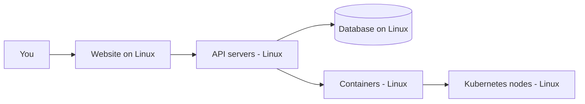

# Linux in the Real World

## 1. What Is This?

A tour of **where Linux actually runs** — often invisibly — in everyday technology and in professional IT.

## 2. Why Is This Needed?

Beginners often think Linux is a niche "hacker OS." In reality it's everywhere. Seeing that makes the effort obviously worthwhile and helps you connect commands to real systems.

## 3. Simple Layman Explanation

Linux is like **electricity** in a building: you rarely see it, but it powers almost everything. Your favorite website, your bank's backend, the cloud storing your photos, even your Android phone — Linux is underneath.

## 4. Technical Explanation

| Domain | Linux Role |
|--------|-----------|
| Web servers | Nginx/Apache on Linux serve most websites |
| Cloud | EC2/GCE/Azure VMs run Linux by default |
| Containers | Docker images use Linux base layers |
| Orchestration | Kubernetes nodes are Linux machines |
| Mobile | Android is built on the Linux kernel |
| Supercomputers | ~all of the world's top supercomputers run Linux |
| IoT / Embedded | Routers, smart TVs, cars often run embedded Linux |
| CI/CD | GitHub Actions / GitLab runners are usually Linux |

## 5. Real-World Example

When you stream a video: the website's frontend, the API servers, the CDN edge nodes, and the storage backend are almost certainly Linux machines, many running inside Docker containers on Kubernetes — all of it Linux end to end.

## 6. Diagram



## 7. Commands

On a real Linux host you can confirm common roles:

```bash
systemctl status nginx     # is a web server running?
docker ps                  # list running containers (each uses Linux)
kubectl get nodes -o wide  # node OS shows Linux (on a k8s cluster)
```

## 8. Command Explanation

- `systemctl status nginx` → checks the Nginx web server service state.
- `docker ps` → lists running containers; their isolation comes from the Linux kernel.
- `kubectl get nodes -o wide` → shows cluster nodes; the OS column reads Linux.

(These need the respective tools installed — covered in Modules 05, 06, 13.)

## 9. Practice Tasks

1. List five apps/sites you use daily and guess which run on Linux servers (hint: almost all).
2. If you have Docker, run `docker run hello-world` and read the message about the Linux kernel.

## 10. Common Mistakes

- Assuming Linux is only for "experts." It's the everyday tool of millions of engineers.
- Ignoring containers/cloud because they "aren't pure Linux" — they're Linux underneath.

## 11. Troubleshooting

If `docker`/`kubectl` aren't installed, that's expected — you'll set them up later (Module 13).

## 12. Best Practices

- As you learn each command, ask: *where would this be used on a real server?*
- Connect every module to a real-world scenario to make it memorable.

## 13. Quick Recap

- Linux runs the web, cloud, containers, Kubernetes, Android, and most servers.
- It's the silent backbone of modern technology.

## 14. References

- CNCF (Cloud Native Computing Foundation): https://www.cncf.io/
- Android (Linux kernel): https://source.android.com/

<!-- NAV-FOOTER -->

---

### 🧭 Navigation

| Previous | Up | Next |
|:---|:---:|---:|
| ⬅️ Prev: [Why Learn Linux?](why-learn-linux.md) | ⬆️ Module: [Module 00 — Getting Started](README.md) | ➡️ Next: [Linux Learning Roadmap](linux-learning-roadmap.md) |
