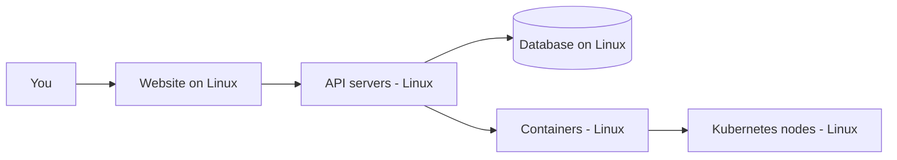

# Linux in the Real World

## 1. What Is This?

A tour of **where Linux actually runs** — often invisibly — in everyday technology and in professional IT.

## 2. Why Is This Needed?

Beginners often think Linux is a niche "hacker OS." In reality it's everywhere. Seeing that makes the effort obviously worthwhile and helps you connect commands to real systems.

## 3. Simple Layman Explanation

Linux is like **electricity** in a building: you rarely see it, but it powers almost everything. Your favorite website, your bank's backend, the cloud storing your photos, even your Android phone — Linux is underneath.

## 4. Technical Explanation

| Domain | Linux Role |
|--------|-----------|
| Web servers | Nginx/Apache on Linux serve most websites |
| Cloud | EC2/GCE/Azure VMs run Linux by default |
| Containers | Docker images use Linux base layers |
| Orchestration | Kubernetes nodes are Linux machines |
| Mobile | Android is built on the Linux kernel |
| Supercomputers | ~all of the world's top supercomputers run Linux |
| IoT / Embedded | Routers, smart TVs, cars often run embedded Linux |
| CI/CD | GitHub Actions / GitLab runners are usually Linux |

## 5. How It Works Under the Hood

Why did Linux end up *everywhere* instead of one dominant vendor OS? Three properties of how it's built:

- **It's the kernel, and the kernel is free to reuse.** Because Linux is open source under the GPL, a phone maker, a router vendor, and a cloud provider can all take the same kernel and wrap their own userland around it. That's why Android (phones), OpenWrt (routers), and Ubuntu Server (cloud) are all "Linux" yet look nothing alike — same engine, different chassis.
- **It scales down and up the same way.** The kernel's job — schedule processes, manage memory, talk to devices via **drivers** — is identical whether it's running on a 5-dollar IoT chip or a 10,000-core supercomputer. Only the hardware drivers and how much you enable differ. One skillset therefore spans the whole range.
- **Isolation is a kernel feature, not an add-on.** The same **namespaces + cgroups** primitives that let a phone sandbox apps let a server pack hundreds of Docker containers onto one machine. Containers didn't need a new OS — they exposed something the Linux kernel could already do.

So when you learn "a Linux command," you're learning something the kernel offers *everywhere* it runs — which is almost everywhere computing happens.

## 6. Diagram



## 7. Real-World Examples

**1. The everyday case — streaming a video.** The website's frontend, the API servers, the CDN edge nodes, and the storage backend are almost certainly Linux machines, many running inside Docker containers on Kubernetes — all of it Linux end to end.

**2. Proving it on a real host:**

```
$ systemctl is-active nginx
active
$ docker ps --format '{{.Image}}\t{{.Status}}'
nginx:1.25        Up 3 days
postgres:16       Up 3 days
$ kubectl get nodes -o wide
NAME     STATUS   OS-IMAGE       KERNEL-VERSION
node-1   Ready    Ubuntu 22.04   5.15.0-105-generic
```

A running web server, containers, and a cluster node — every layer reports Linux.

**3. Production war story — the "invisible" Linux that pages you.** A company's smart-TV app kept dropping video. Engineers blamed the app for weeks. The real cause: the **embedded Linux** in a batch of set-top boxes had a full `/tmp` partition, so the video buffer couldn't write. It was a Module 8 disk-full problem — on a device nobody thought of as "a Linux server." Linux being invisible doesn't mean it's absent; it means the failures show up in surprising places, and Linux skills find them.

## 8. Worked Walkthrough

If you have Docker, watch Linux reveal itself in a single container run:

```
$ docker run --rm hello-world
Hello from Docker!
This message shows that your installation appears to be working correctly.
To generate this message, Docker took the following steps:
 ...
 3. The Docker daemon created a new container from that image which runs the
    executable that produced the output you are currently reading.
```

The message itself explains the chain: your command → the Docker daemon (a Linux service) → a new **container** (an isolated Linux process) → its output. Now peek inside a real one:

```
$ docker run --rm alpine uname -a
Linux 3f2a1c 5.15.0-105-generic ... x86_64 Linux
```

Notice the **kernel version matches the host** (`5.15.0-105-generic`) — the container didn't boot its own kernel. That single line proves Section 5: containers share the host's Linux kernel and only bring their own userland (here, tiny Alpine).

## 9. Commands

```bash
systemctl status nginx     # is a web server running?
docker ps                  # list running containers (each uses Linux)
docker run --rm alpine uname -a   # show the shared host kernel from inside a container
kubectl get nodes -o wide  # node OS shows Linux (on a k8s cluster)
```

Sample output for each (dummy values, for reference):

```text
$ systemctl status nginx
● nginx.service - A high performance web server
     Active: active (running) since Tue 2026-07-02 06:00:11 UTC; 3 days ago
   Main PID: 812 (nginx)

$ docker ps
CONTAINER ID   IMAGE        STATUS         PORTS                NAMES
a1b2c3d4e5f6   nginx:1.25   Up 3 days      0.0.0.0:80->80/tcp   web
9f8e7d6c5b4a   postgres:16  Up 3 days      5432/tcp             db

$ docker run --rm alpine uname -a
Linux 3f2a1c9d8e7f 5.15.0-105-generic #115-Ubuntu SMP x86_64 Linux

$ kubectl get nodes -o wide
NAME     STATUS   ROLES           VERSION   OS-IMAGE       KERNEL-VERSION
node-1   Ready    control-plane   v1.29.2   Ubuntu 22.04   5.15.0-105-generic
```

## 10. Command Explanation

- `systemctl status nginx` → checks the Nginx web server service state.
- `docker ps` → lists running containers; their isolation comes from the Linux kernel.
- `docker run --rm alpine uname -a` → runs a throwaway container and prints the kernel — which is the host's, proving the shared-kernel model.
- `kubectl get nodes -o wide` → shows cluster nodes; the OS column reads Linux.

(These need the respective tools installed — covered in Modules 05, 06, 13.)

## 11. In Production (DevOps Context)

- **Cloud:** you'll rarely touch physical hardware — you'll operate fleets of Linux VMs and containers remotely.
- **Docker/Kubernetes:** the shared-kernel model (Section 5/8) is why containers are lightweight and why a host kernel bug can affect every container on the box.
- **CI/CD:** build/test runners are ephemeral Linux machines spun up per job.
- **Edge/IoT:** the same skills reach routers, kiosks, and devices — where failures (like the war story) are easy to miss without Linux instincts.

## 12. Practice Tasks

1. List five apps/sites you use daily and guess which run on Linux servers (hint: almost all).
2. If you have Docker, run `docker run --rm hello-world` and read the message about the Linux kernel.
3. Run `docker run --rm alpine uname -a` and compare the kernel line to your host's `uname -a`.

## 13. Common Mistakes

- Assuming Linux is only for "experts." It's the everyday tool of millions of engineers.
- Thinking a container boots its own OS/kernel — it shares the host kernel (Section 8).
- Ignoring containers/cloud because they "aren't pure Linux" — they're Linux underneath.

## 14. Troubleshooting

- **`docker`/`kubectl` not installed** → expected for now; you'll set them up in Module 13.
- **`docker: permission denied`** → your user isn't in the `docker` group yet (Module 04/13); try with `sudo` for the demo.

## 15. Best Practices

- As you learn each command, ask: *where would this be used on a real server?*
- Connect every module to a real-world scenario to make it memorable.

## 16. Connects To

- **Prev:** [Why Learn Linux?](why-learn-linux.md). **Next:** [Linux Learning Roadmap](linux-learning-roadmap.md).
- **The shared-kernel model in depth:** [Linux for Docker](../13-real-world-linux-for-devops/linux-for-docker.md) and [Linux for Kubernetes](../13-real-world-linux-for-devops/linux-for-kubernetes.md).
- **Foundations:** [What Is Linux?](what-is-linux.md).

## 17. Quick Recap

- Linux runs the web, cloud, containers, Kubernetes, Android, and most servers.
- One free kernel, many chassis — same skills scale from IoT chips to supercomputers.
- Containers share the host kernel (proven by matching `uname` output).
- It's the silent backbone of modern technology — and its failures surface in surprising places.

## 18. References

- CNCF (Cloud Native Computing Foundation): https://www.cncf.io/
- Android (Linux kernel): https://source.android.com/

<!-- NAV-FOOTER -->

---

### 🧭 Navigation

| Previous | Up | Next |
|:---|:---:|---:|
| ⬅️ Prev: [Why Learn Linux?](why-learn-linux.md) | ⬆️ Module: [Module 00 — Getting Started](README.md) | ➡️ Next: [Linux Learning Roadmap](linux-learning-roadmap.md) |
