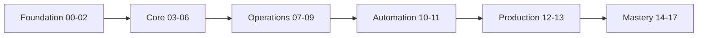

# Linux Learning Roadmap

## 1. What Is This?

A **step-by-step map** of how to move through this repository from zero to intermediate, and roughly how long each stage takes.

## 2. Why Is This Needed?

Without a path, beginners jump randomly between topics and get confused. A sequential roadmap ensures each concept builds on the previous one.

## 3. Simple Layman Explanation

Learning Linux is like **building a house**: foundation first (setup, basics), then walls (files, users, processes), then plumbing and wiring (networking, storage, logs), then automation and finishing (scripting, security), and finally decorating and inspection (projects, interviews).

## 4. Technical Explanation

The repo is divided into stages. Master each before moving on:

| Stage | Modules | Skills Gained |
|-------|---------|---------------|
| Foundation | 00–02 | Setup, architecture, navigation |
| Core Skills | 03–06 | Files, users, processes, packages |
| Operations | 07–09 | Networking, storage, logs, troubleshooting |
| Automation | 10–11 | Shell scripting, cron scheduling |
| Production | 12–13 | Security, DevOps/Cloud integration |
| Mastery | 14–17 | Labs, projects, cheatsheets, interviews |

## 5. How It Works Under the Hood

The order isn't arbitrary — it mirrors the **dependency graph** of how Linux actually fits together, so each module gives you the vocabulary the next one assumes:

- You can't understand **permissions** (04) until you know **users** and the **filesystem** (02/04), because a permission is just "which user/group can touch this file."
- You can't debug a **service** (05) until you understand a **process**, because a service is a managed process.
- **Networking, storage, and logs** (07–09) are the three things that break in production, so they come right after you can navigate and manage processes.
- **Scripting and cron** (10–11) only make sense once you know the commands you're automating — you automate what you already do by hand.
- **Security and DevOps** (12–13) sit on top because hardening and containers *reuse* everything below: a container is processes + filesystem + networking + cgroups, all earlier modules.

So the "house" analogy is literally true: skipping ahead is building walls with no foundation — the advanced topic will keep collapsing onto a basic you never learned. Learn in order and each new idea clicks onto one you already hold.

## 6. Diagram



## 7. Real-World Examples

**1. The everyday case — a new hire's first month.** With this roadmap completed, a new DevOps hire given a Linux server can: log in (12), navigate (02), check why an app is down (05, 09), fix a full disk (08), and automate a backup (10, 11) — confidently, without hand-holding.

**2. What "learning in order" prevents, shown concretely.** A learner who jumped straight to Kubernetes hits this and freezes:

```
$ kubectl get pods
NAME                 READY   STATUS             RESTARTS   AGE
web-6f9c-abcde       0/1     CrashLoopBackOff   5          4m
```

Someone who did Modules 04–09 first reads it calmly: check logs (09), check the process exit (05), check node disk/memory (08). The roadmap is what turns that scary status into a checklist.

**3. War story — the skipped-foundation trap.** A bootcamp grad could deploy apps with copy-pasted YAML but couldn't fix a `Permission denied` on a mounted volume, because they never did Module 04. Every incident became a full stop. After going back and doing the foundation in order, the same incidents became five-minute fixes. Order isn't bureaucracy — it's what makes the hard topics survivable.

## 8. Worked Walkthrough

Turn this roadmap into a concrete plan right now:

```text
Step 1  Pick a pace:        ~30–60 min/day, 1 topic file per session.
Step 2  Per topic:          read §1–§8 → run the §12 Practice Tasks → skim §17 recap.
Step 3  Per module:         finish with its Labs (Module 14) + Revision (Module 17).
Step 4  Track it:           keep a "commands I learned" log; review weekly.
Step 5  Finish-line goal:   e.g. "deploy Nginx on a cloud server and back it up nightly."
```

Sample of a personal tracker you might keep:

```text
Week 1  ✓ 00 Getting Started   ✓ 01 Setup (WSL)      ▶ 02 Basics (navigation)
Week 2    03 Files             04 Permissions          Lab 01, Lab 02
Goal check: can I find a config file and fix its permissions unaided? (Y/N)
```

The point of the walkthrough: a roadmap you don't schedule is just a diagram. Turn the table above into calendar entries.

## 9. Commands

This is a planning topic — no system commands. Your suggested cadence, as a reference block:

```text
30–60 min/day, 1 topic file per session.
End each module with its labs (Module 14) and revision (Module 17).
Redo a module's Practice Tasks if the next module feels shaky.
```

Sample "learning log" format (dummy values, for reference):

```text
DATE        MODULE  TOPIC                 COMMANDS I LEARNED
2026-07-02  02      navigation            pwd, cd, ls -la
2026-07-03  03      view-files            cat, less, head, tail
2026-07-04  04      permissions           chmod, chown, ls -l, stat
```

## 10. Command Explanation

(Planning topic — hands-on execution begins in Module 01. The "log format" above is the one artifact to actually maintain: writing a command down after using it is what moves it from short-term to long-term memory.)

## 11. In Production (DevOps Context)

- The Foundation→Mastery order matches how **on-call skill** is built: you must navigate and read logs before you can own an incident.
- **DevOps interviews** (Module 17) probe the whole chain — "app is down, walk me through it" touches Modules 05/07/08/09 at once, which is why the roadmap front-loads them.
- Teams that onboard engineers **bottom-up** (Linux → containers → orchestration) produce people who can debug, not just deploy.

## 12. Practice Tasks

1. Set a realistic weekly schedule (e.g., 4 sessions/week) and put it in your calendar.
2. Bookmark Module 14 (labs) and Module 16 (cheatsheets) for quick access.
3. Start the "commands I learned" log using the format in Section 9.
4. Decide your finish-line goal (e.g., "deploy Nginx on a cloud server").

## 13. Common Mistakes

- Skipping the foundation to chase advanced topics like Kubernetes (see the war story).
- Not doing the labs. Reading alone won't build muscle memory.
- Never scheduling the plan, so it stays a nice diagram you never follow.

## 14. Troubleshooting

Feeling stuck on a module? Drop back one module and redo its practice tasks — gaps usually come from a skipped basic. If a topic's §5/§8 doesn't click, it often depends on an earlier module you rushed.

## 15. Best Practices

- Finish a module's **Quick Revision** before moving on.
- Keep a "commands I learned" log; review it weekly.
- Learn in order — the dependency graph in Section 5 is why.

## 16. Connects To

- **Prev:** [Linux in the Real World](linux-in-real-world.md). **Next:** [Module 01 — Linux Setup](../01-linux-setup/README.md).
- **Do the work in:** [Module 14 — Hands-On Labs](../14-hands-on-labs/README.md) and [Module 15 — Mini Projects](../15-mini-projects/README.md).
- **Test yourself:** [Module 17 — Interview & Revision](../17-interview-and-revision/README.md).
- **Big picture:** the [root README](../README.md) roadmap table.

## 17. Quick Recap

- Follow modules in order: Foundation → Core → Operations → Automation → Production → Mastery.
- The order mirrors Linux's real dependency graph — each module supplies vocabulary the next assumes.
- Do the labs and revisions; schedule the plan and keep a command log.
- Steady daily practice wins over cramming.

## 18. References

- This repo's [root README](../README.md) roadmap table.
- roadmap.sh/linux: https://roadmap.sh/linux

<!-- NAV-FOOTER -->

---

### 🧭 Navigation

| Previous | Up | Next |
|:---|:---:|---:|
| ⬅️ Prev: [Linux in the Real World](linux-in-real-world.md) | ⬆️ Module: [Module 00 — Getting Started](README.md) | ➡️ Next: [Module 01 — Linux Setup](../01-linux-setup/README.md) |
