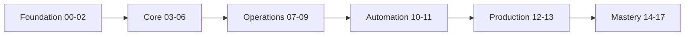

# Linux Learning Roadmap

## 1. What Is This?

A **step-by-step map** of how to move through this repository from zero to intermediate, and roughly how long each stage takes.

## 2. Why Is This Needed?

Without a path, beginners jump randomly between topics and get confused. A sequential roadmap ensures each concept builds on the previous one.

## 3. Simple Layman Explanation

Learning Linux is like **building a house**: foundation first (setup, basics), then walls (files, users, processes), then plumbing and wiring (networking, storage, logs), then automation and finishing (scripting, security), and finally decorating and inspection (projects, interviews).

## 4. Technical Explanation

The repo is divided into stages. Master each before moving on:

| Stage | Modules | Skills Gained |
|-------|---------|---------------|
| Foundation | 00–02 | Setup, architecture, navigation |
| Core Skills | 03–06 | Files, users, processes, packages |
| Operations | 07–09 | Networking, storage, logs, troubleshooting |
| Automation | 10–11 | Shell scripting, cron scheduling |
| Production | 12–13 | Security, DevOps/Cloud integration |
| Mastery | 14–17 | Labs, projects, cheatsheets, interviews |

## 5. Real-World Example

A new DevOps hire is given a Linux server. With this roadmap completed, they can: log in (12), navigate (02), check why an app is down (05, 09), fix a full disk (08), and automate a backup (10, 11) — confidently.

## 6. Diagram



## 7. Commands

No commands — this is your study plan. Suggested pace:

```text
30-60 min/day, 1 topic file per session.
End each module with its labs (Module 14) and revision (Module 17).
```

## 8. Command Explanation

(Planning topic — execution begins in Module 01.)

## 9. Practice Tasks

1. Set a realistic weekly schedule (e.g., 4 sessions/week).
2. Bookmark Module 14 (labs) and Module 16 (cheatsheets) for quick access.
3. Decide your finish-line goal (e.g., "deploy Nginx on a cloud server").

## 10. Common Mistakes

- Skipping the foundation to chase advanced topics like Kubernetes.
- Not doing the labs. Reading alone won't build muscle memory.

## 11. Troubleshooting

Feeling stuck on a module? Drop back one module and redo its practice tasks — gaps usually come from a skipped basic.

## 12. Best Practices

- Finish a module's **Quick Revision** before moving on.
- Keep a "commands I learned" log; review it weekly.

## 13. Quick Recap

- Follow modules in order: Foundation → Core → Operations → Automation → Production → Mastery.
- Do the labs and revisions. Steady daily practice wins.

## 14. References

- This repo's [root README](../README.md) roadmap table.
- roadmap.sh/linux: https://roadmap.sh/linux

<!-- NAV-FOOTER -->

---

### 🧭 Navigation

| Previous | Up | Next |
|:---|:---:|---:|
| ⬅️ Prev: [Linux in the Real World](linux-in-real-world.md) | ⬆️ Module: [Module 00 — Getting Started](README.md) | ➡️ Next: [Module 01 — Linux Setup](../01-linux-setup/README.md) |
