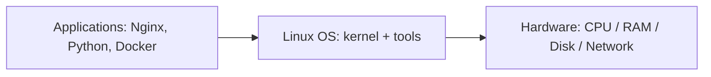
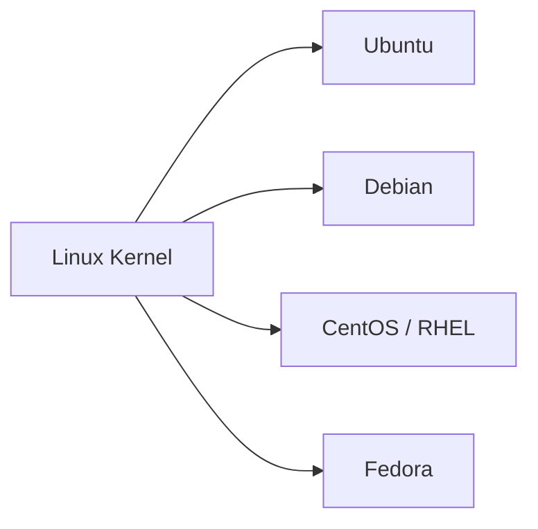

# What Is Linux?

## 1. What Is This?

Linux is a **free, open-source operating system (OS)**. An operating system is the core software that lets your applications talk to your hardware (CPU, memory, disk, network). Windows and macOS are also operating systems — Linux is the one that powers most servers and the cloud.

Strictly speaking, **"Linux" is the kernel** — the central piece that manages hardware. A full usable system (kernel + tools + package manager + desktop) is called a **Linux distribution** (or "distro"), such as **Ubuntu**, **Debian**, **CentOS**, **Fedora**, or **Red Hat Enterprise Linux**.

## 2. Why Is This Needed?

Every computer needs an OS to function. Linux exists because:

- It is **free** and **open source** — anyone can use, read, and modify it.
- It is **stable and secure** enough to run critical systems for years without rebooting.
- It is **lightweight** — it can run on a tiny IoT chip or a giant supercomputer.

## 3. Simple Layman Explanation

Think of a computer like a **restaurant**:

- **Hardware** = the kitchen (stoves, fridge, ingredients).
- **Operating system** = the kitchen manager who decides who cooks what and when.
- **Applications** = the chefs making specific dishes.

Linux is one such manager. It's popular because it's free to hire, never complains, rarely gets sick, and works in any kitchen — from a food truck to a five-star hotel.

## 4. Technical Explanation

- The **kernel** is the lowest software layer. It manages processes, memory, devices, and the filesystem, and exposes **system calls** for programs to use.
- Around the kernel, the **GNU tools** (coreutils, bash, etc.) provide the commands you type.
- A **distribution** bundles the kernel + tools + a **package manager** (apt, dnf) + default config so you get a usable system.

Linux was created by **Linus Torvalds in 1991** and is developed by thousands of contributors worldwide under the **GPL** license.

## 5. How It Works Under the Hood

Here's the key idea most beginners miss: **your programs never touch the hardware directly.** A web server can't just write to the disk or send a network packet on its own — that would be chaos with hundreds of programs running at once. Instead, every program asks the **kernel** to do it, through a narrow, guarded doorway called a **system call** (syscall).

Think of the kernel as the restaurant manager from Section 3, and syscalls as the *order slips*: a chef (program) never walks into the storeroom himself; he writes "need 2 kg flour" on a slip and the manager fetches it, deciding who gets served first. `open()`, `read()`, `write()`, and `fork()` are a few of those slips. This is why:

- **The kernel runs in a privileged mode** (kernel space) and your programs run in a restricted mode (user space). A crashing program can't take down the whole machine, because it never had direct hardware access.
- **The same program runs on any distro.** Ubuntu and Fedora ship different tools and package managers, but they share the same kernel syscall interface — so software written against Linux "just works" across distros.
- **"Linux vs a distro" finally makes sense:** the kernel is the manager; a distro is the *whole staffed restaurant* (manager + waiters + menu + décor) built around that one manager.

You don't call syscalls by hand — the commands and libraries do it for you. But knowing they exist explains *why* Linux is stable, multi-user, and portable.

## 6. Diagram





## 7. Real-World Examples

**1. The everyday case — a cloud server.** When you launch an **AWS EC2** instance with "Ubuntu" selected, AWS boots a Linux distribution. You SSH in and get a terminal. Every cloud server, Docker image, and Kubernetes node you'll meet is built on this same foundation.

**2. Seeing it with real output.** Ask any Linux box what it is and it will tell you:

```
$ uname -a
Linux web-01 5.15.0-105-generic #115-Ubuntu SMP x86_64 GNU/Linux
$ cat /etc/os-release | head -2
NAME="Ubuntu"
VERSION="22.04.4 LTS (Jammy Jellyfish)"
```

`uname` reports the *kernel* (5.15.0); `/etc/os-release` reports the *distribution* (Ubuntu 22.04). Two different layers, one for each half of "Linux vs distro."

**3. Production war story — "same code, different distro."** A team's Python app worked on the developer's Ubuntu laptop but failed on a CentOS server with "command not found" for a helper script. The *kernel* was identical, so the app logic ran fine — but the distro's tools differed (CentOS lacked a package Ubuntu preinstalls). The fix was a distro-level package install, not a code change. This is exactly the kernel-vs-distribution split in Section 4/5 biting in practice — and why Docker (which pins the whole distro userland) became popular.

## 8. Worked Walkthrough

Run these on any Linux machine (WSL, VM, or cloud) and read what each layer tells you.

```
$ uname -s -r
Linux 5.15.0-105-generic          # -s = kernel name, -r = kernel release
```

You're looking at the **kernel** — the same core whether you're on Ubuntu or Fedora.

```
$ cat /etc/os-release
NAME="Ubuntu"
VERSION="22.04.4 LTS (Jammy Jellyfish)"
ID=ubuntu
ID_LIKE=debian                    # tells scripts this distro behaves like Debian
```

Now you're looking at the **distribution** — the userland built around the kernel. Notice `ID_LIKE=debian`: that's how tools know `apt` will work here.

```
$ hostnamectl
   Static hostname: web-01
         Icon name: computer-vm
            Chassis: vm
   Operating System: Ubuntu 22.04.4 LTS
             Kernel: Linux 5.15.0-105-generic
      Architecture: x86-64
```

`hostnamectl` shows both layers at once — OS (distro) *and* Kernel — plus the CPU architecture the kernel was built for.

## 9. Commands

```bash
uname -a          # show kernel and system info
cat /etc/os-release   # show which distribution you're on
hostnamectl       # system + OS summary (systemd distros)
lsb_release -a    # distro name/version (if lsb-release installed)
```

Sample output for each (dummy values, for reference):

```text
$ uname -a
Linux web-01 5.15.0-105-generic #115-Ubuntu SMP Mon Apr 15 x86_64 GNU/Linux

$ cat /etc/os-release
NAME="Ubuntu"
VERSION="22.04.4 LTS (Jammy Jellyfish)"
ID=ubuntu
ID_LIKE=debian
VERSION_ID="22.04"

$ hostnamectl
   Static hostname: web-01
   Operating System: Ubuntu 22.04.4 LTS
             Kernel: Linux 5.15.0-105-generic
      Architecture: x86-64

$ lsb_release -a
Distributor ID: Ubuntu
Description:    Ubuntu 22.04.4 LTS
Release:        22.04
Codename:       jammy
```

## 10. Command Explanation

- `uname -a` → prints all (`-a`) system info: kernel name, version, architecture.
- `cat /etc/os-release` → `cat` prints a file; `/etc/os-release` is a standard file naming your distro and version.
- `hostnamectl` → shows hostname, OS, kernel, and architecture in a friendly summary.
- `lsb_release -a` → distro name/version in a normalized form (handy in scripts).

## 11. In Production (DevOps Context)

- **Docker** images are named after distros (`FROM ubuntu:22.04`, `FROM alpine`) because a container ships a distro's *userland* while sharing the *host kernel* — the exact split from Section 5.
- **Kubernetes** nodes are Linux servers; `kubectl get nodes -o wide` shows their OS image and kernel version.
- **Cloud** providers offer "Amazon Linux", "Ubuntu", "RHEL" images — all Linux, differing only in the distro layer.
- **Ansible/CI scripts** often branch on `ID`/`ID_LIKE` from `/etc/os-release` to choose `apt` vs `dnf`.

## 12. Practice Tasks

1. Run `uname -a` and identify the kernel version.
2. Run `cat /etc/os-release` and note your distribution name and `ID_LIKE`.
3. Run `hostnamectl` and find your CPU architecture.
4. Search online for three companies that run on Linux servers.

## 13. Common Mistakes

- Thinking "Linux" and "Ubuntu" are different OSes — Ubuntu *is* Linux (a distro).
- Confusing the **kernel** version (`uname`) with the **distro** version (`/etc/os-release`).
- Assuming you need a Linux laptop. You can learn on Windows via WSL (Module 01).

## 14. Troubleshooting

- **`cat: /etc/os-release: No such file`** → very old or minimal system; try `uname -a` or `lsb_release -a`.
- **`lsb_release: command not found`** → the `lsb-release` package isn't installed; use `/etc/os-release` instead.
- **`uname: command not found`** → extremely rare; you're likely in a restricted shell.

## 15. Best Practices

- Learn the *concepts* of Linux once; they transfer across all distros.
- Pick **Ubuntu** or **Debian** as your first distro — they have the best beginner support.
- When scripting, read `/etc/os-release` rather than hard-coding a distro name.

## 16. Connects To

- **Next:** [Why Learn Linux?](why-learn-linux.md).
- **Goes deeper in:** [Linux Architecture](../02-linux-basics/linux-architecture.md) and [Kernel, Shell & Terminal](../02-linux-basics/kernel-shell-terminal.md) — the kernel/user-space split in detail.
- **Set up your own in:** [Module 01 — Linux Setup](../01-linux-setup/README.md).
- **Real-world payoff:** [Linux in the Real World](linux-in-real-world.md).

## 17. Quick Recap

- Linux = free, open-source OS; the **kernel** is the core, and programs reach hardware only via **system calls**.
- A **distribution** = kernel + tools + package manager (the whole "restaurant" around the manager).
- `uname` shows the kernel; `/etc/os-release` shows the distro — two different layers.
- It powers most servers, cloud, and containers.

## 18. References

- The Linux Kernel: https://www.kernel.org/
- Ubuntu: https://ubuntu.com/
- `man uname`, `man hostnamectl`

<!-- NAV-FOOTER -->

---

### 🧭 Navigation

| Previous | Up | Next |
|:---|:---:|---:|
| ⬅️ Prev: [Module 00 — Getting Started](README.md) | ⬆️ Module: [Module 00 — Getting Started](README.md) | ➡️ Next: [Why Learn Linux?](why-learn-linux.md) |
