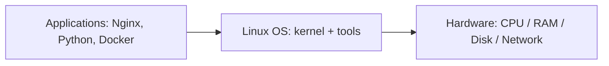
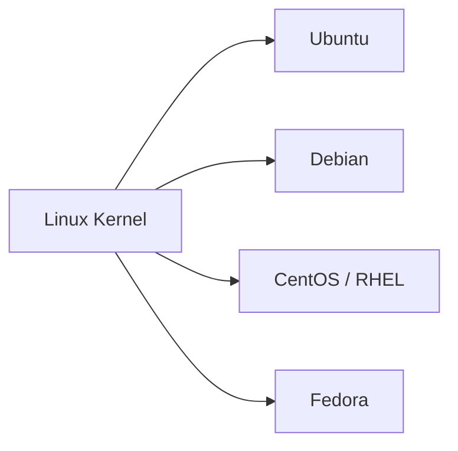

# What Is Linux?

## 1. What Is This?

Linux is a **free, open-source operating system (OS)**. An operating system is the core software that lets your applications talk to your hardware (CPU, memory, disk, network). Windows and macOS are also operating systems — Linux is the one that powers most servers and the cloud.

Strictly speaking, **"Linux" is the kernel** — the central piece that manages hardware. A full usable system (kernel + tools + package manager + desktop) is called a **Linux distribution** (or "distro"), such as **Ubuntu**, **Debian**, **CentOS**, **Fedora**, or **Red Hat Enterprise Linux**.

## 2. Why Is This Needed?

Every computer needs an OS to function. Linux exists because:

- It is **free** and **open source** — anyone can use, read, and modify it.
- It is **stable and secure** enough to run critical systems for years without rebooting.
- It is **lightweight** — it can run on a tiny IoT chip or a giant supercomputer.

## 3. Simple Layman Explanation

Think of a computer like a **restaurant**:

- **Hardware** = the kitchen (stoves, fridge, ingredients).
- **Operating system** = the kitchen manager who decides who cooks what and when.
- **Applications** = the chefs making specific dishes.

Linux is one such manager. It's popular because it's free to hire, never complains, rarely gets sick, and works in any kitchen — from a food truck to a five-star hotel.

## 4. Technical Explanation

- The **kernel** is the lowest software layer. It manages processes, memory, devices, and the filesystem, and exposes **system calls** for programs to use.
- Around the kernel, the **GNU tools** (coreutils, bash, etc.) provide the commands you type.
- A **distribution** bundles the kernel + tools + a **package manager** (apt, dnf) + default config so you get a usable system.

Linux was created by **Linus Torvalds in 1991** and is developed by thousands of contributors worldwide under the **GPL** license.

## 5. Real-World Example

When you launch an **AWS EC2** instance with "Ubuntu" selected, AWS boots a Linux distribution. You SSH in and get a terminal. Every cloud server, Docker image, and Kubernetes node you'll meet is built on this same foundation.

## 6. Diagram





## 7. Commands

```bash
uname -a          # show kernel and system info
cat /etc/os-release   # show which distribution you're on
hostnamectl       # system + OS summary (systemd distros)
```

## 8. Command Explanation

- `uname -a` → prints all (`-a`) system info: kernel name, version, architecture.
- `cat /etc/os-release` → `cat` prints a file; `/etc/os-release` is a standard file naming your distro and version.
- `hostnamectl` → shows hostname, OS, kernel, and architecture in a friendly summary.

Expected output (example):

```
$ cat /etc/os-release
NAME="Ubuntu"
VERSION="22.04.4 LTS (Jammy Jellyfish)"
ID=ubuntu
```

## 9. Practice Tasks

1. Run `uname -a` and identify the kernel version.
2. Run `cat /etc/os-release` and note your distribution name.
3. Search online for three companies that run on Linux servers.

## 10. Common Mistakes

- Thinking "Linux" and "Ubuntu" are different OSes — Ubuntu *is* Linux (a distro).
- Assuming you need a Linux laptop. You can learn on Windows via WSL (Module 01).

## 11. Troubleshooting

- **`cat: /etc/os-release: No such file`** → very old or minimal system; try `uname -a` or `lsb_release -a`.
- **`uname: command not found`** → extremely rare; you're likely in a restricted shell.

## 12. Best Practices

- Learn the *concepts* of Linux once; they transfer across all distros.
- Pick **Ubuntu** or **Debian** as your first distro — they have the best beginner support.

## 13. Quick Recap

- Linux = free, open-source OS; the kernel is the core.
- A **distribution** = kernel + tools + package manager.
- It powers most servers, cloud, and containers.

## 14. References

- The Linux Kernel: https://www.kernel.org/
- Ubuntu: https://ubuntu.com/
- `man uname`, `man hostnamectl`

<!-- NAV-FOOTER -->

---

### 🧭 Navigation

| Previous | Up | Next |
|:---|:---:|---:|
| ⬅️ Prev: [Module 00 — Getting Started](README.md) | ⬆️ Module: [Module 00 — Getting Started](README.md) | ➡️ Next: [Why Learn Linux?](why-learn-linux.md) |
