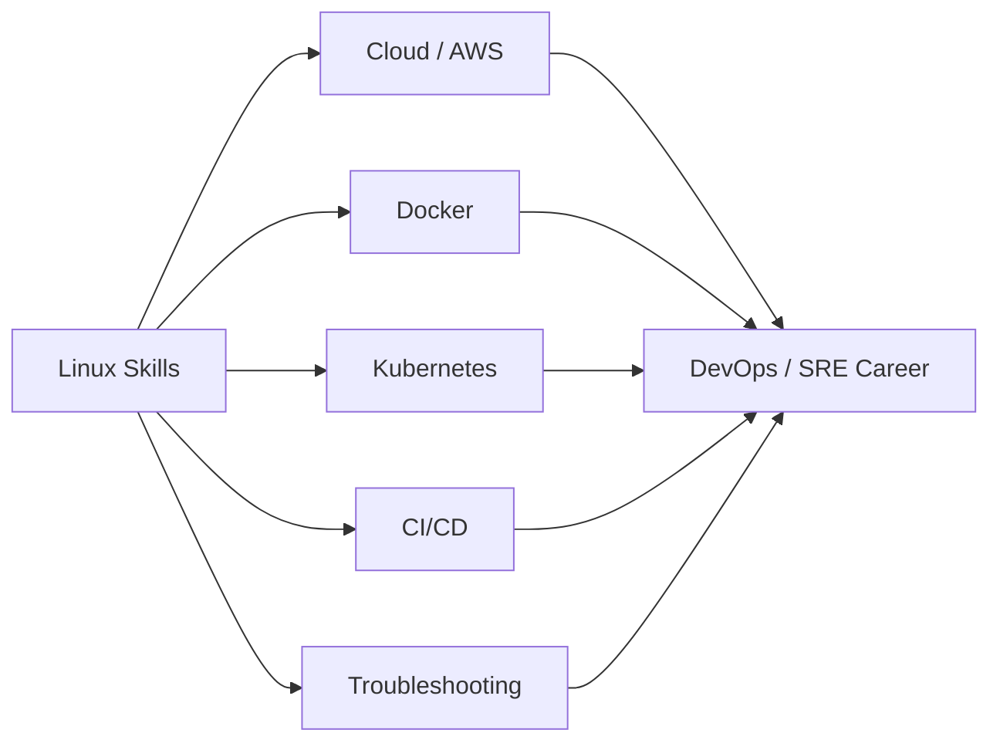

# Why Learn Linux?

## 1. What Is This?

This topic explains the **motivation**: what you gain — in career, skill, and control — by learning Linux.

## 2. Why Is This Needed?

Learning anything new takes effort. Knowing *why* keeps you going when a command doesn't work. The short version: **Linux is the operating system of modern infrastructure**, so learning it unlocks DevOps, Cloud, SRE, and SysAdmin careers.

## 3. Simple Layman Explanation

Imagine every road in a city is built one way. If you learn to drive that way, you can drive **anywhere** in the city. Linux is that "one way" for servers and cloud. Learn it once, and you can work on almost any backend system in the world.

## 4. Technical Explanation

Linux skills are foundational because:

- **Servers run Linux.** Web, database, and application servers are overwhelmingly Linux.
- **Cloud runs Linux.** EC2, GCE, and Azure VMs default to Linux images.
- **Containers are Linux.** Docker and Kubernetes are built on Linux kernel features (namespaces, cgroups).
- **Automation is Linux.** Shell scripts, cron, CI/CD pipelines, and config tools assume Linux.

Without Linux, you cannot effectively debug, deploy, or operate modern systems.

## 5. Real-World Example

A DevOps engineer's typical day: SSH into a Linux server, check why a service crashed with `journalctl`, free up a full disk with `df`/`du`, restart the service with `systemctl`, and write a small shell script to prevent it happening again. **Every step is Linux.**

## 6. Diagram



## 7. Commands

No commands here — but here are the **skills** this repo builds, mapped to jobs:

```text
Navigation + files        -> daily server work
Permissions + users       -> securing systems
Processes + services      -> keeping apps running
Networking + logs         -> troubleshooting outages
Shell scripting + cron    -> automation
```

## 8. Command Explanation

(Conceptual topic — see later modules for hands-on commands.)

## 9. Practice Tasks

1. Open three DevOps/Cloud job listings and count how many mention Linux.
2. Write down your personal reason for learning Linux. Revisit it when stuck.

## 10. Common Mistakes

- Collecting tutorials without practicing. **Doing** beats watching.
- Trying to memorize everything. Understand patterns; look up flags as needed.

## 11. Troubleshooting

The biggest blocker is motivation, not technology. When stuck: take a break, re-read the layman section, and run a small command to feel progress.

## 12. Best Practices

- Practice a little **every day**.
- Always practice on a safe environment (Module 01), never a production box.

## 13. Quick Recap

- Linux powers servers, cloud, containers, and automation.
- It's the entry ticket to DevOps/Cloud/SRE careers.
- Consistent hands-on practice is how you actually learn it.

## 14. References

- DevOps Roadmap: https://roadmap.sh/devops
- Linux Foundation: https://www.linuxfoundation.org/

<!-- NAV-FOOTER -->

---

### 🧭 Navigation

| Previous | Up | Next |
|:---|:---:|---:|
| ⬅️ Prev: [What Is Linux?](what-is-linux.md) | ⬆️ Module: [Module 00 — Getting Started](README.md) | ➡️ Next: [Linux in the Real World](linux-in-real-world.md) |
