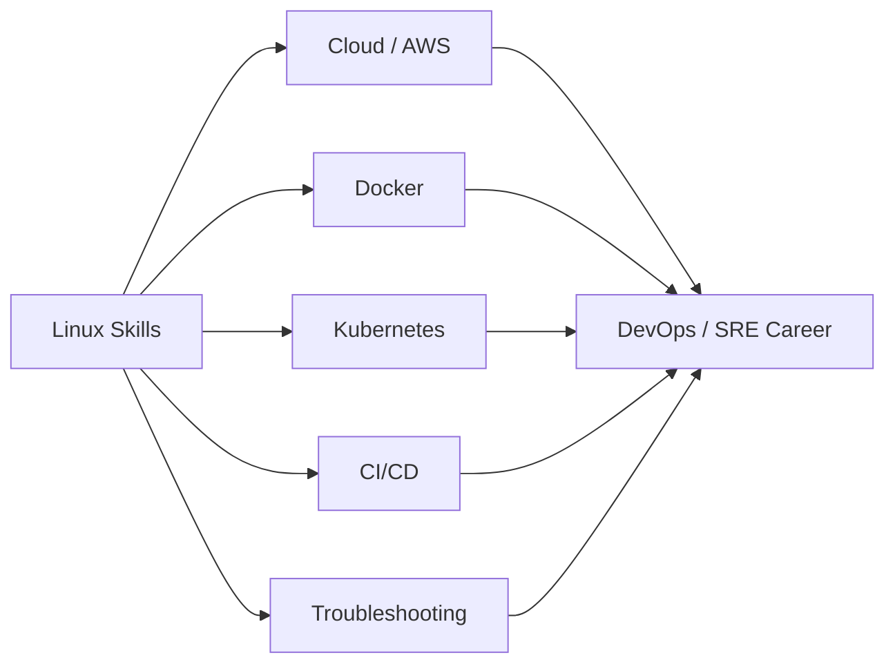

# Why Learn Linux?

## 1. What Is This?

This topic explains the **motivation**: what you gain — in career, skill, and control — by learning Linux.

## 2. Why Is This Needed?

Learning anything new takes effort. Knowing *why* keeps you going when a command doesn't work. The short version: **Linux is the operating system of modern infrastructure**, so learning it unlocks DevOps, Cloud, SRE, and SysAdmin careers.

## 3. Simple Layman Explanation

Imagine every road in a city is built one way. If you learn to drive that way, you can drive **anywhere** in the city. Linux is that "one way" for servers and cloud. Learn it once, and you can work on almost any backend system in the world.

## 4. Technical Explanation

Linux skills are foundational because:

- **Servers run Linux.** Web, database, and application servers are overwhelmingly Linux.
- **Cloud runs Linux.** EC2, GCE, and Azure VMs default to Linux images.
- **Containers are Linux.** Docker and Kubernetes are built on Linux kernel features (namespaces, cgroups).
- **Automation is Linux.** Shell scripts, cron, CI/CD pipelines, and config tools assume Linux.

Without Linux, you cannot effectively debug, deploy, or operate modern systems.

## 5. How It Works Under the Hood

Why does *one* skillset unlock *so many* jobs? Because the modern cloud stack is layers stacked on the **same Linux base**, and every layer leaks Linux back to you when something breaks:

- A **container** (Docker) is not a mini-VM — it's a normal Linux process the kernel has isolated with **namespaces** (private view of processes/network) and **cgroups** (capped CPU/memory). So "debugging a container" is debugging a Linux process.
- A **Kubernetes pod** is one or more of those containers on a Linux **node**. When a pod won't start, the root cause is usually node-level Linux: disk full, out of memory, a service down.
- A **CI/CD job** is a shell script running on a Linux runner. When the pipeline fails, you read Linux logs and exit codes.

That's the leverage: the abstractions (Docker, K8s, CI) are convenient *most* of the time, but the moment they misbehave you drop down to Linux — permissions, processes, disk, networking, logs. Learn the base once and every layer above it becomes debuggable instead of magic. This is *why* the rest of this repo is structured bottom-up.

## 6. Diagram



## 7. Real-World Examples

**1. The everyday case — a DevOps engineer's morning.** SSH into a Linux server, check why a service crashed with `journalctl`, free up a full disk with `df`/`du`, restart the service with `systemctl`, and write a small shell script to prevent it happening again. **Every step is Linux.**

**2. What that actually looks like on screen:**

```
$ systemctl is-active myapp
failed
$ journalctl -u myapp -n 3 --no-pager
Jul 02 09:14:01 web-01 myapp[8123]: FATAL: could not write to disk: No space left on device
$ df -h / | tail -1
/dev/nvme0n1p1  40G   40G     0  100% /
```

Three commands, and the "app is down" mystery is solved: the disk is full. No Kubernetes dashboard would have told you as directly — the answer lived in Linux logs and disk usage.

**3. Career war story — the interview filter.** Two candidates apply for a cloud role. Both list "Docker" and "Kubernetes." In the interview one is asked, "A pod is `CrashLoopBackOff` — walk me through it." The candidate who understands Linux says "I'd check the container's logs, then the node's disk and memory, then the process exit code." The other only knows dashboard buttons. The Linux fundamentals are what separate "I use the tools" from "I can fix it" — and that's what gets hired.

## 8. Worked Walkthrough

You don't need a server to feel the payoff — map the repo to a real job. For each skill below, note the on-the-job task it enables:

```text
Skill (module)                         On-the-job task it unlocks
-------------------------------------  -----------------------------------------
Navigation + files (02–03)             Find config/log files on an unfamiliar server
Permissions + users (04)               Fix "Permission denied", lock down access
Processes + services (05)              Restart a crashed app, find a CPU hog
Networking + logs (07, 09)             Diagnose "the site is down" outages
Shell scripting + cron (10–11)         Automate backups & cleanups so 3am pages stop
Security + DevOps (12–13)              Harden servers; operate Docker/K8s/CI
```

Now open three DevOps/Cloud job listings and match their bullet points to the rows above — you'll see most of the "requirements" are exactly these skills. That mapping *is* your study plan and your motivation in one place.

## 9. Commands

This is a motivation topic, so the "commands" are the skills this repo builds — but here are a few you can run now to preview where you're headed:

```bash
whoami            # which user am I? (permissions, Module 04)
uptime            # how long/how loaded is this machine? (Module 09)
free -h           # memory in use (Module 09)
df -h             # disk space (Module 08)
```

Sample output for each (dummy values, for reference):

```text
$ whoami
deploy

$ uptime
 09:20:11 up 42 days,  3:11,  2 users,  load average: 0.15, 0.22, 0.19

$ free -h
               total        used        free      shared  buff/cache   available
Mem:            7.7Gi       2.1Gi       3.0Gi       120Mi       2.6Gi       5.2Gi

$ df -h
Filesystem      Size  Used Avail Use% Mounted on
/dev/nvme0n1p1   40G   18G   22G  46% /
```

## 10. Command Explanation

- `whoami` → the user you're acting as; central to permissions and security.
- `uptime` → how long the box has run and its **load average** (a health signal).
- `free -h` → memory usage in human units; the first check for "why is it slow?".
- `df -h` → disk usage; the first check for "why did it stop writing?".

(Each is covered in depth in later modules — this is just a taste.)

## 11. In Production (DevOps Context)

- **Cloud:** every EC2/GCE/Azure VM you'll operate is a Linux box you reach over SSH.
- **Docker/Kubernetes:** the abstractions save time until they break — then Linux fundamentals are the debugger.
- **CI/CD:** pipelines are shell scripts on Linux runners; green/red comes down to exit codes and logs.
- **On-call/SRE:** incidents are resolved with the exact commands above, fast, under pressure — which is why fluency (not memorization) matters.

## 12. Practice Tasks

1. Open three DevOps/Cloud job listings and count how many mention Linux.
2. Match each listing's bullet points to the skill table in Section 8.
3. Write down your personal reason for learning Linux. Revisit it when stuck.

## 13. Common Mistakes

- Collecting tutorials without practicing. **Doing** beats watching.
- Chasing Kubernetes/Docker before the Linux base — the layer you skip is the one that breaks at 3am.
- Trying to memorize everything. Understand patterns; look up flags as needed.

## 14. Troubleshooting

The biggest blocker is motivation, not technology. When stuck: take a break, re-read the layman section, and run a small command (like those in Section 9) to feel progress.

## 15. Best Practices

- Practice a little **every day**.
- Always practice on a safe environment (Module 01), never a production box.
- Keep tying each new command back to a real job task (Section 8).

## 16. Connects To

- **Prev:** [What Is Linux?](what-is-linux.md). **Next:** [Linux in the Real World](linux-in-real-world.md).
- **Your path:** [Linux Learning Roadmap](linux-learning-roadmap.md).
- **Where it pays off:** [Module 13 — Linux for DevOps](../13-real-world-linux-for-devops/README.md) and [Module 17 — Interview & Revision](../17-interview-and-revision/README.md).

## 17. Quick Recap

- Linux powers servers, cloud, containers, and automation.
- The cloud stack is layers on a Linux base; when a layer breaks, Linux is the debugger.
- It's the entry ticket to DevOps/Cloud/SRE careers — fundamentals separate "uses tools" from "fixes problems".
- Consistent hands-on practice is how you actually learn it.

## 18. References

- DevOps Roadmap: https://roadmap.sh/devops
- Linux Foundation: https://www.linuxfoundation.org/

<!-- NAV-FOOTER -->

---

### 🧭 Navigation

| Previous | Up | Next |
|:---|:---:|---:|
| ⬅️ Prev: [What Is Linux?](what-is-linux.md) | ⬆️ Module: [Module 00 — Getting Started](README.md) | ➡️ Next: [Linux in the Real World](linux-in-real-world.md) |
