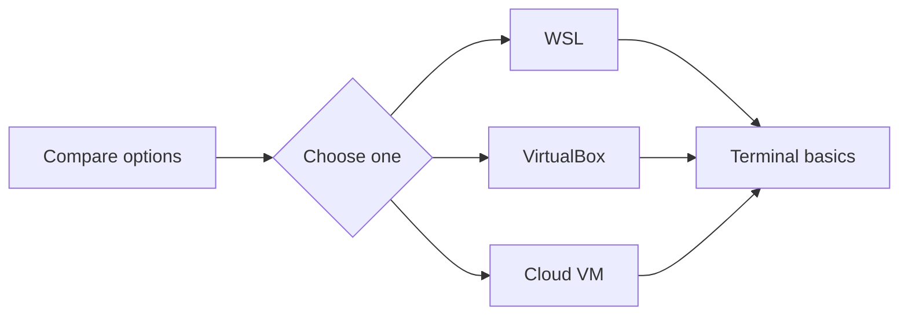

# Module 01 — Linux Setup

## What You Will Learn

- The different ways to get a Linux environment.
- How to set up Linux on Windows using **WSL** (fastest).
- How to run **Ubuntu in VirtualBox**.
- How to launch a **Linux server in the cloud**.
- The absolute basics of using a **terminal**.

## Why This Module Matters

You cannot learn Linux by only reading. You need a real environment to type commands into. This module gets you a working Linux you can safely break and rebuild.

## Real-World Use Case

DevOps engineers practice on disposable environments before touching production. WSL or a free-tier cloud VM is exactly how professionals prototype and test.

## Topics Covered

| File | What It Covers |
|------|----------------|
| [install-linux-options.md](./install-linux-options.md) | Compare all ways to get Linux |
| [wsl-setup-windows.md](./wsl-setup-windows.md) | Linux on Windows via WSL |
| [virtualbox-ubuntu-setup.md](./virtualbox-ubuntu-setup.md) | Full Ubuntu VM |
| [cloud-linux-server.md](./cloud-linux-server.md) | Linux server in the cloud (AWS) |
| [terminal-basics.md](./terminal-basics.md) | Using the terminal confidently |

## Learning Flow

## Hands-On Practice

Pick **one** environment and get to a working shell prompt where `whoami` and `pwd` run.

## Common Mistakes

- Trying to set up all three environments at once. Pick one, get comfortable, expand later.
- Installing a heavy desktop VM when WSL would have been enough.

## Troubleshooting

- WSL not enabling → ensure virtualization is on in BIOS and Windows is updated.
- VirtualBox VM won't boot → enable VT-x/AMD-V in BIOS.
- Can't SSH to cloud VM → check the security group/firewall allows port 22.

## Best Practices

- Use a **throwaway** environment for learning, never a work machine's production setup.
- Snapshot your VM before risky experiments.

## Quick Revision

- WSL = easiest on Windows. VirtualBox = full desktop Linux. Cloud = real server feel.
- You only need one working terminal to start.

## Next Module

➡️ [02 — Linux Basics](../02-linux-basics/): architecture, filesystem, and navigation.

<!-- NAV-FOOTER -->

---

### 🧭 Navigation

| Previous | Up | Next |
|:---|:---:|---:|
| ⬅️ Prev: [Linux Learning Roadmap](../00-getting-started/linux-learning-roadmap.md) | ⬆️ Home: [Learning Linux](../README.md) | ➡️ Next: [Install Linux — Your Options](install-linux-options.md) |
