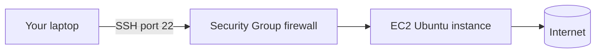

# Cloud Linux Server (AWS EC2)

## 1. What Is This?

Launching a **Linux server in the cloud** — a real, internet-connected machine you rent from a provider like **AWS** (EC2), and connect to over **SSH**.

## 2. Why Is This Needed?

This is exactly how real production servers work. Practicing on a cloud VM teaches you SSH, remote administration, and the "headless" (no desktop) workflow that DevOps actually uses.

## 3. Simple Layman Explanation

A cloud server is like **renting a computer in someone else's data center**. You never see it physically — you reach it through the internet with a secure key and type commands remotely.

## 4. Technical Explanation

Providers run huge fleets of physical servers and slice them into **virtual machines (instances)**. You pick an OS image (e.g., Ubuntu), an instance size, and a key pair, then connect via **SSH** on **port 22**. A **security group** acts as a firewall controlling which ports are open.

## 5. How It Works Under the Hood

Connecting to a cloud server chains together three things you'll meet again all over this repo:

- **The instance is a VM** on the provider's hypervisor (same idea as VirtualBox, Section 5 there — but at data-center scale). Your "server" is a slice of a big physical machine, given a **public IP** reachable over the internet.
- **SSH is public-key cryptography, not a password.** When you created the instance, AWS put the *public* half of your key pair into the server's `~/.ssh/authorized_keys`. You keep the *private* half (the `.pem`). At connect time, the server sends a challenge; only your private key can answer it, proving who you are without ever sending a secret over the wire. That's why losing the `.pem` locks you out — nothing else can answer the challenge.
- **The security group is a firewall in front of the VM.** Before your SSH packet even reaches the server, AWS checks: is inbound TCP port 22 allowed from your IP? If not, the packet is silently dropped and you get a *timeout* (not a rejection). This is why "connection timed out" almost always means "the firewall, not the server" — a distinction you'll use constantly (Module 07/12).

So a successful login = right network path (security group) + right key (SSH) + a running VM. Each can fail independently, which maps directly to the three troubleshooting cases below.

## 6. Diagram



## 7. Real-World Examples

**1. The everyday case.** A team deploys a website by launching an EC2 Ubuntu instance, SSHing in, installing Nginx, and opening port 80. This is the foundation of Module 13 and Mini Project 04.

**2. A first successful connection, on screen:**

```
$ chmod 400 my-key.pem
$ ssh -i my-key.pem ubuntu@203.0.113.25
The authenticity of host '203.0.113.25' can't be established.
ED25519 key fingerprint is SHA256:abc123...
Are you sure you want to continue connecting (yes/no)? yes
Welcome to Ubuntu 22.04.4 LTS (GNU/Linux 5.15.0-105-generic x86_64)
ubuntu@ip-172-31-8-12:~$
```

The changed prompt (`ubuntu@ip-172-31-8-12`) means you're now on the remote server.

**3. War story — the 30-minute "server is broken" that was a firewall.** A new engineer launched an instance and got `ssh: connect to host ... port 22: Connection timed out`. They rebooted the instance twice, blaming AWS. The real cause: the **security group** only allowed SSH from the office IP, and they were working from home. Adding their home IP to port 22 fixed it instantly. The tell was in Section 5 — a *timeout* (dropped packet) points at the firewall, not the server; a *"Permission denied"* would have pointed at the key.

## 8. Worked Walkthrough

From zero to a shell on a rented Linux box:

```text
1. Create a free AWS account.
2. EC2 > Launch Instance > choose an "Ubuntu" AMI.
3. Instance type: t2.micro / t3.micro (free tier).
4. Key pair: create + download my-key.pem  → keep it safe, you can't re-download it.
5. Security group: allow SSH (22) from "My IP".
6. Launch, then copy the instance's Public IPv4 address.
```

Then, from your terminal:

```
$ chmod 400 my-key.pem                 # lock the key down or SSH will refuse it
$ ssh -i my-key.pem ubuntu@<PUBLIC_IP>
# ... accept the fingerprint with 'yes' the first time ...
ubuntu@ip-172-31-8-12:~$ whoami
ubuntu
ubuntu@ip-172-31-8-12:~$ uname -a
Linux ip-172-31-8-12 5.15.0-105-generic ... x86_64 GNU/Linux
ubuntu@ip-172-31-8-12:~$ df -h /
Filesystem      Size  Used Avail Use% Mounted on
/dev/root       7.6G  1.8G  5.8G  24% /
```

You're now administering a real internet-connected server. When done: **Stop** (keeps it, pauses billing) or **Terminate** (deletes it) to avoid charges.

## 9. Commands / Steps

Connect and verify from your terminal:

```bash
chmod 400 my-key.pem                      # restrict key file permissions
ssh -i my-key.pem ubuntu@<PUBLIC_IP>      # connect as user 'ubuntu'
whoami                                    # confirm the remote user
sudo apt update                           # refresh packages on the server
```

Sample output for each (dummy values, for reference):

```text
$ chmod 400 my-key.pem
# (no output = success)

$ ssh -i my-key.pem ubuntu@203.0.113.25
Welcome to Ubuntu 22.04.4 LTS (GNU/Linux 5.15.0-105-generic x86_64)
Last login: Wed Jul  2 09:30:01 2026 from 198.51.100.7
ubuntu@ip-172-31-8-12:~$

$ whoami
ubuntu

$ sudo apt update
Hit:1 http://.../ubuntu jammy InRelease
Reading package lists... Done
```

## 10. Command Explanation

- `chmod 400 my-key.pem` → makes the key readable only by you; SSH refuses loose permissions (Module 04).
- `ssh -i my-key.pem ubuntu@<IP>` → `ssh` opens a secure remote shell; `-i` selects the identity (private key); `ubuntu` is the default user on Ubuntu AMIs.
- First connection prompts you to accept the host fingerprint — type `yes` (it's then remembered in `~/.ssh/known_hosts`).

## 11. In Production (DevOps Context)

- This *is* production: real servers are Linux VMs reached over SSH, exactly like this.
- **Security groups / firewalls** gate every production service — the timeout-vs-refused distinction (Section 5) is a daily debugging tool.
- **Key management** scales up to bastion hosts, SSH agents, and short-lived certificates; the public/private model is the same.
- **Cost hygiene** (stop/terminate idle instances, billing alerts) is a real DevOps responsibility, not just a learning tip.

## 12. Practice Tasks

1. Launch a free-tier Ubuntu EC2 instance.
2. SSH into it and run `whoami`, `uname -a`, `df -h`.
3. Run `sudo apt update`.
4. **Stop or terminate** the instance when done to avoid charges.

## 13. Common Mistakes

- Leaving the instance running and incurring cost. Stop/terminate when done.
- Opening SSH to `0.0.0.0/0` (the whole internet) instead of your IP.
- Losing the `.pem` key — nothing else can answer the SSH challenge, so you're locked out (Section 5).

## 14. Troubleshooting

- **Connection timed out** → security group isn't allowing port 22 from your IP (packet dropped by the firewall).
- **Permission denied (publickey)** → wrong username or wrong/missing key (the key layer, not the network).
- **"Unprotected private key file"** → run `chmod 400 my-key.pem`.

(See [Module 12 SSH basics](../12-linux-security-basics/ssh-basics.md) for deeper SSH coverage.)

## 15. Best Practices

- Restrict SSH to your own IP, not the whole internet.
- Always `chmod 400` your private key.
- Terminate unused instances; set a billing alert.

## 16. Connects To

- **Prev:** [VirtualBox + Ubuntu Setup](virtualbox-ubuntu-setup.md). **Next:** [Terminal Basics](terminal-basics.md).
- **Deeper SSH & firewalls:** [SSH Basics](../12-linux-security-basics/ssh-basics.md), [Firewall Basics](../12-linux-security-basics/firewall-basics-ufw-firewalld.md).
- **Timeout vs refused, in networking:** [Networking Fundamentals](../07-networking-basics/networking-fundamentals.md).
- **Build on it:** [Linux for AWS](../13-real-world-linux-for-devops/linux-for-aws.md), [Mini Project 04 — Nginx Setup](../15-mini-projects/project-04-simple-nginx-server-setup.md).

## 17. Quick Recap

- A cloud VM is a real remote Linux server reached over SSH.
- Login = running VM + allowed firewall path + matching private key; each fails differently.
- Timeout ≈ firewall/security group; "Permission denied" ≈ key/user.
- Use a key pair, open only needed ports, and stop it when idle.

## 18. References

- AWS EC2 docs: https://docs.aws.amazon.com/ec2/
- Connect to your instance: https://docs.aws.amazon.com/AWSEC2/latest/UserGuide/AccessingInstances.html

<!-- NAV-FOOTER -->

---

### 🧭 Navigation

| Previous | Up | Next |
|:---|:---:|---:|
| ⬅️ Prev: [VirtualBox + Ubuntu Setup](virtualbox-ubuntu-setup.md) | ⬆️ Module: [Module 01 — Linux Setup](README.md) | ➡️ Next: [Terminal Basics](terminal-basics.md) |
