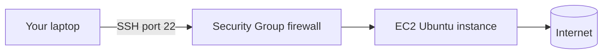

# Cloud Linux Server (AWS EC2)

## 1. What Is This?

Launching a **Linux server in the cloud** — a real, internet-connected machine you rent from a provider like **AWS** (EC2), and connect to over **SSH**.

## 2. Why Is This Needed?

This is exactly how real production servers work. Practicing on a cloud VM teaches you SSH, remote administration, and the "headless" (no desktop) workflow that DevOps actually uses.

## 3. Simple Layman Explanation

A cloud server is like **renting a computer in someone else's data center**. You never see it physically — you reach it through the internet with a secure key and type commands remotely.

## 4. Technical Explanation

Providers run huge fleets of physical servers and slice them into **virtual machines (instances)**. You pick an OS image (e.g., Ubuntu), an instance size, and a key pair, then connect via **SSH** on **port 22**. A **security group** acts as a firewall controlling which ports are open.

## 5. Real-World Example

A team deploys a website by launching an EC2 Ubuntu instance, SSHing in, installing Nginx, and opening port 80. This is the foundation of Module 13 and Mini Project 04.

## 6. Diagram



## 7. Commands / Steps

```text
1. Create a free AWS account.
2. EC2 > Launch Instance > choose "Ubuntu" AMI.
3. Instance type: t2.micro / t3.micro (free tier).
4. Create/download a key pair (.pem file) - keep it safe.
5. Security group: allow SSH (22) from your IP.
6. Launch, then copy the public IP.
```

Connect from your terminal:

```bash
chmod 400 my-key.pem                      # restrict key file permissions
ssh -i my-key.pem ubuntu@<PUBLIC_IP>      # connect as user 'ubuntu'
```

## 8. Command Explanation

- `chmod 400 my-key.pem` → makes the key readable only by you (SSH refuses loose permissions). See Module 04.
- `ssh -i my-key.pem ubuntu@<IP>` → `ssh` opens a secure remote shell; `-i` selects the identity (key) file; `ubuntu` is the default username on Ubuntu AMIs.

Expected first connection prompts to accept the host fingerprint — type `yes`.

## 9. Practice Tasks

1. Launch a free-tier Ubuntu EC2 instance.
2. SSH into it and run `whoami`, `uname -a`, `df -h`.
3. Run `sudo apt update`.
4. **Stop or terminate** the instance when done to avoid charges.

## 10. Common Mistakes

- Leaving the instance running and incurring cost. Stop/terminate when done.
- Opening SSH to `0.0.0.0/0` (the whole internet) instead of your IP.
- Losing the `.pem` key — you can't reconnect without it.

## 11. Troubleshooting

- **Connection timed out** → security group isn't allowing port 22 from your IP.
- **Permission denied (publickey)** → wrong username or wrong/missing key.
- **"Unprotected private key file"** → run `chmod 400 my-key.pem`.

(See [Module 12 SSH basics](../12-linux-security-basics/ssh-basics.md) for deeper SSH coverage.)

## 12. Best Practices

- Restrict SSH to your own IP, not the whole internet.
- Always `chmod 400` your private key.
- Terminate unused instances; set a billing alert.

## 13. Quick Recap

- A cloud VM is a real remote Linux server reached over SSH.
- Use a key pair, open only needed ports, and stop it when idle.

## 14. References

- AWS EC2 docs: https://docs.aws.amazon.com/ec2/
- Connect to your instance: https://docs.aws.amazon.com/AWSEC2/latest/UserGuide/AccessingInstances.html

<!-- NAV-FOOTER -->

---

### 🧭 Navigation

| Previous | Up | Next |
|:---|:---:|---:|
| ⬅️ Prev: [VirtualBox + Ubuntu Setup](virtualbox-ubuntu-setup.md) | ⬆️ Module: [Module 01 — Linux Setup](README.md) | ➡️ Next: [Terminal Basics](terminal-basics.md) |
