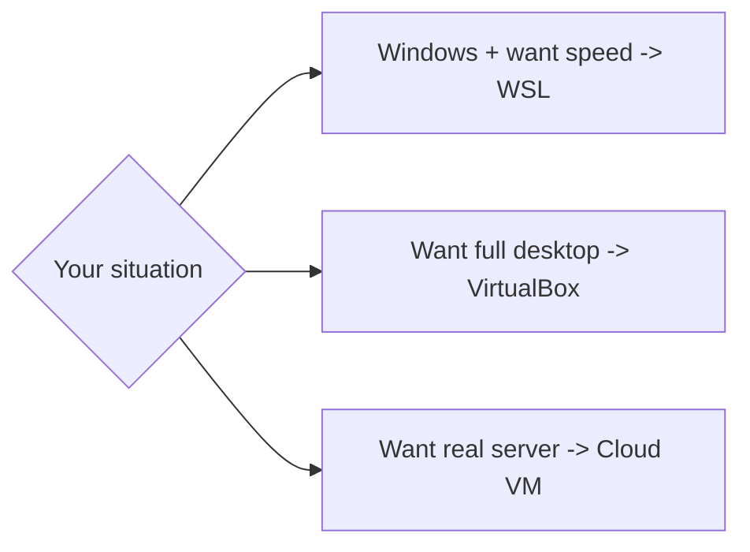

# Install Linux — Your Options

## 1. What Is This?

An overview of every practical way to get a Linux environment to learn on, with the pros and cons of each.

## 2. Why Is This Needed?

There's no single "right" way to run Linux. The best choice depends on your computer, your goal, and how much you want to install. Choosing well saves hours of frustration.

## 3. Simple Layman Explanation

Getting Linux is like getting a car to learn driving:
- **WSL** = a driving simulator on your existing PC (fast, no garage needed).
- **VirtualBox** = a real car parked in your garage (full experience, takes space).
- **Cloud VM** = renting a car parked elsewhere (real roads, accessed remotely).
- **Dual boot** = replacing your daily car (powerful but committal).

## 4. Technical Explanation

| Option | What It Is | Pros | Cons |
|--------|-----------|------|------|
| WSL | Linux running inside Windows | Fast, lightweight, integrates with Windows | Not a full separate OS |
| VirtualBox VM | A virtual computer running Linux | Full desktop Linux, safe sandbox | Uses RAM/disk, slower |
| Cloud VM | Linux server rented from AWS/GCP/Azure | Real server, accessible anywhere | Needs internet, possible cost |
| Dual boot | Linux installed alongside Windows | Native speed | Risky for beginners, repartitioning |
| Live USB | Boot Linux from a USB stick | No install needed | Changes not saved by default |

## 5. How It Works Under the Hood

The options differ mainly in **how much they share with your real machine** — that's the whole trade-off:

- **Dual boot / bare metal:** Linux talks to your hardware directly. Fastest, but only one OS runs at a time, and partitioning mistakes can wipe Windows.
- **Virtual machine (VirtualBox):** a **hypervisor** creates *fake* hardware — a virtual CPU, disk, and network card — and Linux thinks it's on a real machine. Full isolation (crash it freely), but you pay an overhead tax because two OSes run at once and the guest's requests are translated to the host.
- **WSL 2:** a hybrid — Microsoft runs a **real Linux kernel in a tiny, tuned VM** that boots in a second and shares memory/files smartly with Windows. You get real syscalls with almost none of the "boot a whole desktop" weight.
- **Cloud VM:** the *same* VM idea, but the hypervisor and hardware live in a data center; you only hold the keyboard (over SSH). Nothing installs on your laptop.

Knowing this explains the advice that follows: on a low-RAM laptop, a full VM makes *two* OSes fight over the same RAM (slow), while WSL or a cloud VM sidesteps that. The "which is faster/safer" questions all reduce to *what am I sharing vs. faking?*

## 6. Diagram



## 7. Real-World Examples

**1. The everyday case.** Most learners on Windows start with **WSL** because it takes minutes. Those wanting the "real server" feel spin up a **free-tier AWS EC2** instance. Both are exactly what professionals use day to day.

**2. Confirming you actually landed in Linux:**

```
$ uname -s
Linux
$ whoami
prakhar
$ free -h | head -2
               total        used        free
Mem:            7.7Gi       1.2Gi       5.9Gi     # how much RAM your environment got
```

`uname -s` printing `Linux` is your proof the environment is real, regardless of which option you chose.

**3. War story — the "Linux is slow" that was really RAM.** A learner ran a VirtualBox Ubuntu desktop with only 1 GB RAM on a 4 GB laptop and concluded "Linux is sluggish." The guest and host were starving each other (Section 5). Switching to WSL — which shares the host's memory instead of reserving a fixed slice — made the exact same commands feel instant. The lesson: match the *option* to your hardware; the OS wasn't the problem.

## 8. Worked Walkthrough

Choose your path with this quick decision flow, then verify:

```text
Do you have admin rights on a Windows 10/11 PC with 8GB+ RAM?
   YES → use WSL (fastest). Next file: wsl-setup-windows.md
Do you want a full graphical Linux desktop and have 8GB+ RAM to spare?
   YES → VirtualBox + Ubuntu. Next-next file.
No admin rights / low RAM / want the real server feel?
   → Cloud VM (AWS EC2 free tier). cloud-linux-server.md
```

After whichever setup, run the same three checks to confirm success:

```
$ whoami          # you should see YOUR linux username, not "root" ideally
prakhar
$ uname -s        # must print: Linux
Linux
$ pwd             # your home dir, e.g. /home/prakhar
/home/prakhar
```

If all three behave, your environment is ready — the rest of the repo works identically no matter which option produced this prompt.

## 9. Commands

After setup, these confirm you're in Linux (covered in each topic):

```bash
whoami        # your username
uname -s      # kernel name -> Linux
pwd           # current directory
free -h       # how much memory your environment has
```

Sample output for each (dummy values, for reference):

```text
$ whoami
prakhar

$ uname -s
Linux

$ pwd
/home/prakhar

$ free -h
               total        used        free      shared  buff/cache   available
Mem:            7.7Gi       1.2Gi       5.9Gi       80Mi        600Mi       6.1Gi
```

## 10. Command Explanation

- `whoami` → prints the current logged-in user.
- `uname -s` → prints just the kernel name; on Linux it returns `Linux`.
- `pwd` → "print working directory"; shows where you are in the filesystem.
- `free -h` → memory available to your environment — the number that decides whether a VM will feel fast.

## 11. In Production (DevOps Context)

- The **cloud VM** option isn't just for practice — it *is* production. Learning SSH + a headless server now is the exact skill you'll use daily.
- **VMs and hypervisors** underpin all cloud compute; EC2/GCE instances are VMs on a provider's hypervisor.
- **WSL** is a real dev workflow: many engineers build, test, and run Docker on WSL before pushing to Linux servers.
- CI runners are ephemeral cloud VMs — the same "rent a Linux box, use it, throw it away" pattern.

## 12. Practice Tasks

1. Decide which option fits your machine and goal (use the flow in Section 8).
2. If on Windows with 8GB+ RAM → start with WSL (next file).
3. Note your choice, and your RAM (`free -h` later), in your study log.

## 13. Common Mistakes

- Dual-booting as a beginner and accidentally wiping Windows. Avoid until experienced.
- Choosing a heavy VM on a low-RAM laptop, then blaming Linux for being slow (the war story).
- Assuming the options behave differently for learning — the commands are identical once you get a prompt.

## 14. Troubleshooting

- **Low RAM (≤4GB)?** Prefer WSL or a cloud VM over a desktop VM.
- **No admin rights on your PC?** A cloud VM avoids installing anything locally.
- **Virtualization errors on VM/WSL?** Enable VT-x/SVM in BIOS (see the WSL and VirtualBox topics).

## 15. Best Practices

- Start simple (WSL/cloud). Add VirtualBox later if you want a GUI.
- Keep your learning environment separate from work data.
- Match the option to your hardware, not to what a tutorial happened to use.

## 16. Connects To

- **Next:** [WSL Setup on Windows](wsl-setup-windows.md), then [VirtualBox + Ubuntu Setup](virtualbox-ubuntu-setup.md) and [Cloud Linux Server](cloud-linux-server.md).
- **Then learn to drive it:** [Terminal Basics](terminal-basics.md).
- **Why any of this matters:** [What Is Linux?](../00-getting-started/what-is-linux.md).

## 17. Quick Recap

- WSL = easiest on Windows; VirtualBox = full desktop; Cloud = real server.
- The trade-off is *how much you share vs. fake* — which drives speed and safety.
- Pick one based on RAM, goal, and how much you want to install; verify with `uname -s`.

## 18. References

- WSL: https://learn.microsoft.com/windows/wsl/
- VirtualBox: https://www.virtualbox.org/
- AWS EC2: https://docs.aws.amazon.com/ec2/

<!-- NAV-FOOTER -->

---

### 🧭 Navigation

| Previous | Up | Next |
|:---|:---:|---:|
| ⬅️ Prev: [Module 01 — Linux Setup](README.md) | ⬆️ Module: [Module 01 — Linux Setup](README.md) | ➡️ Next: [WSL Setup on Windows](wsl-setup-windows.md) |
