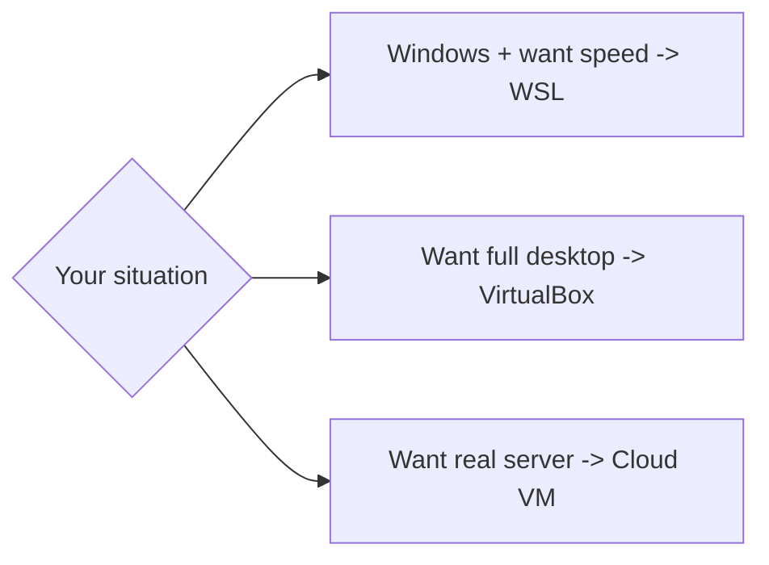

# Install Linux — Your Options

## 1. What Is This?

An overview of every practical way to get a Linux environment to learn on, with the pros and cons of each.

## 2. Why Is This Needed?

There's no single "right" way to run Linux. The best choice depends on your computer, your goal, and how much you want to install. Choosing well saves hours of frustration.

## 3. Simple Layman Explanation

Getting Linux is like getting a car to learn driving:
- **WSL** = a driving simulator on your existing PC (fast, no garage needed).
- **VirtualBox** = a real car parked in your garage (full experience, takes space).
- **Cloud VM** = renting a car parked elsewhere (real roads, accessed remotely).
- **Dual boot** = replacing your daily car (powerful but committal).

## 4. Technical Explanation

| Option | What It Is | Pros | Cons |
|--------|-----------|------|------|
| WSL | Linux running inside Windows | Fast, lightweight, integrates with Windows | Not a full separate OS |
| VirtualBox VM | A virtual computer running Linux | Full desktop Linux, safe sandbox | Uses RAM/disk, slower |
| Cloud VM | Linux server rented from AWS/GCP/Azure | Real server, accessible anywhere | Needs internet, possible cost |
| Dual boot | Linux installed alongside Windows | Native speed | Risky for beginners, repartitioning |
| Live USB | Boot Linux from a USB stick | No install needed | Changes not saved by default |

## 5. Real-World Example

Most learners on Windows start with **WSL** because it takes minutes. Those wanting the "real server" feel spin up a **free-tier AWS EC2** instance. Both are exactly what professionals use day to day.

## 6. Diagram



## 7. Commands

After setup, these confirm you're in Linux (covered in each topic):

```bash
whoami        # your username
uname -s      # kernel name -> Linux
pwd           # current directory
```

## 8. Command Explanation

- `whoami` → prints the current logged-in user.
- `uname -s` → prints just the kernel name; on Linux it returns `Linux`.
- `pwd` → "print working directory"; shows where you are in the filesystem.

## 9. Practice Tasks

1. Decide which option fits your machine and goal.
2. If on Windows with 8GB+ RAM → start with WSL (next file).
3. Note your choice in your study log.

## 10. Common Mistakes

- Dual-booting as a beginner and accidentally wiping Windows. Avoid until experienced.
- Choosing a heavy VM on a low-RAM laptop, then blaming Linux for being slow.

## 11. Troubleshooting

- Low RAM (≤4GB)? Prefer WSL or a cloud VM over a desktop VM.
- No admin rights on your PC? A cloud VM avoids installing anything locally.

## 12. Best Practices

- Start simple (WSL/cloud). Add VirtualBox later if you want a GUI.
- Keep your learning environment separate from work data.

## 13. Quick Recap

- WSL = easiest on Windows; VirtualBox = full desktop; Cloud = real server.
- Pick one based on RAM, goal, and how much you want to install.

## 14. References

- WSL: https://learn.microsoft.com/windows/wsl/
- VirtualBox: https://www.virtualbox.org/
- AWS EC2: https://docs.aws.amazon.com/ec2/
