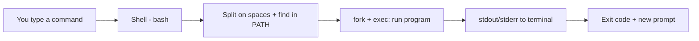

# Terminal Basics

## 1. What Is This?

The **terminal** is a text window where you type commands to control Linux. The program reading your commands is the **shell** (usually **bash**). This is your primary tool for everything that follows.

## 2. Why Is This Needed?

Most servers have **no graphical interface** — only a terminal. Mastering it is non-negotiable for DevOps/SysAdmin work. It's also far faster and scriptable compared to clicking.

## 3. Simple Layman Explanation

The terminal is like **texting your computer**. You type an instruction, press Enter, and it does exactly what you said. No buttons, no menus — just a conversation in commands.

## 4. Technical Explanation

You type a command; the **shell** parses it, finds the program, runs it, and prints its output. The text before your cursor is the **prompt**, typically showing `user@host:current-directory$`. The `$` means a normal user; `#` means root (admin).

## 5. How It Works Under the Hood

A lot happens between pressing Enter and seeing output — and knowing the steps demystifies most beginner errors:

1. **The shell reads your line and splits it on spaces** into a command and its arguments. This is *why* `cd/etc` fails but `cd /etc` works: without the space, the shell looks for a program literally named `cd/etc`.
2. **It finds the program** by searching the directories listed in the `PATH` environment variable, in order. `ls` works from anywhere because `/usr/bin` is on `PATH`. "command not found" usually means a typo or that the program's directory isn't on `PATH`.
3. **It runs the program** by asking the kernel to `fork` (make a copy of the shell) and `exec` (replace that copy with the program). The program inherits three open channels: **stdin** (input), **stdout** (normal output), **stderr** (errors) — the plumbing that later lets you redirect and pipe (`>`, `|`).
4. **It waits** for the program to finish, collects its **exit code** (0 = success, non-zero = failure), then prints the prompt again — signalling it's ready for the next command.

So the prompt returning is the shell saying "the last program finished." A prompt that *doesn't* return means a program is still running — which is exactly when `Ctrl+C` (send an interrupt signal) is the right move.

## 6. Diagram



## 7. Real-World Examples

**1. The everyday case.** To check why a server is full, an engineer types `df -h`, reads the output, and acts — all in seconds. No GUI could be faster across hundreds of servers.

**2. Reading the prompt and exit codes:**

```
$ whoami
ubuntu
$ ls /etc/hostname
/etc/hostname
$ echo $?
0                         # last command succeeded (exit code 0)
$ ls /nope
ls: cannot access '/nope': No such file or directory
$ echo $?
2                         # last command failed (non-zero)
```

`$?` holds the previous command's exit code — the same value scripts and CI pipelines check to decide pass/fail (Module 10).

**3. War story — the frozen terminal that wasn't frozen.** A new admin ran a command, saw no prompt come back, and force-closed the window — killing a long-running copy halfway. In reality the terminal wasn't frozen; the program was simply still running (Section 5: the prompt returns only when it finishes). The right move was to wait, or press `Ctrl+C` to cancel cleanly. Understanding "no prompt = still running" prevents corrupting half-done work.

## 8. Worked Walkthrough

Type these in order and watch the shell's behavior:

```
$ pwd
/home/ubuntu                      # where you are
$ whoami
ubuntu                            # who you are
$ echo "Hello $USER"
Hello ubuntu                      # the shell expanded the $USER variable
$ cd /etc
$ pwd
/etc                              # you moved; the prompt's directory changes too
$ lss
lss: command not found            # typo → not on PATH (Section 5, step 2)
$ ls -d hostname
hostname
$ history | tail -3
  1021  cd /etc
  1022  lss
  1023  ls -d hostname
```

Notice: the `$USER` expansion, the "command not found" on a typo, and that `history` remembers everything — including the mistake. Now press **Up arrow** to recall `ls -d hostname` without retyping, and **Tab** after `ls -d host` to autocomplete it.

## 9. Commands

```bash
whoami            # current user
pwd               # where am I
ls                # list files here
cd /etc           # change directory to /etc
clear             # clear the screen
history           # show commands you've run
echo "Hello"      # print text
echo $?           # exit code of the last command
man ls            # manual page for the 'ls' command
```

Useful keys:

```text
Tab         -> auto-complete file/command names
Up / Down   -> scroll through previous commands
Ctrl + C    -> cancel the running command
Ctrl + L    -> clear screen (same as 'clear')
q           -> quit a manual/pager view
```

Sample output for each (dummy values, for reference):

```text
$ whoami
ubuntu

$ pwd
/home/ubuntu

$ ls
Desktop  Documents  Downloads  notes.txt

$ history | tail -3
  1044  pwd
  1045  ls
  1046  history | tail -3

$ echo "Hello"
Hello

$ echo $?
0
```

## 10. Command Explanation

- `whoami` → who you're logged in as.
- `pwd` → "print working directory" — your current location.
- `ls` → list directory contents.
- `cd /etc` → "change directory" to `/etc`.
- `echo "Hello"` → prints text; the building block of scripts.
- `echo $?` → prints the last command's exit code (0 = success) — the core of error-checking in scripts.
- `man ls` → opens the **manual**; press `q` to quit. Your built-in help system.

## 11. In Production (DevOps Context)

- Production servers are **headless** — the terminal is the *only* interface, so terminal fluency is the baseline skill.
- **Exit codes** (`$?`) are how shell scripts, `Makefile`s, and CI/CD pipelines decide success vs. failure — a red build is usually a non-zero exit code.
- **`PATH`** issues are a classic deploy bug: a tool that works interactively "isn't found" in a cron job or CI because that environment has a different `PATH` (Module 11).
- Over SSH, the terminal is your remote hands — the same keys and rules apply on a server across the world.

## 12. Practice Tasks

1. Run `whoami`, `pwd`, `ls`, then `cd /` and `ls` again.
2. Run a successful command, then `echo $?`; run a failing one (`ls /nope`), then `echo $?`.
3. Type `ls` then press Up arrow to repeat it; start typing `his` and press **Tab**.
4. Open `man pwd`, read it, and press `q` to exit.

## 13. Common Mistakes

- Typos in command names → "command not found". Check spelling and case (`LS` ≠ `ls`).
- Forgetting spaces: `cd/etc` is wrong (the shell splits on spaces, Section 5); it's `cd /etc`.
- Force-closing the terminal when a command is still running (the war story) — use `Ctrl+C`.
- Getting stuck inside `man`/a pager — press `q` to quit.

## 14. Troubleshooting

- **`command not found`** → typo, or the program isn't installed / not on `PATH` (Module 06).
- **Stuck with no prompt** → a command is still running; press `Ctrl + C` to cancel.
- **Weird screen after exiting a program** → run `reset`.

## 15. Best Practices

- Use **Tab completion** constantly — it prevents typos and saves time.
- Read a command's `man` page when unsure instead of guessing.
- Check `$?` (or use `set -e` in scripts) to catch failures instead of assuming success.
- Press `Ctrl + C` to safely abort anything you didn't mean to run.

## 16. Connects To

- **Prev:** [Cloud Linux Server](cloud-linux-server.md). **Next:** [Module 02 — Linux Basics](../02-linux-basics/README.md).
- **The shell in depth:** [Kernel, Shell & Terminal](../02-linux-basics/kernel-shell-terminal.md).
- **Navigate from here:** [Basic Navigation Commands](../02-linux-basics/basic-navigation-commands.md).
- **Exit codes in scripts:** [Shell Script Basics](../10-shell-scripting/shell-script-basics.md).
- **Quick lookup:** [Basic Commands Cheatsheet](../16-cheatsheets/basic-commands-cheatsheet.md).

## 17. Quick Recap

- Terminal = type commands; shell (bash) parses, finds via `PATH`, `fork`+`exec`s, and prints output.
- The prompt returns only when the program finishes; no prompt = still running (use `Ctrl+C`).
- `$?` holds the exit code (0 = success) — the basis of error checking.
- Core moves: `pwd`, `ls`, `cd`, `man`, `clear`, `history`; Tab to autocomplete, Up/Down for history.

## 18. References

- GNU Bash manual: https://www.gnu.org/software/bash/manual/
- `man bash`, `man man`

<!-- NAV-FOOTER -->

---

### 🧭 Navigation

| Previous | Up | Next |
|:---|:---:|---:|
| ⬅️ Prev: [Cloud Linux Server (AWS EC2)](cloud-linux-server.md) | ⬆️ Module: [Module 01 — Linux Setup](README.md) | ➡️ Next: [Module 02 — Linux Basics](../02-linux-basics/README.md) |
