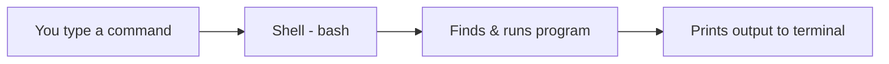

# Terminal Basics

## 1. What Is This?

The **terminal** is a text window where you type commands to control Linux. The program reading your commands is the **shell** (usually **bash**). This is your primary tool for everything that follows.

## 2. Why Is This Needed?

Most servers have **no graphical interface** — only a terminal. Mastering it is non-negotiable for DevOps/SysAdmin work. It's also far faster and scriptable compared to clicking.

## 3. Simple Layman Explanation

The terminal is like **texting your computer**. You type an instruction, press Enter, and it does exactly what you said. No buttons, no menus — just a conversation in commands.

## 4. Technical Explanation

You type a command; the **shell** parses it, finds the program, runs it, and prints its output. The text before your cursor is the **prompt**, typically showing `user@host:current-directory$`. The `$` means a normal user; `#` means root (admin).

## 5. Real-World Example

To check why a server is full, an engineer types `df -h`, reads the output, and acts — all in seconds. No GUI could be faster across hundreds of servers.

## 6. Diagram



## 7. Commands

```bash
whoami            # current user
pwd               # where am I
ls                # list files here
cd /etc           # change directory to /etc
clear             # clear the screen
history           # show commands you've run
echo "Hello"      # print text
man ls            # manual page for the 'ls' command
```

Useful keys:

```text
Tab         -> auto-complete file/command names
Up / Down   -> scroll through previous commands
Ctrl + C    -> cancel the running command
Ctrl + L    -> clear screen (same as 'clear')
q           -> quit a manual/pager view
```

## 8. Command Explanation

- `whoami` → who you're logged in as.
- `pwd` → "print working directory" — your current location.
- `ls` → list directory contents.
- `cd /etc` → "change directory" to `/etc`.
- `echo "Hello"` → prints text; the building block of scripts.
- `man ls` → opens the **manual**; press `q` to quit. Your built-in help system.

## 9. Practice Tasks

1. Run `whoami`, `pwd`, `ls`, then `cd /` and `ls` again.
2. Type `ls` then press Up arrow to repeat it.
3. Start typing `his` and press **Tab** to autocomplete to `history`.
4. Open `man pwd`, read it, and press `q` to exit.

## 10. Common Mistakes

- Typos in command names → "command not found". Check spelling and case (`LS` ≠ `ls`).
- Forgetting spaces: `cd/etc` is wrong; it's `cd /etc`.
- Getting stuck inside `man`/a pager — press `q` to quit.

## 11. Troubleshooting

- **`command not found`** → typo, or the program isn't installed (Module 06).
- **Stuck with no prompt** → a command is still running; press `Ctrl + C` to cancel.
- **Weird screen after exiting a program** → run `reset`.

## 12. Best Practices

- Use **Tab completion** constantly — it prevents typos and saves time.
- Read a command's `man` page when unsure instead of guessing.
- Press `Ctrl + C` to safely abort anything you didn't mean to run.

## 13. Quick Recap

- Terminal = type commands; shell (bash) runs them.
- Core moves: `pwd`, `ls`, `cd`, `man`, `clear`, `history`.
- Tab to autocomplete, Up/Down for history, Ctrl+C to cancel.

## 14. References

- GNU Bash manual: https://www.gnu.org/software/bash/manual/
- `man bash`, `man man`
