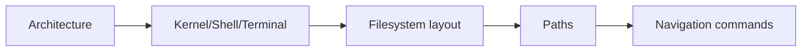

# Module 02 — Linux Basics

## What You Will Learn

- How Linux is structured internally (architecture).
- The difference between **kernel**, **shell**, and **terminal**.
- How the **Linux filesystem** is organized.
- **Absolute vs relative paths**.
- Core **navigation commands** to move around confidently.

## Why This Module Matters

These are the mental models everything else depends on. Once you "see" how Linux is laid out, commands stop feeling random and start making sense.

## Real-World Use Case

When a server breaks, you need to know *where* things live: configs in `/etc`, logs in `/var/log`, binaries in `/usr/bin`. This module builds that map in your head.

## Topics Covered

| File | What It Covers |
|------|----------------|
| [linux-architecture.md](./linux-architecture.md) | Layers from hardware to apps |
| [kernel-shell-terminal.md](./kernel-shell-terminal.md) | Who does what |
| [linux-file-system-overview.md](./linux-file-system-overview.md) | The directory tree (FHS) |
| [absolute-vs-relative-path.md](./absolute-vs-relative-path.md) | How paths work |
| [basic-navigation-commands.md](./basic-navigation-commands.md) | cd, ls, pwd, tree |

## Learning Flow

## Hands-On Practice

Explore your own system: `ls /`, `cd /etc`, `cat /etc/os-release`, and map what you find to the filesystem overview.

## Common Mistakes

- Confusing the shell with the terminal (the shell runs *inside* the terminal).
- Assuming `/` (root directory) and `root` (the admin user) are the same — they're not.

## Troubleshooting

- Lost in the filesystem? Run `pwd` to see where you are, `cd ~` to go home.

## Best Practices

- Memorize the purpose of the top-level directories — it speeds up all later work.
- Use Tab completion when typing paths.

## Quick Revision

- Linux is layered: hardware → kernel → shell → apps.
- The filesystem is a single tree starting at `/`.
- Paths can be absolute (from `/`) or relative (from where you are).

## Next Module

➡️ [03 — Files & Directories](../03-files-and-directories/): create, view, search, compress.
