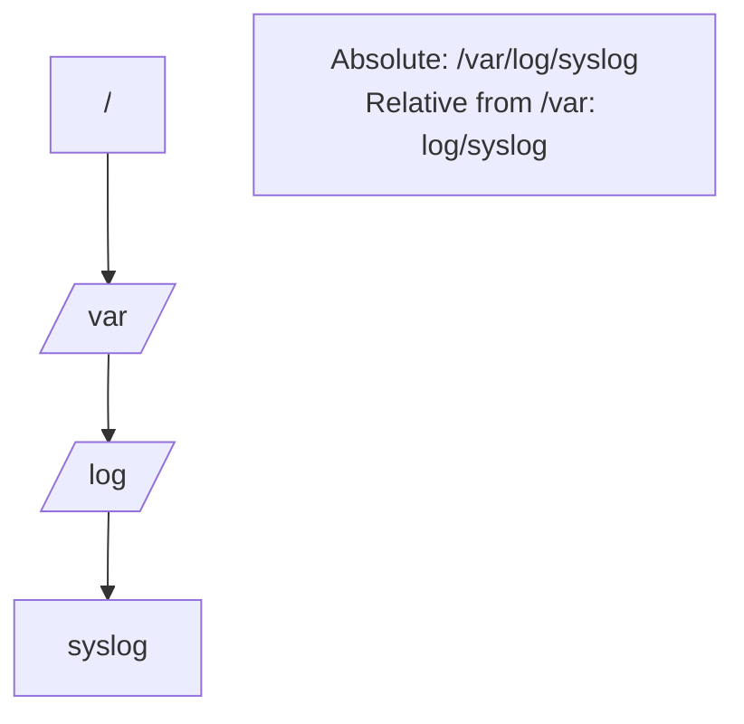

# Absolute vs Relative Paths

## 1. What Is This?

A **path** is the address of a file or directory. An **absolute path** starts from the root `/` and is complete. A **relative path** starts from your **current** location.

## 2. Why Is This Needed?

You constantly tell Linux *where* a file is. Mixing up path types causes "No such file or directory" errors. Getting this right is half of avoiding beginner mistakes.

## 3. Simple Layman Explanation

- **Absolute path** = full postal address: "123 Main St, Springfield, USA". Works from anywhere.
- **Relative path** = directions from where you stand: "two doors down on the left". Only works from your current spot.

## 4. Technical Explanation

| Symbol | Meaning |
|--------|---------|
| `/` | Root directory (start of absolute paths) |
| `.` | Current directory |
| `..` | Parent directory (one level up) |
| `~` | Your home directory (`/home/you`) |
| `-` | Previous directory (with `cd -`) |

- Absolute: `/var/log/syslog` — same meaning no matter where you are.
- Relative: `log/syslog` — only valid if you're currently in `/var`.

## 5. How It Works Under the Hood

The rule the kernel actually follows is simple: **does the path start with `/` or not?**

- If it starts with `/`, resolution begins at the **root directory** — that's an absolute path, and your location is irrelevant.
- If it doesn't, the kernel silently prepends your process's **current working directory (CWD)** and resolves from there — that's relative.

Every process has its own CWD, stored by the kernel (you can see it at `/proc/<pid>/cwd`). When you `cd`, the shell asks the kernel to change *its* CWD via the `chdir()` syscall — which is why `cd` must be a shell builtin, not a separate program: a child program changing its own directory couldn't affect the parent shell.

The special symbols are just conveniences resolved during the walk: `.` = "the current directory," `..` = "its parent" (real entries in every directory), while `~` is different — it's expanded by the **shell** into your home path *before* the kernel ever sees it. That distinction matters: because `~` is shell magic, it does **not** expand inside single quotes (`'~/file'` stays literal), a subtle bug in scripts.

So "why did my relative path fail?" almost always answers to: *my CWD wasn't what I assumed.* `pwd` shows the anchor the kernel is using.

## 6. Diagram



## 7. Real-World Examples

**1. The everyday case.** A script that uses `cd logs && rm old.txt` (relative) breaks if run from the wrong directory. A script using `/var/log/app/old.txt` (absolute) works reliably from anywhere — which is why production scripts prefer absolute paths.

**2. Same target, two ways, watching the CWD:**

```
$ pwd
/var
$ cat log/syslog | tail -1          # relative: works because CWD is /var
Jul  2 09:00:01 web-01 CRON[9]: session closed
$ cd /home/alice
$ cat log/syslog                    # same relative path, different CWD
cat: log/syslog: No such file or directory
$ cat /var/log/syslog | tail -1     # absolute: works from anywhere
Jul  2 09:00:01 web-01 CRON[9]: session closed
```

The relative path didn't "break" — your CWD moved (Section 5).

**3. War story — the backup script that deleted the wrong files.** A cron backup did `cd backups && rm -rf old/*`. It worked for months from the user's home, but when moved to run as a different user (different home, different CWD), `cd backups` silently failed, leaving the script in an unexpected directory where `rm -rf old/*` matched nothing useful — and a follow-up command ran in the wrong place. Rewriting with absolute paths (`rm -rf /srv/backups/old/*`) and adding `cd ... || exit 1` made it deterministic. Relative paths in automation are a real hazard (Modules 10–11).

## 8. Worked Walkthrough

Feel how the anchor (CWD) drives everything:

```
$ cd ~                              # ~ expands to your home
$ pwd
/home/alice
$ mkdir -p project/src && cd project/src   # relative descent
$ pwd
/home/alice/project/src
$ cd ..                             # .. = up one level
$ pwd
/home/alice/project
$ cd /etc                           # absolute jump, ignores where you were
$ pwd
/etc
$ cd -                              # toggle back to the previous dir
/home/alice/project
$ echo '~/notes.txt'                # single quotes: ~ does NOT expand
~/notes.txt
$ echo ~/notes.txt                  # unquoted: shell expands ~
/home/alice/notes.txt
```

That last pair is the `~` gotcha from Section 5 — memorable once you've seen it.

## 9. Commands

```bash
pwd                   # show current absolute path (the anchor)
cd /var/log           # absolute: go straight to /var/log
cd ..                 # relative: go up one level
cd ./scripts          # relative: into 'scripts' below here
cd ~                  # go to your home directory
cd -                  # go back to previous directory
realpath ./file       # resolve a relative path to its absolute form
```

Sample output for each (dummy values, for reference):

```text
$ pwd
/home/alice

$ cd /var/log ; pwd
/var/log

$ cd .. ; pwd
/var

$ cd ~ ; pwd
/home/alice

$ cd - 
/var

$ realpath ./notes.txt
/home/alice/notes.txt
```

## 10. Command Explanation

- `pwd` → confirms your absolute location (the anchor for relative paths).
- `cd /var/log` → absolute jump; location before it doesn't matter.
- `cd ..` → up one directory (relative).
- `cd ./scripts` → `.` means "here"; into the `scripts` subfolder.
- `cd ~` → home, regardless of current location.
- `cd -` → toggles back to where you just were.
- `realpath ./file` → prints the full absolute path a relative one resolves to — great for confirming what a script will actually touch.

## 11. In Production (DevOps Context)

- **Scripts, cron jobs, and CI steps** should use **absolute paths** (or `cd ... || exit 1` guards) because their CWD is often not what you expect — the war story is a real class of outage (Modules 10–11).
- **Dockerfiles** set an explicit `WORKDIR` precisely to make relative paths deterministic inside the image.
- **`systemd` services** run with a defined `WorkingDirectory`; forgetting it means relative paths resolve against `/`.
- Interactive work favors relative paths + Tab completion for speed; automation favors absolute for safety.

## 12. Practice Tasks

1. From your home dir, run `cd /etc` (absolute), then `pwd`.
2. Run `cd ..` and `pwd`. Where are you?
3. Run `cd ~` then `cd -` and observe the toggle.
4. `mkdir -p test/a/b`, then `cd test/a/b` (relative), `pwd`, and `realpath .`.
5. Compare `echo ~/x` vs `echo '~/x'` and explain the difference.

## 13. Common Mistakes

- Forgetting the leading `/` when you meant an absolute path.
- Assuming a relative path works from anywhere — it depends on your CWD (Section 5).
- Using `~` inside single quotes in scripts (it won't expand).
- Relying on relative paths in cron/CI where the CWD isn't your home.

## 14. Troubleshooting

- **"No such file or directory"** → run `pwd`; your relative path may be wrong for your location. Try the absolute path or `realpath`.
- **Script works by hand, fails in cron** → CWD differs; switch to absolute paths.
- **Unsure where you are?** Always `pwd` first.

## 15. Best Practices

- In **scripts**, prefer **absolute paths** for reliability; guard any `cd` with `|| exit 1`.
- Interactively, relative paths + Tab completion are faster.
- Use `~` for home instead of typing `/home/you` (but not inside single quotes).

## 16. Connects To

- **Prev:** [Linux Filesystem Overview](linux-file-system-overview.md). **Next:** [Basic Navigation Commands](basic-navigation-commands.md).
- **Where paths point:** [Linux Filesystem Overview](linux-file-system-overview.md).
- **Absolute paths in scripts:** [Shell Script Basics](../10-shell-scripting/shell-script-basics.md), [Cron Troubleshooting](../11-automation-and-cron/cron-troubleshooting.md).

## 17. Quick Recap

- Absolute = starts with `/`, works anywhere. Relative = resolved against your CWD.
- The kernel decides by the leading `/`; `cd` changes the shell's CWD via `chdir()`.
- `.` = here, `..` = up, `~` = home (shell-expanded, not in single quotes), `-` = previous.
- Scripts should use absolute paths.

## 18. References

- `man cd` (bash builtin), `man pwd`, `man realpath`
- GNU Coreutils: https://www.gnu.org/software/coreutils/manual/

<!-- NAV-FOOTER -->

---

### 🧭 Navigation

| Previous | Up | Next |
|:---|:---:|---:|
| ⬅️ Prev: [Linux Filesystem Overview](linux-file-system-overview.md) | ⬆️ Module: [Module 02 — Linux Basics](README.md) | ➡️ Next: [Basic Navigation Commands](basic-navigation-commands.md) |
