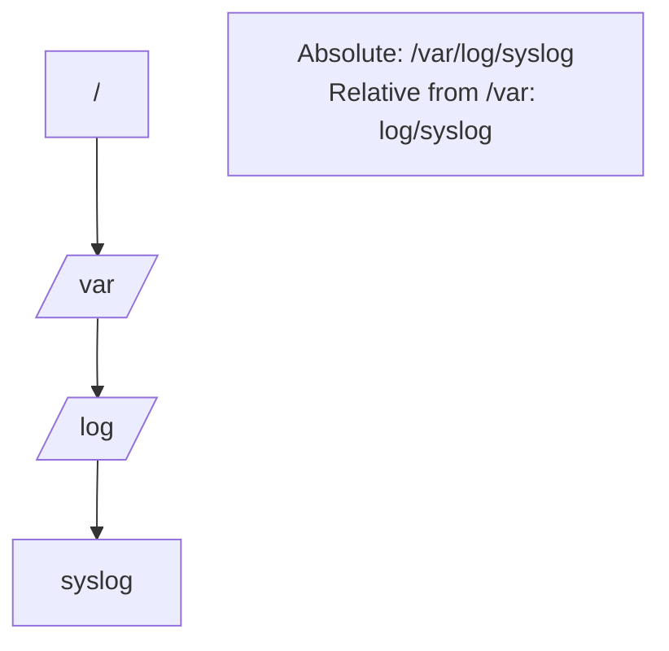

# Absolute vs Relative Paths

## 1. What Is This?

A **path** is the address of a file or directory. An **absolute path** starts from the root `/` and is complete. A **relative path** starts from your **current** location.

## 2. Why Is This Needed?

You constantly tell Linux *where* a file is. Mixing up path types causes "No such file or directory" errors. Getting this right is half of avoiding beginner mistakes.

## 3. Simple Layman Explanation

- **Absolute path** = full postal address: "123 Main St, Springfield, USA". Works from anywhere.
- **Relative path** = directions from where you stand: "two doors down on the left". Only works from your current spot.

## 4. Technical Explanation

| Symbol | Meaning |
|--------|---------|
| `/` | Root directory (start of absolute paths) |
| `.` | Current directory |
| `..` | Parent directory (one level up) |
| `~` | Your home directory (`/home/you`) |
| `-` | Previous directory (with `cd -`) |

- Absolute: `/var/log/syslog` — same meaning no matter where you are.
- Relative: `log/syslog` — only valid if you're currently in `/var`.

## 5. Real-World Example

A script that uses `cd logs && rm old.txt` (relative) breaks if run from the wrong directory. A script using `/var/log/app/old.txt` (absolute) works reliably from anywhere — which is why production scripts prefer absolute paths.

## 6. Diagram



## 7. Commands

```bash
pwd                   # show current absolute path
cd /var/log           # absolute: go straight to /var/log
cd ..                 # relative: go up one level
cd ./scripts          # relative: into 'scripts' below here
cd ~                  # go to your home directory
cd -                  # go back to previous directory
```

## 8. Command Explanation

- `pwd` → confirms your absolute location (the anchor for relative paths).
- `cd /var/log` → absolute jump.
- `cd ..` → up one directory (relative).
- `cd ./scripts` → `.` means "here"; into the `scripts` subfolder.
- `cd ~` → home, regardless of current location.
- `cd -` → toggles back to where you just were.

## 9. Practice Tasks

1. From your home dir, run `cd /etc` (absolute), then `pwd`.
2. Run `cd ..` and `pwd`. Where are you?
3. Run `cd ~` then `cd -` and observe the toggle.
4. Create `mkdir -p test/a/b`, then `cd test/a/b` (relative) and `pwd`.

## 10. Common Mistakes

- Forgetting the leading `/` when you meant an absolute path.
- Assuming a relative path works from anywhere — it doesn't.
- Using `~` inside single quotes in scripts (it won't expand).

## 11. Troubleshooting

- **"No such file or directory"** → run `pwd`; your relative path may be wrong for your location. Try the absolute path.
- Unsure where you are? Always `pwd` first.

## 12. Best Practices

- In **scripts**, prefer **absolute paths** for reliability.
- Interactively, relative paths + Tab completion are faster.
- Use `~` for home instead of typing `/home/you`.

## 13. Quick Recap

- Absolute = from `/`, works anywhere. Relative = from current dir.
- `.` = here, `..` = up, `~` = home, `-` = previous.
- Scripts should use absolute paths.

## 14. References

- `man cd` (bash builtin), `man pwd`
- GNU Coreutils: https://www.gnu.org/software/coreutils/manual/
