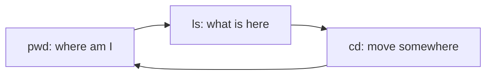

# Basic Navigation Commands

## 1. What Is This?

The handful of commands you use to **move around** and **see** the Linux filesystem: `pwd`, `ls`, `cd`, and helpers like `tree`.

## 2. Why Is This Needed?

Every task starts with "where am I and what's here?" These commands are the ones you'll type most — thousands of times in your career.

## 3. Simple Layman Explanation

Navigation is like **walking through a building**: `pwd` tells you which room you're in, `ls` shows what's in the room, and `cd` walks you to another room.

## 4. Technical Explanation

| Command | Job |
|---------|-----|
| `pwd` | Print current directory |
| `ls` | List directory contents |
| `cd` | Change directory |
| `tree` | Show directory structure as a tree |

`ls` has many flags that change *what* and *how* it shows files.

## 5. How It Works Under the Hood

These commands feel trivial, but two facts explain their behavior:

- **`cd` is a shell builtin, not a program.** If `cd` were a separate executable, it would run as a *child* process, change *its own* current directory, then exit — leaving your shell exactly where it was. So the shell itself must handle `cd`, calling the `chdir()` syscall to move its own working directory. That's why `which cd` finds nothing and why you can't "pipe into" `cd`.
- **`ls` reads the directory as data.** A directory is really a file listing names → inode numbers (see [Linux Filesystem Overview](linux-file-system-overview.md)). Plain `ls` asks the kernel for those names. `ls -l` goes further: for *each* name it makes a `stat()` syscall to fetch the inode's metadata — permissions, owner, size, timestamps — which is why `ls -l` on a huge directory is noticeably slower than plain `ls`. Hidden files (starting with `.`) aren't special to the kernel; `ls` merely *chooses* to skip them unless you pass `-a`. That's the whole "where are my dotfiles?" mystery.

Knowing this, the flags stop being magic incantations: `-l` = "also stat each entry," `-a` = "don't hide dot-entries," `-t` = "sort by the mtime you already fetched," `-h` = "print those sizes in K/M/G."

## 6. Diagram



## 7. Real-World Examples

**1. The everyday case.** Logging into a new server, you immediately run `pwd` (where am I), `ls -lah` (what's here, including hidden files and sizes), and `cd /var/log` to investigate logs.

**2. `ls -lt` to find what just changed — the incident reflex:**

```
$ cd /var/log
$ ls -lt | head -4
total 4820
-rw-r----- 1 syslog adm   1240055 Jul  2 09:14 syslog     # newest = most active right now
-rw-r--r-- 1 root   root   882101 Jul  2 09:02 nginx
-rw-r----- 1 syslog adm    40213  Jul  1 23:59 auth.log
```

During an incident, "what changed most recently?" is `ls -lt` — the freshest file is usually where the action is.

**3. War story — "the config isn't there" (but it was).** A junior engineer swore an app had no config in its directory: `ls` showed only a binary. A senior ran `ls -a` and revealed `.env` and `.apprc` — dotfiles, hidden by default (Section 5). The config was there all along; `ls` just hides dot-entries unless asked. Now `ls -la` is their reflex on any "missing file" report.

## 8. Worked Walkthrough

Inspect a directory the way you would on a real server:

```
$ pwd
/home/alice
$ ls
Documents  app  notes.txt              # plain: names only, no hidden files
$ ls -a
.  ..  .bashrc  .ssh  Documents  app  notes.txt   # -a reveals dotfiles
$ ls -lah
drwxr-xr-x 5 alice alice 4.0K Jul  2 09:00 .
drwxr-xr-x 3 root  root  4.0K Jul  1 08:00 ..
-rw-r--r-- 1 alice alice 3.5K Jun 30 21:10 .bashrc
drwx------ 2 alice alice 4.0K Jun 30 21:10 .ssh
-rw-r--r-- 1 alice alice 1.2K Jul  2 08:55 notes.txt
$ ls -lt | head -2                     # sort by time, newest first
-rw-r--r-- 1 alice alice 1.2K Jul  2 08:55 notes.txt
drwxr-xr-x 2 alice alice 4.0K Jul  2 08:40 app
```

Read the `.ssh` line: `drwx------` means only you can enter it — a permissions preview (Module 04). Each column came from a `stat()` the `-l` flag triggered (Section 5).

## 9. Commands

```bash
pwd                 # print working directory
ls                  # list files
ls -l               # long format (permissions, owner, size, date)
ls -a               # show hidden files (starting with .)
ls -lah             # long + all + human-readable sizes
ls -lt              # sort by modification time, newest first
cd /etc             # go to /etc
cd                  # go home (same as cd ~)
cd ..               # up one level
tree -L 2           # tree, 2 levels deep
```

Sample output for each (dummy values, for reference):

```text
$ pwd
/home/alice

$ ls
Documents  app  notes.txt

$ ls -lah
total 28K
drwxr-xr-x 5 alice alice 4.0K Jun 28 10:00 .
drwxr-xr-x 3 root  root  4.0K Jun 28 09:00 ..
-rw-r--r-- 1 alice alice 3.5K Jun 28 09:55 .bashrc
-rw-r--r-- 1 alice alice 1.2K Jun 28 09:55 notes.txt

$ ls -lt | head -3
total 28K
-rw-r--r-- 1 alice alice 1.2K Jun 28 09:55 notes.txt
drwxr-xr-x 2 alice alice 4.0K Jun 28 09:40 app

$ tree -L 2 ~
/home/alice
├── Documents
│   └── resume.pdf
└── app
    └── main.py
```

## 10. Command Explanation

- `ls -l` → long listing: type, permissions, links, owner, group, size, date, name (each line needs a `stat()`).
- `ls -a` → includes hidden dotfiles like `.bashrc`.
- `ls -h` → human-readable sizes (K/M/G) — combine as `-lah`.
- `ls -lt` → sorts by time so the newest files are on top (great for finding recent logs).
- `cd` with no argument → returns to your home directory.
- `tree -L 2` → visual structure limited to 2 levels (install with `apt install tree` if missing).

## 11. In Production (DevOps Context)

- `ls -lt /var/log` (or on an app's dir) is a first-response reflex during incidents: **what changed just now?** (Module 09).
- `ls -la` reveals hidden config (`.env`, `.git`, `.dockerignore`) that deploys and CI depend on — hidden files cause real "works locally, not in CI" bugs.
- On headless servers these three commands are how you orient before touching anything — the equivalent of looking around a room before acting.
- Reading the permissions column from `ls -l` is the entry point to diagnosing "Permission denied" (Module 04).

## 12. Practice Tasks

1. Run `pwd`, then `ls -lah` in your home directory and find your dotfiles.
2. `cd /etc`, run `ls -lt | head` to see recently changed configs.
3. Install `tree` and run `tree -L 2 ~`.
4. Use `cd ..` repeatedly until you reach `/`, checking with `pwd`.

## 13. Common Mistakes

- Forgetting `-a`, then wondering where hidden config files are (the war story).
- Misreading the first column of `ls -l` (that's permissions — Module 04).
- Typing `cd` to a file instead of a directory → "Not a directory".
- Expecting `cd` inside a script/subshell to change the parent shell's directory (it can't — Section 5).

## 14. Troubleshooting

- **`ls: cannot access`** → the path doesn't exist; check spelling with Tab completion.
- **`cd: not a directory`** → you targeted a file; `cd` only enters directories.
- **"File is missing" but it isn't** → try `ls -a`; it may be a dotfile.
- **`tree: command not found`** → install it (`sudo apt install tree`).

## 15. Best Practices

- Make `ls -lah` your default inspection command.
- Use `ls -lt` to quickly find recently changed files (useful in incidents).
- Combine with Tab completion to avoid typos.

## 16. Connects To

- **Prev:** [Absolute vs Relative Paths](absolute-vs-relative-path.md). **Next:** [Module 03 — Files & Directories](../03-files-and-directories/README.md).
- **Where you're navigating:** [Linux Filesystem Overview](linux-file-system-overview.md).
- **Reading the `ls -l` columns:** [File Permissions](../04-users-groups-permissions/file-permissions.md).
- **Finding recent files in incidents:** [CPU/Memory/Disk Checks](../09-logs-monitoring-troubleshooting/cpu-memory-disk-checks.md).
- **Quick lookup:** [Basic Commands Cheatsheet](../16-cheatsheets/basic-commands-cheatsheet.md).

## 17. Quick Recap

- `pwd` = where, `ls` = what's here, `cd` = move.
- `cd` is a shell builtin (uses `chdir()`); `ls -l` runs a `stat()` per entry; `-a` unhides dotfiles.
- `ls -lah` shows everything clearly; `ls -lt` sorts by time (incident reflex).
- `tree` visualizes structure.

## 18. References

- GNU Coreutils (ls): https://www.gnu.org/software/coreutils/manual/
- `man ls`, `man cd`, `man tree`

<!-- NAV-FOOTER -->

---

### 🧭 Navigation

| Previous | Up | Next |
|:---|:---:|---:|
| ⬅️ Prev: [Absolute vs Relative Paths](absolute-vs-relative-path.md) | ⬆️ Module: [Module 02 — Linux Basics](README.md) | ➡️ Next: [Module 03 — Files & Directories](../03-files-and-directories/README.md) |
