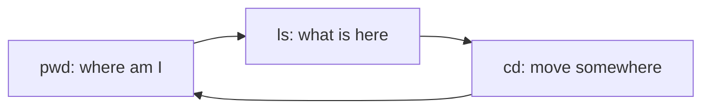

# Basic Navigation Commands

## 1. What Is This?

The handful of commands you use to **move around** and **see** the Linux filesystem: `pwd`, `ls`, `cd`, and helpers like `tree`.

## 2. Why Is This Needed?

Every task starts with "where am I and what's here?" These commands are the ones you'll type most — thousands of times in your career.

## 3. Simple Layman Explanation

Navigation is like **walking through a building**: `pwd` tells you which room you're in, `ls` shows what's in the room, and `cd` walks you to another room.

## 4. Technical Explanation

| Command | Job |
|---------|-----|
| `pwd` | Print current directory |
| `ls` | List directory contents |
| `cd` | Change directory |
| `tree` | Show directory structure as a tree |

`ls` has many flags that change *what* and *how* it shows files.

## 5. Real-World Example

Logging into a new server, you immediately run `pwd` (where am I), `ls -lah` (what's here, including hidden files and sizes), and `cd /var/log` to investigate logs.

## 6. Diagram



## 7. Commands

```bash
pwd                 # print working directory
ls                  # list files
ls -l               # long format (permissions, owner, size, date)
ls -a               # show hidden files (starting with .)
ls -lah             # long + all + human-readable sizes
ls -lt              # sort by modification time, newest first
cd /etc             # go to /etc
cd                  # go home (same as cd ~)
cd ..               # up one level
tree -L 2           # tree, 2 levels deep
```

## 8. Command Explanation

- `ls -l` → long listing: type, permissions, links, owner, group, size, date, name.
- `ls -a` → includes hidden dotfiles like `.bashrc`.
- `ls -h` → human-readable sizes (K/M/G) — combine as `-lah`.
- `ls -lt` → sorts by time so the newest files are on top (great for finding recent logs).
- `cd` with no argument → returns to your home directory.
- `tree -L 2` → visual structure limited to 2 levels (install with `apt install tree` if missing).

Expected `ls -lah` output:

```
drwxr-xr-x  2 alice alice 4.0K Jun 28 10:00 .
-rw-r--r--  1 alice alice  1.2K Jun 28 09:55 notes.txt
```

## 9. Practice Tasks

1. Run `pwd`, then `ls -lah` in your home directory.
2. `cd /etc`, run `ls -lt | head` to see recently changed configs.
3. Install `tree` and run `tree -L 2 ~`.
4. Use `cd ..` repeatedly until you reach `/`, checking with `pwd`.

## 10. Common Mistakes

- Forgetting `-a`, then wondering where hidden config files are.
- Misreading the first column of `ls -l` (that's permissions — Module 04).
- Typing `cd` to a file instead of a directory → "Not a directory".

## 11. Troubleshooting

- **`ls: cannot access`** → the path doesn't exist; check spelling with Tab completion.
- **`cd: not a directory`** → you targeted a file; `cd` only enters directories.
- **`tree: command not found`** → install it (`sudo apt install tree`).

## 12. Best Practices

- Make `ls -lah` your default inspection command.
- Use `ls -lt` to quickly find recently changed files (useful in incidents).
- Combine with Tab completion to avoid typos.

## 13. Quick Recap

- `pwd` = where, `ls` = what's here, `cd` = move.
- `ls -lah` shows everything clearly; `ls -lt` sorts by time.
- `tree` visualizes structure.

## 14. References

- GNU Coreutils (ls): https://www.gnu.org/software/coreutils/manual/
- `man ls`, `man cd`, `man tree`
