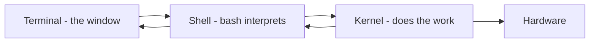

# Kernel, Shell, and Terminal

## 1. What Is This?

Three words beginners constantly mix up:
- **Kernel** — the core of the OS that controls hardware.
- **Shell** — the program that interprets your typed commands.
- **Terminal** — the window/app that displays the shell.

## 2. Why Is This Needed?

Using these terms correctly makes documentation, error messages, and interviews far easier. They describe three different things doing three different jobs.

## 3. Simple Layman Explanation

- **Terminal** = the phone handset (the device you hold).
- **Shell** = the language you speak into it.
- **Kernel** = the person on the other end who actually does the work.

You speak (shell) into the handset (terminal), and the worker (kernel) acts.

## 4. Technical Explanation

| Term | What It Is | Example |
|------|-----------|---------|
| Kernel | Core software managing CPU, memory, devices | Linux kernel 6.x |
| Shell | Command interpreter that parses & runs commands | bash, zsh, sh |
| Terminal | Text I/O application hosting the shell | GNOME Terminal, Windows Terminal, PuTTY |

Flow: you type into the **terminal** → the **shell** interprets it → it asks the **kernel** to do the work → results come back to the terminal.

## 5. How It Works Under the Hood

These three are genuinely separate programs, and you can prove it — which is the fastest way to stop confusing them:

- **The terminal** is a program whose only job is drawing text and capturing keystrokes. It doesn't understand `ls` at all. It provides a **pseudo-terminal (pty)** — a virtual wire — and hands your keystrokes to whatever program is connected to the other end. Historically this was a physical teletype; today it's an app window or an SSH session.
- **The shell** (bash) is the program usually sitting at the other end of that wire. *It* is what understands commands: it reads your line, expands variables/wildcards, finds the program on `PATH`, and asks the kernel to run it (`fork` + `exec`). Swap bash for zsh and the *language* changes while the terminal stays identical.
- **The kernel** does the actual work the shell requests — creating the process, giving it CPU time and memory, opening files, sending network packets — because only the kernel can touch hardware (see [Linux Architecture](linux-architecture.md)).

So they're independent: you can run the *same* shell inside many terminals (GNOME Terminal, tmux, PuTTY over SSH), and run *different* shells inside the *same* terminal. `ps -p $$` shows the shell process; the terminal is its parent; the kernel is what schedules them both. Three programs, three jobs — not one blurry thing.

## 6. Diagram



## 7. Real-World Examples

**1. The everyday case.** You SSH into a server (terminal = your SSH client), type `systemctl restart nginx` (shell = bash interprets it), and the kernel actually stops/starts the process and reassigns resources.

**2. Proving all three are distinct:**

```
$ ps -p $$ -o pid,comm
    PID COMMAND
   4821 bash                 # the SHELL you're typing into
$ ps -o comm= -p $(ps -o ppid= -p $$)
gnome-terminal-             # its parent: the TERMINAL program
$ uname -r
5.15.0-105-generic          # the KERNEL, a separate thing entirely
```

Three different names for three different programs — exactly Section 5.

**3. War story — "my script works but the cron job doesn't."** A deploy script ran perfectly when typed by hand but silently failed under cron. The cause: interactively the user's **shell** was bash, but cron ran the script with `/bin/sh` (a more minimal shell), and a bash-only feature (`[[ ]]`) wasn't understood. The *terminal* and *kernel* were irrelevant — it was purely a shell mismatch. The fix: add `#!/bin/bash` and check `echo $0`/`$SHELL`. Knowing shell ≠ terminal ≠ kernel located the bug in seconds (Module 11 covers cron environments).

## 8. Worked Walkthrough

Experience the independence yourself:

```
$ echo $SHELL
/bin/bash                        # your default login shell
$ cat /etc/shells
/bin/sh
/bin/bash
/usr/bin/zsh                     # other shells installed on this system
$ ps -p $$ -o comm=
bash
$ sh                             # start a DIFFERENT shell in the SAME terminal
$ ps -p $$ -o comm=
sh                               # same window, different shell now
$ echo "still the same terminal window, different language"
still the same terminal window, different language
$ exit                          # leave the sub-shell, back to bash
$ ps -p $$ -o comm=
bash
```

You never changed terminals or rebooted the kernel — you just swapped the *shell* program at the end of the wire. That's the whole distinction, demonstrated.

## 9. Commands

```bash
echo $SHELL        # your current shell path
cat /etc/shells    # list of valid shells on the system
ps -p $$ -o comm=  # the shell process you're in ($$ = its PID)
echo $0            # name of the running shell (handy in scripts)
uname -r           # kernel version (the kernel itself)
```

Sample output for each (dummy values, for reference):

```text
$ echo $SHELL
/bin/bash

$ cat /etc/shells
# /etc/shells: valid login shells
/bin/sh
/bin/bash
/usr/bin/zsh

$ ps -p $$ -o comm=
bash

$ echo $0
-bash

$ uname -r
5.15.0-105-generic
```

## 10. Command Explanation

- `echo $SHELL` → shows your login shell, e.g., `/bin/bash`.
- `cat /etc/shells` → standard file listing installed shells.
- `ps -p $$ -o comm=` → `$$` is the current shell's PID; shows which shell process is running.
- `echo $0` → the name the current shell was invoked as — the quickest "which shell am I in *right now*?" check (differs from `$SHELL` after you switch).
- `uname -r` → the kernel release — proof the kernel is a separate thing from the shell.

## 11. In Production (DevOps Context)

- **Scripts must declare their shell** with a shebang (`#!/bin/bash`) because the runtime shell may be `sh`, not bash — the war story's root cause and a classic CI/cron bug (Modules 10–11).
- **Terminal multiplexers** (`tmux`, `screen`) keep a shell alive on a server after you disconnect — essential for long remote jobs.
- **SSH** is just a terminal-over-the-network feeding a remote shell; the kernel doing the work is on the server, not your laptop.
- Kernel upgrades are decoupled from shell/tooling — you patch the kernel (`uname -r` changes) without changing how you type commands.

## 12. Practice Tasks

1. Run `echo $SHELL`, `cat /etc/shells`, and `ps -p $$ -o comm=`.
2. Start `sh`, run `ps -p $$ -o comm=` again, note the change, then `exit`.
3. Compare `echo $SHELL` (login shell) vs `echo $0` (current shell) after switching.
4. Explain, in your own words, how terminal, shell, and kernel differ.

## 13. Common Mistakes

- Saying "open the kernel" when you mean "open the terminal".
- Thinking changing the terminal app changes the shell — they're independent (Section 8).
- Assuming your interactive shell is what scripts/cron use (declare it with a shebang).

## 14. Troubleshooting

- **Commands behave oddly / script syntax errors?** You might be in `sh`, not bash. Check `echo $0`.
- **Want bash but got something else?** Run `bash` to switch, or change your default shell with `chsh`.
- **Script works by hand, fails in cron/CI?** Shell mismatch — add `#!/bin/bash` (Module 11).

## 15. Best Practices

- For learning and scripting, stick with **bash** unless told otherwise.
- Always put a shebang (`#!/bin/bash`) at the top of scripts.
- Know which shell you're in before debugging script issues.

## 16. Connects To

- **Prev:** [Linux Architecture](linux-architecture.md). **Next:** [Linux Filesystem Overview](linux-file-system-overview.md).
- **The terminal in practice:** [Terminal Basics](../01-linux-setup/terminal-basics.md).
- **Shells & shebangs:** [Shell Script Basics](../10-shell-scripting/shell-script-basics.md).
- **Cron shell gotchas:** [Cron Troubleshooting](../11-automation-and-cron/cron-troubleshooting.md).

## 17. Quick Recap

- Kernel = core that controls hardware; Shell = interprets your commands (bash); Terminal = the window hosting the shell.
- They're three independent programs — same shell in many terminals, different shells in one terminal.
- `ps -p $$` shows the shell; `echo $0` shows the current shell name; `uname -r` shows the kernel.

## 18. References

- GNU Bash: https://www.gnu.org/software/bash/manual/
- `man bash`, `man chsh`, `man pty`

<!-- NAV-FOOTER -->

---

### 🧭 Navigation

| Previous | Up | Next |
|:---|:---:|---:|
| ⬅️ Prev: [Linux Architecture](linux-architecture.md) | ⬆️ Module: [Module 02 — Linux Basics](README.md) | ➡️ Next: [Linux Filesystem Overview](linux-file-system-overview.md) |
