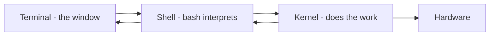

# Kernel, Shell, and Terminal

## 1. What Is This?

Three words beginners constantly mix up:
- **Kernel** — the core of the OS that controls hardware.
- **Shell** — the program that interprets your typed commands.
- **Terminal** — the window/app that displays the shell.

## 2. Why Is This Needed?

Using these terms correctly makes documentation, error messages, and interviews far easier. They describe three different things doing three different jobs.

## 3. Simple Layman Explanation

- **Terminal** = the phone handset (the device you hold).
- **Shell** = the language you speak into it.
- **Kernel** = the person on the other end who actually does the work.

You speak (shell) into the handset (terminal), and the worker (kernel) acts.

## 4. Technical Explanation

| Term | What It Is | Example |
|------|-----------|---------|
| Kernel | Core software managing CPU, memory, devices | Linux kernel 6.x |
| Shell | Command interpreter that parses & runs commands | bash, zsh, sh |
| Terminal | Text I/O application hosting the shell | GNOME Terminal, Windows Terminal, PuTTY |

Flow: you type into the **terminal** → the **shell** interprets it → it asks the **kernel** to do the work → results come back to the terminal.

## 5. Real-World Example

You SSH into a server (terminal = your SSH client), type `systemctl restart nginx` (shell = bash interprets it), and the kernel actually stops/starts the process and reassigns resources.

## 6. Diagram



## 7. Commands

```bash
echo $SHELL        # your current shell path
cat /etc/shells    # list of valid shells on the system
ps -p $$           # the shell process you're in
uname -r           # kernel version (the kernel itself)
```

## 8. Command Explanation

- `echo $SHELL` → shows your login shell, e.g., `/bin/bash`.
- `cat /etc/shells` → standard file listing installed shells.
- `ps -p $$` → `$$` is the current shell's process ID; this shows which shell process is running.
- `uname -r` → the kernel release — proof the kernel is a separate thing from the shell.

## 9. Practice Tasks

1. Run `echo $SHELL` and `cat /etc/shells`.
2. Run `ps -p $$` and note the shell name.
3. Explain in your own words how terminal, shell, and kernel differ.

## 10. Common Mistakes

- Saying "open the kernel" when you mean "open the terminal".
- Thinking changing the terminal app changes the shell — they're independent.

## 11. Troubleshooting

- Commands behave oddly? You might be in a different shell (`sh` vs `bash`). Check `echo $SHELL`.
- Want bash but got something else? Run `bash` to switch, or change your default shell with `chsh`.

## 12. Best Practices

- For learning and scripting, stick with **bash** unless told otherwise.
- Know which shell you're in before debugging script issues.

## 13. Quick Recap

- Kernel = core that controls hardware.
- Shell = interprets your commands (bash).
- Terminal = the window the shell runs in.

## 14. References

- GNU Bash: https://www.gnu.org/software/bash/manual/
- `man bash`, `man chsh`
