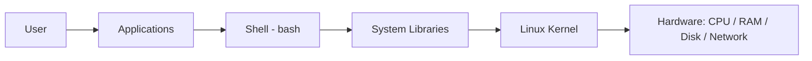
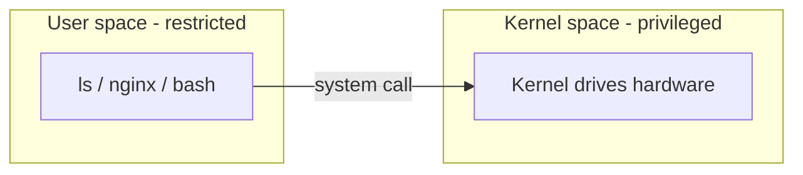

# Linux Architecture

## 1. What Is This?

Linux architecture is the **layered structure** of the operating system — from physical hardware at the bottom, up through the kernel, system libraries, the shell, and finally the applications you use.

## 2. Why Is This Needed?

Understanding the layers tells you *where a problem lives*. Is it the app, the shell, the kernel, or the hardware? This map makes troubleshooting logical instead of guesswork.

## 3. Simple Layman Explanation

Think of a **company**:
- **Hardware** = the building and equipment.
- **Kernel** = the operations manager who controls all resources.
- **Shell** = the receptionist who takes your requests and passes them on.
- **Applications** = the employees doing visible work.

You talk to the receptionist (shell); they relay to the manager (kernel); the manager uses the building (hardware).

## 4. Technical Explanation

| Layer | Role |
|-------|------|
| Hardware | CPU, RAM, disk, network — the physical machine |
| Kernel | Manages processes, memory, devices, filesystems; exposes **system calls** |
| System libraries | (e.g., glibc) reusable code apps use to make system calls |
| Shell | Command interpreter (bash) that runs your commands |
| Applications | Programs you run (nginx, python, ls) |

Applications rarely talk to hardware directly; they ask the kernel via system calls.

## 5. How It Works Under the Hood

The single most important boundary in the whole stack is the line between **user space** and **kernel space**:

- Everything above the kernel — your shell, `ls`, nginx, Python — runs in **user space**, a restricted mode where a program *cannot* touch hardware, other programs' memory, or the disk directly. If it tries, the CPU blocks it.
- The **kernel** runs in **kernel space**, a privileged mode with full hardware access.
- The only legal doorway between them is a **system call** (`open`, `read`, `write`, `fork`, ...). When `ls` wants to list a directory, it doesn't read the disk — it asks the kernel via the `getdents`/`read` syscalls, and the kernel (which alone can drive the disk) returns the data.

Why the layers in between? **System libraries** (like glibc) wrap those raw syscalls in friendly functions so app authors don't hand-code CPU instructions — that's what `ldd` reveals. The **shell** is just another user-space program whose special job is launching other programs.

This boundary is *why* Linux is stable and multi-user: a buggy app can crash itself but can't corrupt the kernel or another user's memory, because it never had direct access. And it's why "which layer?" is the fastest troubleshooting question — a config typo lives in the app layer, a missing `.so` in the library layer, a dead disk in hardware, and each has a different fix.

## 6. Diagram





## 7. Real-World Examples

**1. The everyday case.** When you run a Python web app: Python (application) asks the kernel (via libraries/system calls) to open a network port; the kernel uses the network card (hardware) to send data. Each layer does its job.

**2. Seeing the layers on a real system:**

```
$ echo $SHELL
/bin/bash                          # shell layer
$ ldd /bin/ls | head -3
    linux-vdso.so.1
    libc.so.6 => /lib/x86_64-linux-gnu/libc.so.6    # library layer (glibc)
$ uname -r
5.15.0-105-generic                 # kernel layer
$ grep -m1 'model name' /proc/cpuinfo
model name : Intel(R) Xeon(R) ...  # hardware, reported by the kernel via /proc
```

Four commands, four different layers — each one is separately inspectable.

**3. War story — the "app crash" that was a library.** A deployed Go/Python service suddenly failed to start after a base-image change, with `error while loading shared libraries: libssl.so.1.1: cannot open shared object file`. Engineers first blamed the application code. But the layer was the giveaway: it's a *library* error, not an app-logic error — a required shared library was missing from the new image (Section 5's library layer). The fix was installing the package that provides it (Module 06), not touching a single line of app code. Naming the layer pointed straight at the fix.

## 8. Worked Walkthrough

Trace a single `ls` command down through the architecture, then verify each layer:

```
$ ps -p $$ -o comm=
bash                               # 1. You're in the SHELL (a user-space program)

$ type ls
ls is /usr/bin/ls                  # 2. The shell found the APPLICATION on PATH

$ ldd /usr/bin/ls
    libc.so.6 => /lib/x86_64-linux-gnu/libc.so.6   # 3. It uses LIBRARIES to make syscalls

$ strace -e trace=openat,getdents64 ls / 2>&1 | head -4
openat(AT_FDCWD, "/", O_RDONLY|O_DIRECTORY...) = 3
getdents64(3, ...)                 # 4. Libraries issue SYSCALLS; the KERNEL reads the disk
```

(`strace` shows the actual system calls a program makes — the doorway into kernel space. Install it with `sudo apt install strace` if needed.) You've now watched one command pass shell → app → library → syscall → kernel → hardware.

## 9. Commands

```bash
uname -r          # kernel version (the kernel layer)
ldd /bin/ls       # libraries that 'ls' depends on (library layer)
echo $SHELL       # which shell you're using (shell layer)
ps -p $$ -o comm= # the shell process you're actually in
cat /proc/cpuinfo # hardware: CPU details (reported by the kernel)
```

Sample output for each (dummy values, for reference):

```text
$ uname -r
5.15.0-105-generic

$ ldd /bin/ls
    linux-vdso.so.1 (0x00007fff...)
    libc.so.6 => /lib/x86_64-linux-gnu/libc.so.6 (0x00007f...)
    /lib64/ld-linux-x86-64.so.2 (0x00007f...)

$ echo $SHELL
/bin/bash

$ ps -p $$ -o comm=
bash

$ cat /proc/cpuinfo | grep -m1 'model name'
model name : Intel(R) Xeon(R) Platinum 8259CL CPU @ 2.50GHz
```

## 10. Command Explanation

- `uname -r` → the running kernel's version (`-r` = release).
- `ldd /bin/ls` → lists shared libraries a program needs — shows the library layer.
- `echo $SHELL` → prints the path of your login shell (e.g., `/bin/bash`).
- `ps -p $$ -o comm=` → `$$` is your shell's PID; confirms which shell program is running.
- `cat /proc/cpuinfo` → `/proc` is a virtual filesystem the kernel exposes about hardware/processes.

## 11. In Production (DevOps Context)

- **Containers** package the *user-space* layers (app + libraries + shell) while sharing the host **kernel** — the whole point of Docker's efficiency (Module 13). This is why "it works in the container" depends on bundled libraries, not the kernel.
- **"Shared library not found"** errors (the war story) are a top cause of failed deploys after base-image or OS upgrades.
- **`/proc` and `/sys`** power almost every monitoring tool (`top`, `htop`, node_exporter) — they read the kernel's virtual files.
- Debugging by layer ("app? config? library? kernel? hardware?") is the mental model behind structured incident response (Module 09).

## 12. Practice Tasks

1. Find your kernel version with `uname -r`.
2. Identify your shell with `echo $SHELL` and confirm the process with `ps -p $$ -o comm=`.
3. Run `ldd /bin/ls` and notice the shared libraries.
4. (Optional) `sudo apt install strace`, then `strace ls /` and spot the syscalls crossing into the kernel.

## 13. Common Mistakes

- Thinking the shell *is* the OS. The shell is just one user-space layer that talks to the kernel.
- Believing apps control hardware directly — they go through syscalls to the kernel.
- Misreading a *library* error as an *application* error (the war story).

## 14. Troubleshooting

- **App misbehaving but hardware fine?** The issue is usually in the app or its config, not the kernel.
- **`ldd` shows "not found"?** A required library is missing — a packaging issue (Module 06).
- **Permission/hardware errors from an app?** Remember the app only asked; the kernel enforced — check permissions (Module 04) and device/mount state (Module 08).

## 15. Best Practices

- When debugging, ask "which layer?" to narrow the problem quickly.
- Don't modify kernel-level things as a beginner; focus on apps, shell, and config.
- Treat "shared library not found" as a packaging problem, not a code problem.

## 16. Connects To

- **Prev:** [Module 02 — Linux Basics](README.md). **Next:** [Kernel, Shell & Terminal](kernel-shell-terminal.md).
- **Foundation:** [What Is Linux?](../00-getting-started/what-is-linux.md).
- **The library layer & packaging:** [Module 06 — Package Management](../06-package-management/README.md).
- **Kernel sharing in containers:** [Linux for Docker](../13-real-world-linux-for-devops/linux-for-docker.md).

## 17. Quick Recap

- Layers: Hardware → Kernel → Libraries → Shell → Applications.
- User space is restricted; only **system calls** cross into privileged kernel space — the reason Linux is stable and multi-user.
- Apps ask the kernel for hardware via syscalls; libraries wrap those calls.
- Knowing the layer speeds up troubleshooting.

## 18. References

- The Linux Kernel docs: https://docs.kernel.org/
- `man 2 syscalls`, `man strace`

<!-- NAV-FOOTER -->

---

### 🧭 Navigation

| Previous | Up | Next |
|:---|:---:|---:|
| ⬅️ Prev: [Module 02 — Linux Basics](README.md) | ⬆️ Module: [Module 02 — Linux Basics](README.md) | ➡️ Next: [Kernel, Shell, and Terminal](kernel-shell-terminal.md) |
