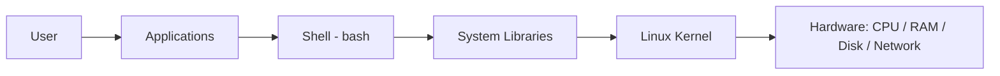

# Linux Architecture

## 1. What Is This?

Linux architecture is the **layered structure** of the operating system — from physical hardware at the bottom, up through the kernel, system libraries, the shell, and finally the applications you use.

## 2. Why Is This Needed?

Understanding the layers tells you *where a problem lives*. Is it the app, the shell, the kernel, or the hardware? This map makes troubleshooting logical instead of guesswork.

## 3. Simple Layman Explanation

Think of a **company**:
- **Hardware** = the building and equipment.
- **Kernel** = the operations manager who controls all resources.
- **Shell** = the receptionist who takes your requests and passes them on.
- **Applications** = the employees doing visible work.

You talk to the receptionist (shell); they relay to the manager (kernel); the manager uses the building (hardware).

## 4. Technical Explanation

| Layer | Role |
|-------|------|
| Hardware | CPU, RAM, disk, network — the physical machine |
| Kernel | Manages processes, memory, devices, filesystems; exposes **system calls** |
| System libraries | (e.g., glibc) reusable code apps use to make system calls |
| Shell | Command interpreter (bash) that runs your commands |
| Applications | Programs you run (nginx, python, ls) |

Applications rarely talk to hardware directly; they ask the kernel via system calls.

## 5. Real-World Example

When you run a Python web app: Python (application) asks the kernel (via libraries/system calls) to open a network port; the kernel uses the network card (hardware) to send data. Each layer does its job.

## 6. Diagram



## 7. Commands

```bash
uname -r          # kernel version
ldd /bin/ls       # libraries that 'ls' depends on
echo $SHELL       # which shell you're using
cat /proc/cpuinfo # hardware: CPU details (from the kernel)
```

## 8. Command Explanation

- `uname -r` → the running kernel's version (`-r` = release).
- `ldd /bin/ls` → lists shared libraries a program needs — shows the library layer.
- `echo $SHELL` → prints the path of your login shell (e.g., `/bin/bash`).
- `cat /proc/cpuinfo` → `/proc` is a virtual view the kernel exposes about hardware/processes.

## 9. Practice Tasks

1. Find your kernel version with `uname -r`.
2. Identify your shell with `echo $SHELL`.
3. Run `ldd /bin/ls` and notice the shared libraries.

## 10. Common Mistakes

- Thinking the shell *is* the OS. The shell is just one layer that talks to the kernel.
- Believing apps control hardware directly — they go through the kernel.

## 11. Troubleshooting

- App misbehaving but hardware fine? The issue is usually in the app or its config, not the kernel.
- `ldd` shows "not found"? A required library is missing — a packaging issue (Module 06).

## 12. Best Practices

- When debugging, ask "which layer?" to narrow the problem quickly.
- Don't modify kernel-level things as a beginner; focus on apps, shell, and config.

## 13. Quick Recap

- Layers: Hardware → Kernel → Libraries → Shell → Applications.
- Apps ask the kernel for hardware via system calls.
- Knowing the layer speeds up troubleshooting.

## 14. References

- The Linux Kernel docs: https://docs.kernel.org/
- `man 2 syscalls`

<!-- NAV-FOOTER -->

---

### 🧭 Navigation

| Previous | Up | Next |
|:---|:---:|---:|
| ⬅️ Prev: [Module 02 — Linux Basics](README.md) | ⬆️ Module: [Module 02 — Linux Basics](README.md) | ➡️ Next: [Kernel, Shell, and Terminal](kernel-shell-terminal.md) |
