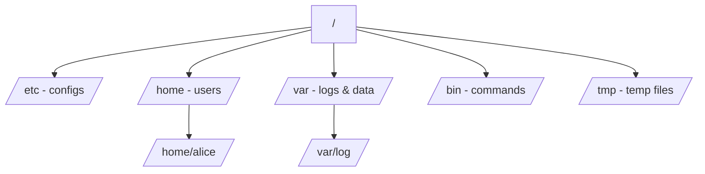

# Linux Filesystem Overview

## 1. What Is This?

The Linux filesystem is a **single tree of directories** starting at the root `/`. Unlike Windows (C:, D:), everything in Linux lives under one root. The standard layout is defined by the **Filesystem Hierarchy Standard (FHS)**.

## 2. Why Is This Needed?

Knowing where things live lets you find configs, logs, and programs instantly. "The web server config is in `/etc/nginx`" only helps if you understand `/etc`.

## 3. Simple Layman Explanation

Think of Linux as a **big filing cabinet** with one top drawer `/`. Inside are labeled folders: `etc` for settings, `home` for personal files, `var` for changing data like logs, `bin` for tools. Everything has its place.

## 4. Technical Explanation

| Directory | Purpose |
|-----------|---------|
| `/` | Root of everything |
| `/bin`, `/usr/bin` | Essential user commands (ls, cp) |
| `/sbin`, `/usr/sbin` | System/admin commands |
| `/etc` | System-wide configuration files |
| `/home` | Users' personal directories (`/home/alice`) |
| `/root` | The root user's home directory |
| `/var` | Variable data: logs (`/var/log`), spool, caches |
| `/tmp` | Temporary files (cleared on reboot) |
| `/opt` | Optional/third-party software |
| `/usr` | User programs, libraries, docs |
| `/lib`, `/usr/lib` | Shared libraries |
| `/dev` | Device files (disks, terminals) |
| `/proc`, `/sys` | Virtual views of kernel/process info |
| `/mnt`, `/media` | Mount points for external/temporary disks |
| `/boot` | Kernel and bootloader files |

## 5. How It Works Under the Hood

Two ideas make the whole tree click:

- **One tree, many disks — via "mounting".** Windows shows each disk as its own letter (C:, D:). Linux instead *grafts* every disk onto a single tree at a chosen **mount point**. Your root disk is mounted at `/`; a second disk might be mounted at `/data`; a USB stick at `/media/usb`. So `/data/file` and `/home/file` can physically live on completely different disks, yet look like one seamless tree. `df -h` shows which directory maps to which disk (Module 08).
- **Not every "file" is a real file.** `/proc` and `/sys` are **virtual filesystems** the kernel generates on the fly — reading `/proc/cpuinfo` doesn't read a disk, it asks the kernel to describe the CPU *right now*. `/dev` holds **device files**: `/dev/sda` *is* your disk as a file, `/dev/null` is a black hole that discards anything written to it. This "everything is a file" design is why the same tools (`cat`, `ls`, redirection) work on regular files, hardware, and kernel data alike.

That's the payoff of the FHS: because the layout is standardized *and* uniform, "where is the config / the logs / the disk?" has the same answer on every Linux server you'll ever touch — `/etc`, `/var/log`, `/dev`.

## 6. Diagram



## 7. Real-World Examples

**1. The everyday case.** Server slow? Check logs in `/var/log`. Need to edit the SSH config? It's `/etc/ssh/sshd_config`. A user's files? `/home/<user>`. The FHS makes any Linux server navigable.

**2. Finding your way on an unfamiliar box:**

```
$ ls /
bin  boot  dev  etc  home  lib  media  mnt  opt  proc  root  run  sbin  srv  sys  tmp  usr  var
$ ls /etc/ssh/
ssh_config  sshd_config  ssh_host_ed25519_key  ...
$ cat /proc/uptime
1043027.35 2081　　　　　　　　# kernel-generated, not a disk file
$ ls -l /dev/null
crw-rw-rw- 1 root root 1, 3 Jul  2 09:00 /dev/null   # a device file (note the 'c')
```

Configs in `/etc`, live kernel data in `/proc`, hardware as files in `/dev` — the tree in action.

**3. War story — the disk that filled but `df` said root was fine.** An app crashed with "No space left on device," yet `df -h /` showed the root disk 60% free. The catch: `/var/log` was a **separately mounted disk** (Section 5's mounting), and *that* mount was 100% full. Checking `df -h` (not just `/`) revealed the real culprit. Understanding that one tree can span many disks turned a baffling error into a two-minute fix (Module 08).

## 8. Worked Walkthrough

Explore the standard layout and confirm the "one tree, many disks" idea:

```
$ ls /
bin  boot  dev  etc  home  opt  proc  root  sys  tmp  usr  var    # top-level FHS dirs

$ ls -ld /root /home
drwx------  3 root  root  4096 Jul 1 08:00 /root      # root USER's home (locked down)
drwxr-xr-x  4 root  root  4096 Jul 1 08:00 /home      # all normal users' homes

$ df -h --output=source,target | head
Filesystem      Mounted on
/dev/nvme0n1p1  /                  # root disk mounted at /
/dev/nvme1n1    /data              # a SECOND disk grafted onto the same tree at /data

$ du -sh /var/log
412M    /var/log                   # how much the logs are using
```

Notice `/` and `/data` are *different physical disks* appearing in one tree (Section 5), and `/root` ≠ `/home` (a classic mix-up).

## 9. Commands

```bash
ls /              # see top-level directories
ls -l /etc        # list config files
ls /var/log       # see system logs
df -h             # which directories map to which disks (mounts)
du -sh /home/*    # size of each user's home
tree -L 1 /       # one-level tree of root (if 'tree' installed)
```

Sample output for each (dummy values, for reference):

```text
$ ls /
bin  boot  dev  etc  home  lib  media  mnt  opt  proc  root  run  sbin  srv  sys  tmp  usr  var

$ ls /var/log
auth.log  dpkg.log  journal  nginx  syslog

$ df -h
Filesystem      Size  Used Avail Use% Mounted on
/dev/nvme0n1p1   40G   18G   22G  46% /
/dev/nvme1n1    100G   30G   70G  31% /data

$ du -sh /home/*
1.2G    /home/alice
340M    /home/bob

$ tree -L 1 /
/
├── bin
├── etc
├── home
├── var
└── usr
```

## 10. Command Explanation

- `ls /` → lists the root directory's contents (the top folders above).
- `ls -l /etc` → long listing of configuration files.
- `ls /var/log` → where logs live (Module 09).
- `df -h` → shows each mounted filesystem and *which directory* it's attached to — the mounting concept made visible.
- `du -sh /home/*` → summarized (`-s`), human-readable (`-h`) size per home dir.
- `tree -L 1 /` → visual structure limited to 1 level deep.

## 11. In Production (DevOps Context)

- **Configuration management** (Ansible, Docker) writes to standard FHS paths — `/etc` for config, `/var/log` for logs, `/opt` or `/usr/local` for third-party apps — so tooling works across distros.
- **Containers** ship their own root tree; a `Dockerfile`'s `COPY app /opt/app` follows the same FHS conventions.
- **Separate mounts** for `/var`, `/var/log`, or `/data` are a deliberate production practice so runaway logs can't fill the root disk (the war story) — and why `df -h` (all mounts) beats `df /`.
- **`/proc` and `/sys`** are where monitoring agents read live metrics.

## 12. Practice Tasks

1. Run `ls /` and match each folder to the table in Section 4.
2. List `/var/log` and `/etc/ssh`.
3. Run `df -h` and note whether `/var` or `/home` is a separate disk from `/`.
4. Compare `ls -ld /root` and `ls -ld /home` — confirm they're different things.

## 13. Common Mistakes

- Confusing `/` (root directory) with `/root` (root user's home) — different things.
- Assuming `df /` tells the whole story when `/var/log` may be a separate, full mount (the war story).
- Creating personal files in `/` or `/etc`; use your home directory instead.
- Deleting files in `/var` or `/etc` without understanding them.

## 14. Troubleshooting

- **"Where is the config for X?"** → almost always under `/etc`.
- **"Where are the logs?"** → `/var/log` or via `journalctl` (Module 09).
- **"No space left" but `/` looks fine?** → run `df -h` for *all* mounts; a sub-mount may be full (Module 08).

## 15. Best Practices

- Keep personal/work files in `/home/<you>`.
- Never edit system files without a backup copy.
- Learn the top-level directories by heart; check `df -h` to know your disk layout on a new server.

## 16. Connects To

- **Prev:** [Kernel, Shell & Terminal](kernel-shell-terminal.md). **Next:** [Absolute vs Relative Paths](absolute-vs-relative-path.md).
- **Mounting & disks in depth:** [Disk, Partition & Mount Concepts](../08-storage-and-disk-management/disk-partition-mount-concepts.md), [df/du/lsblk](../08-storage-and-disk-management/df-du-lsblk.md).
- **Logs live in /var/log:** [Syslog & /var/log](../09-logs-monitoring-troubleshooting/syslog-and-var-log.md).
- **Configs live in /etc:** many topics across Modules 05, 07, 12.

## 17. Quick Recap

- One tree, starting at `/`; many disks are grafted on via **mount points** (not drive letters).
- `/etc` = configs, `/var/log` = logs, `/home` = users, `/bin` = commands, `/dev` = hardware-as-files, `/proc` `/sys` = live kernel data.
- The layout follows the FHS standard on every distro — so navigation skills transfer everywhere.

## 18. References

- Filesystem Hierarchy Standard: https://refspecs.linuxfoundation.org/fhs.shtml
- `man hier`

<!-- NAV-FOOTER -->

---

### 🧭 Navigation

| Previous | Up | Next |
|:---|:---:|---:|
| ⬅️ Prev: [Kernel, Shell, and Terminal](kernel-shell-terminal.md) | ⬆️ Module: [Module 02 — Linux Basics](README.md) | ➡️ Next: [Absolute vs Relative Paths](absolute-vs-relative-path.md) |
