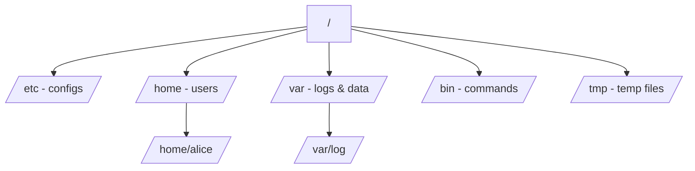

# Linux Filesystem Overview

## 1. What Is This?

The Linux filesystem is a **single tree of directories** starting at the root `/`. Unlike Windows (C:, D:), everything in Linux lives under one root. The standard layout is defined by the **Filesystem Hierarchy Standard (FHS)**.

## 2. Why Is This Needed?

Knowing where things live lets you find configs, logs, and programs instantly. "The web server config is in `/etc/nginx`" only helps if you understand `/etc`.

## 3. Simple Layman Explanation

Think of Linux as a **big filing cabinet** with one top drawer `/`. Inside are labeled folders: `etc` for settings, `home` for personal files, `var` for changing data like logs, `bin` for tools. Everything has its place.

## 4. Technical Explanation

| Directory | Purpose |
|-----------|---------|
| `/` | Root of everything |
| `/bin`, `/usr/bin` | Essential user commands (ls, cp) |
| `/sbin`, `/usr/sbin` | System/admin commands |
| `/etc` | System-wide configuration files |
| `/home` | Users' personal directories (`/home/alice`) |
| `/root` | The root user's home directory |
| `/var` | Variable data: logs (`/var/log`), spool, caches |
| `/tmp` | Temporary files (cleared on reboot) |
| `/opt` | Optional/third-party software |
| `/usr` | User programs, libraries, docs |
| `/lib`, `/usr/lib` | Shared libraries |
| `/dev` | Device files (disks, terminals) |
| `/proc`, `/sys` | Virtual views of kernel/process info |
| `/mnt`, `/media` | Mount points for external/temporary disks |
| `/boot` | Kernel and bootloader files |

## 5. Real-World Example

Server slow? Check logs in `/var/log`. Need to edit the SSH config? It's `/etc/ssh/sshd_config`. A user's files? `/home/<user>`. The FHS makes any Linux server navigable.

## 6. Diagram



## 7. Commands

```bash
ls /              # see top-level directories
ls -l /etc        # list config files
ls /var/log       # see system logs
du -sh /home/*    # size of each user's home
tree -L 1 /       # one-level tree of root (if 'tree' installed)
```

## 8. Command Explanation

- `ls /` → lists the root directory's contents (the top folders above).
- `ls -l /etc` → long listing of configuration files.
- `ls /var/log` → where logs live (Module 09).
- `du -sh /home/*` → summarized (`-s`), human-readable (`-h`) size per home dir.
- `tree -L 1 /` → visual tree limited to 1 level deep.

## 9. Practice Tasks

1. Run `ls /` and match each folder to the table above.
2. List `/var/log` and `/etc`.
3. Find your own home directory under `/home`.

## 10. Common Mistakes

- Confusing `/` (root directory) with `/root` (root user's home) — different things.
- Creating personal files in `/` or `/etc`. Use your home directory instead.
- Deleting files in `/var` or `/etc` without understanding them.

## 11. Troubleshooting

- "Where is the config for X?" → it's almost always under `/etc`.
- "Where are the logs?" → `/var/log` or via `journalctl` (Module 09).

## 12. Best Practices

- Keep personal/work files in `/home/<you>`.
- Never edit system files without a backup copy.
- Learn the top-level directories by heart.

## 13. Quick Recap

- One tree, starting at `/`.
- `/etc` = configs, `/var/log` = logs, `/home` = users, `/bin` = commands.
- The layout follows the FHS standard on every distro.

## 14. References

- Filesystem Hierarchy Standard: https://refspecs.linuxfoundation.org/fhs.shtml
- `man hier`
