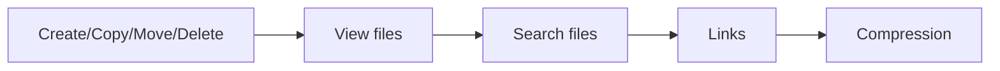

# Module 03 — Files & Directories

## What You Will Learn

- Create, copy, move, rename, and delete files and directories.
- View file contents (cat, less, head, tail).
- Search for files and inside files (find, grep).
- Understand hard links vs soft (symbolic) links.
- Compress and extract archives (tar, gzip, zip).

## Why This Module Matters

Files are everything in Linux — configs, logs, scripts, data. Manipulating them confidently is the daily bread of any Linux user.

## Real-World Use Case

You'll copy config files before editing, tail logs during an incident, search for an error across files, and compress logs before archiving — all in this module.

## Topics Covered

| File | What It Covers |
|------|----------------|
| [create-copy-move-delete.md](./create-copy-move-delete.md) | touch, mkdir, cp, mv, rm |
| [view-files.md](./view-files.md) | cat, less, head, tail |
| [search-files.md](./search-files.md) | find, grep, locate |
| [links-hard-soft.md](./links-hard-soft.md) | ln, symlinks |
| [file-compression.md](./file-compression.md) | tar, gzip, zip |

## Learning Flow

## Hands-On Practice

Build a small directory tree, copy and rename files in it, search for text, then compress the whole thing into a `.tar.gz`.

## Common Mistakes

- Using `rm -r` carelessly. There is no recycle bin — deletions are permanent.
- Overwriting files with `cp`/`mv` without `-i` and losing data.

## Troubleshooting

- "No such file" → check path and spelling (Module 02 paths).
- "Permission denied" → you may need different permissions (Module 04).

## Best Practices

- Use `cp -i` / `mv -i` to confirm overwrites while learning.
- Back up a file (`cp file file.bak`) before editing it.

## Quick Revision

- `touch/mkdir/cp/mv/rm` manage files; `cat/less/head/tail` view them.
- `find`/`grep` locate files and text. `tar` archives. `ln` links.

## Next Module

➡️ [04 — Users, Groups & Permissions](../04-users-groups-permissions/).
