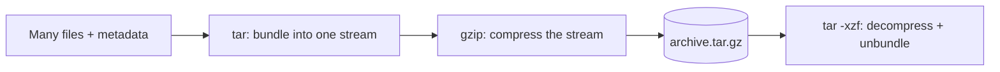

# File Compression & Archiving

## 1. What Is This?

**Archiving** bundles many files into one (`tar`). **Compression** shrinks size (`gzip`, `bzip2`, `zip`). Often combined: `tar.gz` = archived **and** compressed.

## 2. Why Is This Needed?

You move and store lots of files: backups, logs, transfers. Bundling + compressing saves space and makes transfers a single, smaller download.

## 3. Simple Layman Explanation

- `tar` = put many documents into one envelope.
- `gzip` = vacuum-seal the envelope to make it smaller.
- `tar.gz` = both: one sealed, compact package.

## 4. Technical Explanation

| Tool | Role | Common Use |
|------|------|-----------|
| `tar` | Archive multiple files into one | `.tar` |
| `gzip` | Compress a single file | `.gz` |
| `tar + gzip` | Archive + compress | `.tar.gz` / `.tgz` |
| `zip`/`unzip` | Cross-platform archive+compress | `.zip` (Windows-friendly) |

## 5. How It Works Under the Hood

The crucial insight is that **archiving and compression are two separate jobs**, and `tar.gz` chains them:

- **`tar` (Tape ARchive) only bundles.** It concatenates many files plus their metadata (names, permissions, owners, timestamps) into one continuous stream. It makes things *bigger*, not smaller — its value is turning "500 files" into "1 file" while preserving everything the filesystem knew about them. That metadata preservation is why `tar` (not `zip`) is standard for Linux backups: restore and your permissions/owners come back intact.
- **`gzip` only compresses.** It takes one stream of bytes and shrinks it by finding repeated patterns (the DEFLATE algorithm). It has no concept of multiple files.
- **`tar -czf` pipes one into the other:** `tar` produces the bundled stream, `gzip` compresses that whole stream. That's why the order matters and why you can't cleanly extract a *single* file from a `.tar.gz` without decompressing the stream up to it — the compression spans everything.
- **`zip` does both per-file:** it compresses each file individually and stores them together, which is why you *can* pull one file out of a `.zip` quickly, at a small cost to overall ratio. Its trade-off (and weaker Unix-permission handling) is why Linux favors `tar.gz` but `zip` when Windows users are involved.

So `.tar.gz` = "bundle (keep metadata), then squeeze the whole bundle." Knowing they're two steps explains the flags: `-c/-x/-t` are *tar's* bundle/unbundle/list; `-z` is the *gzip* squeeze bolted on.

## 6. Diagram



## 7. Real-World Examples

**1. The everyday case — shipping logs for analysis.** `tar -czf logs-$(date +%F).tar.gz /var/log/myapp/`. One compact file, timestamped, easy to upload. This is the standard way ops engineers share logs.

**2. Seeing the size win and metadata preservation:**

```
$ du -sh /var/log/myapp
480M    /var/log/myapp
$ tar -czf logs.tar.gz /var/log/myapp
$ ls -lh logs.tar.gz
-rw-r--r-- 1 alice alice 47M Jul  2 09:00 logs.tar.gz   # ~10x smaller (text compresses well)
$ tar -tvzf logs.tar.gz | head -2
-rw-r----- root adm  12002 2026-07-01 03:00 var/log/myapp/app.log   # owners/perms preserved
```

`tar -t` lists contents *and* shows the preserved permissions/owners — the Section 5 metadata point in action.

**3. War story — the "extract bomb" that scattered files everywhere.** An engineer downloaded `release.tar.gz` and ran `tar -xzf release.tar.gz` inside their home directory. The archive had no top-level folder, so it exploded hundreds of files directly into `~`, mixing with existing ones — hours of cleanup. The fix they now always use: **list first** (`tar -tzf release.tar.gz | head`) to check for a top folder, and extract into a fresh directory (`mkdir out && tar -xzf ... -C out`). Always inspect an unknown archive before extracting.

## 8. Worked Walkthrough

Create, inspect, and restore an archive — the full backup cycle:

```
$ mkdir demo && touch demo/a.txt demo/b.txt && echo "hello" > demo/a.txt
$ tar -czvf demo.tar.gz demo/          # -v shows files as they're added
demo/
demo/a.txt
demo/b.txt
$ ls -lh demo.tar.gz
-rw-r--r-- 1 alice alice 178 Jul  2 09:00 demo.tar.gz
$ tar -tzf demo.tar.gz                 # LIST contents before trusting it
demo/
demo/a.txt
demo/b.txt
$ rm -r demo                           # simulate losing the originals
$ tar -xzf demo.tar.gz                 # extract; note it has a top 'demo/' folder (safe)
$ cat demo/a.txt
hello                                   # fully restored, content intact
```

The habit to build: **`-tzf` (list) before `-xzf` (extract)** so you know whether the archive contains a top folder (Section 5 / the war story).

## 9. Commands

```bash
tar -czf backup.tar.gz mydir/      # create gzipped archive
tar -xzf backup.tar.gz             # extract gzipped archive
tar -tzf backup.tar.gz             # list contents without extracting
tar -xzf backup.tar.gz -C out/     # extract INTO a chosen directory
gzip bigfile.log                   # compress -> bigfile.log.gz (removes original)
gunzip bigfile.log.gz              # decompress
zip -r project.zip project/        # create a zip
unzip project.zip                  # extract a zip
```

Sample output for each (dummy values, for reference):

```text
$ tar -czvf backup.tar.gz mydir/
mydir/
mydir/config.yaml
mydir/data.csv

$ tar -tzf backup.tar.gz
mydir/
mydir/config.yaml
mydir/data.csv

$ gzip bigfile.log ; ls -lh bigfile.log.gz
-rw-r--r-- 1 alice alice 3.1M Jul  2 09:00 bigfile.log.gz

$ unzip -l project.zip
  Length      Date    Time    Name
   --------                   -------
     1024  2026-07-02 09:00   project/main.py
```

## 10. Command Explanation

`tar` flags (memorize this combo):
- `-c` = **c**reate an archive
- `-x` = e**x**tract
- `-t` = lis**t** contents
- `-z` = gzip compression (`-j` for bzip2, `-J` for xz)
- `-f` = **f**ile name (must come right before the filename)
- `-v` = verbose (show files as they process)
- `-C dir` = change to `dir` first — extract *into* a chosen folder instead of the current one

So `tar -czvf out.tar.gz dir/` = create + gzip + verbose + file `out.tar.gz` from `dir/`. And `gzip` deletes the original after compressing (keep it with `gzip -k`).

## 11. In Production (DevOps Context)

- **Backups** are almost always `tar.gz` because it preserves Unix permissions/owners (Section 5) — critical for a faithful restore (Modules 10–11 backup scripts).
- **Log shipping & artifacts:** CI pipelines bundle build outputs and test logs as `.tar.gz` artifacts for download.
- **Docker images** are distributed as layered tarballs; `docker save` produces a `.tar`.
- **`-C` and "list-first"** matter in automation: extracting into a controlled directory prevents the scatter bomb (the war story) from wrecking a deploy target.
- Timestamped names (`backup-$(date +%F).tar.gz`) enable rotation/retention policies.

## 12. Practice Tasks

1. `mkdir demo && touch demo/a.txt demo/b.txt`.
2. `tar -czf demo.tar.gz demo/`.
3. `tar -tzf demo.tar.gz` to list contents.
4. `rm -r demo && tar -xzf demo.tar.gz` to restore it.
5. `zip -r demo.zip demo/` and `unzip -l demo.zip`.
6. Extract safely into a new dir: `mkdir out && tar -xzf demo.tar.gz -C out`.

## 13. Common Mistakes

- Forgetting `-f` or putting it in the wrong place. Keep `-f` last before the filename.
- Mixing up `-c` (create) and `-x` (extract) — read carefully.
- Extracting an archive that has no top folder, scattering files into the current dir (the war story). Check first with `-t`.
- Assuming `zip` preserves Linux permissions/owners like `tar` does — it often doesn't.

## 14. Troubleshooting

- **"tar: Cannot open: No such file"** → wrong filename/path after `-f`.
- **`gzip: already has .gz suffix`** → it's already compressed.
- **Files scattered after extract** → the archive had no top folder; re-extract into a clean dir with `-C`.
- **`unzip: command not found`** → install it (`sudo apt install unzip`).

## 15. Best Practices

- Always **list** (`-tzf`) an unknown archive before extracting; extract into a fresh dir with `-C`.
- Timestamp backups: `backup-$(date +%F).tar.gz`.
- Use `.tar.gz` for Linux-to-Linux (keeps permissions), `.zip` when Windows users are involved.

## 16. Connects To

- **Prev:** [Links — Hard & Soft](links-hard-soft.md). **Next:** [Module 04 — Users, Groups & Permissions](../04-users-groups-permissions/README.md).
- **Permissions that tar preserves:** [File Permissions](../04-users-groups-permissions/file-permissions.md).
- **Used by backups:** [Backup Script Example](../10-shell-scripting/backup-script-example.md), [Scheduled Backup Example](../11-automation-and-cron/scheduled-backup-example.md).
- **Log cleanup often archives first:** [Log Cleanup Basics](../08-storage-and-disk-management/log-cleanup-basics.md).

## 17. Quick Recap

- `tar` bundles (and preserves metadata); `gzip` compresses; `.tar.gz` chains both.
- `tar -czf x.tar.gz dir/` create, `-xzf` extract, `-tzf` list, `-C dir` extract into a folder.
- `gzip`/`gunzip` for single files; `zip`/`unzip` for cross-platform. Remember c/x/t + z + f.
- Always list an unknown archive before extracting.

## 18. References

- GNU Tar manual: https://www.gnu.org/software/tar/manual/
- `man tar`, `man gzip`, `man zip`

<!-- NAV-FOOTER -->

---

### 🧭 Navigation

| Previous | Up | Next |
|:---|:---:|---:|
| ⬅️ Prev: [Links — Hard and Soft (Symbolic)](links-hard-soft.md) | ⬆️ Module: [Module 03 — Files & Directories](README.md) | ➡️ Next: [Module 04 — Users, Groups & Permissions](../04-users-groups-permissions/README.md) |
