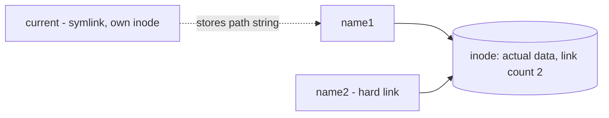

# Links — Hard and Soft (Symbolic)

## 1. What Is This?

A **link** is an extra name pointing to a file. A **hard link** is another name for the same data. A **soft link (symlink)** is a small shortcut file that points to a path.

## 2. Why Is This Needed?

Symlinks are everywhere on Linux: `/usr/bin` shortcuts, versioned releases (`current -> release-2024`), and config management. Knowing them prevents confusion when a "file" is really a pointer.

## 3. Simple Layman Explanation

- **Hard link** = two labels on the *same* physical box. Remove one label, the box still exists via the other.
- **Soft link** = a sticky note saying "the box is in room 12". If the box moves or is removed, the note points to nothing (broken link).

## 4. Technical Explanation

| Feature | Hard Link | Soft Link (symlink) |
|---------|-----------|----------------------|
| Points to | The same inode (data) | A path/filename |
| Across filesystems | No | Yes |
| Link to directories | No (generally) | Yes |
| If original deleted | Data still accessible | Link breaks (dangling) |
| Created with | `ln` | `ln -s` |

An **inode** is the data structure storing a file's actual content/metadata; filenames point to inodes.

## 5. How It Works Under the Hood

Everything here follows from one fact from [Create/Copy/Move/Delete](create-copy-move-delete.md): a filename is a directory entry pointing to an **inode**, and each inode has a **link count** of how many names point at it.

- **A hard link is just a second directory entry pointing at the same inode.** Both names are equal — neither is "the original." The inode's link count goes from 1 to 2. `rm` one name and the count drops to 1; the data survives because another name still references it. The bytes are freed only when the count hits 0. This is *why* deleting a hard-linked file doesn't lose data, and why hard links can't cross filesystems (inode numbers are only unique within one filesystem) or point to directories (that could create loops that break tree-walking tools).
- **A soft link (symlink) is a tiny file of its own, with its own inode, whose contents are literally a path string** like `../releases/v2`. When you open it, the kernel reads that string and *re-resolves* it from scratch. So a symlink knows nothing about the target's inode — only its name. If the target is deleted or moved, the string still says `../releases/v2`, now pointing at nothing: a **dangling** link. Because it's "just a path," it can happily cross filesystems and point to directories.

The practical upshot: hard links share *identity* (same inode, robust to deletion); symlinks share a *name* (flexible, but fragile if the target moves). `ls -li` reveals which is which — matching inode numbers = hard links; an `l` type and `->` = symlink.

## 6. Diagram



## 7. Real-World Examples

**1. The everyday case — zero-downtime releases.** Apps deploy to `/opt/app/releases/v2`, and a symlink `/opt/app/current -> releases/v2` always points at the live version. To roll back, you just repoint the symlink to `v1` — instant, no copying.

**2. Watching the link count and a dangling link:**

```
$ echo "data" > original.txt
$ ln original.txt hardlink.txt          # hard link (same inode)
$ ln -s original.txt softlink.txt       # symlink (stores the name)
$ ls -li
131074 -rw-r--r-- 2 alice alice  5 Jul 2 09:00 original.txt
131074 -rw-r--r-- 2 alice alice  5 Jul 2 09:00 hardlink.txt   # SAME inode, count 2
131075 lrwxrwxrwx 1 alice alice 12 Jul 2 09:00 softlink.txt -> original.txt
$ rm original.txt
$ cat hardlink.txt
data                                    # still works: inode alive via hardlink
$ cat softlink.txt
cat: softlink.txt: No such file or directory   # dangling: the name is gone
```

The hard link kept the data (count was 2, now 1); the symlink broke because its stored path no longer resolves — exactly Section 5.

**3. War story — the rollback that saved a bad deploy.** A new release `v5` started throwing 500s in production. Instead of redeploying, the on-call engineer ran one command: `ln -sfn /opt/app/releases/v4 /opt/app/current`. Because `current` is a symlink (a name pointer), repointing it swapped the whole app back to `v4` atomically — no file copying, service back in seconds. This symlink-swap pattern is the backbone of tools like Capistrano and many CI/CD deploys.

## 8. Worked Walkthrough

Create both link types and prove how each behaves when the target changes:

```
$ mkdir linkdemo && cd linkdemo
$ echo "v1 content" > file.txt
$ ln file.txt hard.txt          # hard link
$ ln -s file.txt soft.txt       # symlink
$ ls -li
262145 -rw-r--r-- 2 alice alice 11 ... file.txt
262145 -rw-r--r-- 2 alice alice 11 ... hard.txt     # note: link count 2, same inode
262146 lrwxrwxrwx 1 alice alice  8 ... soft.txt -> file.txt
$ readlink soft.txt
file.txt                         # the symlink's stored path string
$ echo "changed" > file.txt      # edit the target
$ cat hard.txt ; cat soft.txt
changed                          # hard link: same inode, sees the change
changed                          # symlink: re-resolves to file.txt, sees it too
$ mv file.txt renamed.txt        # move the target away
$ cat hard.txt
changed                          # hard link unaffected (it IS the inode)
$ cat soft.txt
cat: soft.txt: No such file or directory   # symlink now dangling
$ readlink -f soft.txt           # resolve final target (shows it can't)
```

Both saw edits (same underlying data), but only the symlink broke when the *name* moved — because it stored a name, not an identity.

## 9. Commands

```bash
echo "data" > original.txt
ln original.txt hardlink.txt       # create a hard link
ln -s original.txt softlink.txt    # create a symbolic link
ls -li                             # show inode numbers and link type
readlink softlink.txt              # show where a symlink points
readlink -f softlink.txt           # resolve to the final real path
ln -sfn /new/target current        # atomically repoint an existing symlink
```

Sample output for each (dummy values, for reference):

```text
$ ls -li
131074 -rw-r--r-- 2 alice alice 5 Jul  2 09:00 original.txt
131074 -rw-r--r-- 2 alice alice 5 Jul  2 09:00 hardlink.txt
131075 lrwxrwxrwx 1 alice alice 12 Jul  2 09:00 softlink.txt -> original.txt

$ readlink softlink.txt
original.txt

$ readlink -f softlink.txt
/home/alice/original.txt

$ ln -sfn /opt/app/releases/v4 /opt/app/current
# (no output = success; 'current' now points to v4)
```

## 10. Command Explanation

- `ln a b` → creates hard link `b` to `a` (same inode, link count +1).
- `ln -s a b` → `-s` makes a symbolic link (a file storing the path `a`).
- `ls -li` → `-i` shows inode numbers; hard links share the same inode. Symlinks show `l` and `->` target.
- `readlink` → prints the target path string of a symlink; `readlink -f` fully resolves it to the real file.
- `ln -sfn target link` → `-f` replace existing, `-n` treat an existing symlink-to-dir as a file — the safe way to *repoint* a `current` symlink (the deploy trick).

## 11. In Production (DevOps Context)

- **Atomic deploys/rollbacks** repoint a `current` symlink between release directories (the war story) — used by Capistrano, many CI/CD scripts, and `/etc/alternatives`.
- **`/usr/bin` and `/etc/alternatives`** use symlinks so `python` or `java` can point at a chosen version without moving binaries.
- **Docker image layers** and package managers rely on hard links to share identical files across locations without duplicating disk space.
- **Dangling symlinks** are a real deploy failure: a `current -> releases/v5` left pointing at a pruned release breaks the app; monitoring for broken links matters.

## 12. Practice Tasks

1. Create `original.txt`, a hard link, and a soft link as in Section 8.
2. Run `ls -li` and identify the shared inode (hard link) and the `->` symlink.
3. Delete `original.txt`. Read `hardlink.txt` (works) and `softlink.txt` (broken).
4. Recreate the deploy trick: make `releases/v1` and `releases/v2` dirs, point `current` at v1 with `ln -s`, then repoint to v2 with `ln -sfn`.

## 13. Common Mistakes

- Expecting a symlink to keep working after the target moves/deletes (it stores a name — Section 5).
- Trying to hard-link a directory or across disks (not allowed; use a symlink).
- Editing a symlink thinking it's a separate file — you're editing the target.
- Using `ln -s` without `-f`/`-n` when repointing, leaving a nested/duplicate link.

## 14. Troubleshooting

- **Broken symlink (often shown red in `ls`)** → target moved/deleted; recreate it with the correct path.
- **`ln: failed to create hard link: Invalid cross-device link`** → use a symlink (`-s`) across filesystems.
- **Symlink points somewhere unexpected** → `readlink -f` to see the final resolved path.

## 15. Best Practices

- Use **symlinks** for shortcuts and versioned "current" pointers.
- Use **absolute** targets for symlinks that scripts rely on, so they resolve regardless of CWD.
- Verify with `readlink -f` to resolve the final real path.

## 16. Connects To

- **Prev:** [Searching Files](search-files.md). **Next:** [File Compression & Archiving](file-compression.md).
- **Inodes & why rm is permanent:** [Create, Copy, Move, Delete](create-copy-move-delete.md), [Linux Filesystem Overview](../02-linux-basics/linux-file-system-overview.md).
- **Symlink deploys in practice:** [Linux for CI/CD](../13-real-world-linux-for-devops/linux-for-ci-cd.md), [Mini Project 04 — Nginx Setup](../15-mini-projects/project-04-simple-nginx-server-setup.md).

## 17. Quick Recap

- Hard link = another name for the same inode (robust to deletion; same filesystem only).
- Soft link = a small file storing a path string; flexible but breaks if the target moves (dangling).
- `ln` (hard), `ln -s` (soft), `ln -sfn` (repoint); inspect with `ls -li` and `readlink -f`.

## 18. References

- `man ln`, `man readlink`, `man symlink`
- GNU Coreutils: https://www.gnu.org/software/coreutils/manual/

<!-- NAV-FOOTER -->

---

### 🧭 Navigation

| Previous | Up | Next |
|:---|:---:|---:|
| ⬅️ Prev: [Searching Files](search-files.md) | ⬆️ Module: [Module 03 — Files & Directories](README.md) | ➡️ Next: [File Compression & Archiving](file-compression.md) |
