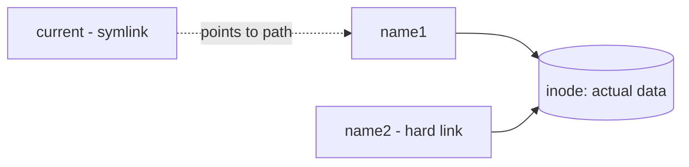

# Links — Hard and Soft (Symbolic)

## 1. What Is This?

A **link** is an extra name pointing to a file. A **hard link** is another name for the same data. A **soft link (symlink)** is a small shortcut file that points to a path.

## 2. Why Is This Needed?

Symlinks are everywhere on Linux: `/usr/bin` shortcuts, versioned releases (`current -> release-2024`), and config management. Knowing them prevents confusion when a "file" is really a pointer.

## 3. Simple Layman Explanation

- **Hard link** = two labels on the *same* physical box. Remove one label, the box still exists via the other.
- **Soft link** = a sticky note saying "the box is in room 12". If the box moves or is removed, the note points to nothing (broken link).

## 4. Technical Explanation

| Feature | Hard Link | Soft Link (symlink) |
|---------|-----------|----------------------|
| Points to | The same inode (data) | A path/filename |
| Across filesystems | No | Yes |
| Link to directories | No (generally) | Yes |
| If original deleted | Data still accessible | Link breaks (dangling) |
| Created with | `ln` | `ln -s` |

An **inode** is the data structure storing a file's actual content/metadata; filenames point to inodes.

## 5. Real-World Example

Apps deploy to `/opt/app/releases/v2`, and a symlink `/opt/app/current -> releases/v2` always points at the live version. To roll back, you just repoint the symlink to `v1` — instant, no copying.

## 6. Diagram



## 7. Commands

```bash
echo "data" > original.txt
ln original.txt hardlink.txt       # create a hard link
ln -s original.txt softlink.txt    # create a symbolic link
ls -li                             # show inode numbers and link type
readlink softlink.txt              # show where a symlink points
rm original.txt                    # now check both links' behavior
```

## 8. Command Explanation

- `ln a b` → creates hard link `b` to `a` (same inode).
- `ln -s a b` → `-s` makes a symbolic link (a pointer to the path `a`).
- `ls -li` → `-i` shows inode numbers; hard links share the same inode. Symlinks show `l` and `->` target.
- `readlink` → prints the target path of a symlink.

Expected `ls -li`:

```
123456 -rw-r--r-- 2 user user 5 original.txt
123456 -rw-r--r-- 2 user user 5 hardlink.txt   # same inode, link count 2
123789 lrwxrwxrwx 1 user user 12 softlink.txt -> original.txt
```

## 9. Practice Tasks

1. Create `original.txt`, a hard link, and a soft link as above.
2. Run `ls -li` and identify the shared inode and the `->` symlink.
3. Delete `original.txt`. Read `hardlink.txt` (works) and `softlink.txt` (broken).

## 10. Common Mistakes

- Expecting a symlink to keep working after the target moves/deletes.
- Trying to hard-link a directory or across disks (not allowed).
- Editing a symlink thinking it's a separate file — you're editing the target.

## 11. Troubleshooting

- **Broken symlink (red in `ls`)** → target moved/deleted; recreate it with the correct path.
- **`ln: failed to create hard link: Invalid cross-device link`** → use a symlink (`-s`) across filesystems.

## 12. Best Practices

- Use **symlinks** for shortcuts and versioned "current" pointers.
- Use absolute targets for symlinks that scripts rely on.
- Verify with `readlink -f` to resolve the final real path.

## 13. Quick Recap

- Hard link = another name for the same data (same inode).
- Soft link = a path pointer; breaks if the target is gone.
- `ln` (hard), `ln -s` (soft), `ls -li` and `readlink` to inspect.

## 14. References

- `man ln`, `man readlink`
- GNU Coreutils: https://www.gnu.org/software/coreutils/manual/
