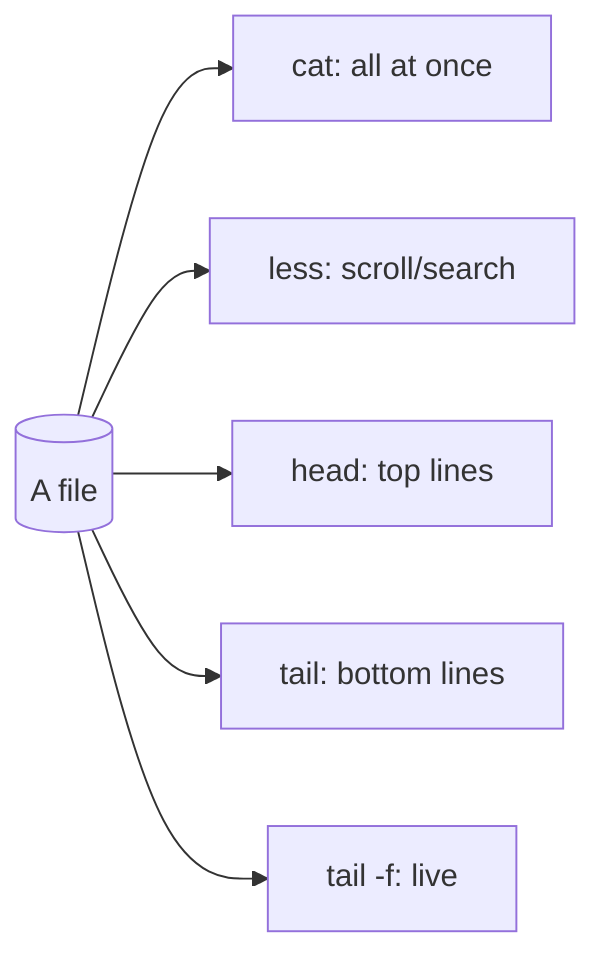

# Viewing Files

## 1. What Is This?

Commands to **read file contents** without an editor: `cat`, `less`, `more`, `head`, and `tail`.

## 2. Why Is This Needed?

You read files constantly — configs, logs, scripts. Different tools suit different needs: whole file, page-by-page, first lines, last lines, or live-updating logs.

## 3. Simple Layman Explanation

- `cat` = dump the whole page on the table at once.
- `less` = read the document page by page, scrolling.
- `head`/`tail` = peek at just the top or bottom.
- `tail -f` = watch new lines appear live, like a news ticker.

## 4. Technical Explanation

| Command | Best For |
|---------|----------|
| `cat` | Short files; also combining files |
| `less` | Large files; scroll/search without loading all into memory |
| `head` | First N lines (default 10) |
| `tail` | Last N lines (default 10) |
| `tail -f` | Follow a file as it grows (live logs) |

## 5. Real-World Example

During an outage you run `tail -f /var/log/nginx/error.log` to watch errors appear in real time as you reproduce the problem — the single most-used log command in operations.

## 6. Diagram



## 7. Commands

```bash
cat notes.txt                 # print whole file
cat -n notes.txt              # with line numbers
less /var/log/syslog          # scroll a big file (q to quit)
head /etc/passwd              # first 10 lines
head -n 5 /etc/passwd         # first 5 lines
tail /var/log/syslog          # last 10 lines
tail -n 50 app.log            # last 50 lines
tail -f /var/log/nginx/access.log   # follow live
```

## 8. Command Explanation

- `cat -n` → adds line numbers; handy for referencing.
- `less` → opens a pager: arrows/PageUp/PageDown to scroll, `/word` to search, `q` to quit. Doesn't load the whole file into memory — safe for huge logs.
- `head -n 5` → first 5 lines.
- `tail -n 50` → last 50 lines — usually the most recent/relevant log entries.
- `tail -f` → keeps the file open and prints new lines as they're written; `Ctrl+C` to stop.

## 9. Practice Tasks

1. `cat /etc/os-release`.
2. `less /etc/services` — scroll, search `/http`, then `q`.
3. `head -n 3 /etc/passwd` and `tail -n 3 /etc/passwd`.
4. In one terminal run `tail -f /tmp/test.log`; in another run `echo "hi" >> /tmp/test.log` and watch it appear.

## 10. Common Mistakes

- `cat` on a huge log floods the screen — use `less` or `tail` instead.
- Forgetting `q` to exit `less`/`more`.
- Using `cat` on a binary file — it garbles the terminal (run `reset` to fix).

## 11. Troubleshooting

- **Terminal garbled after `cat` on binary** → run `reset`.
- **`tail -f` shows nothing** → the file may not be updating, or you lack read permission.
- **Huge file freezes `cat`** → press `Ctrl+C`, switch to `less`.

## 12. Best Practices

- Use `less` or `tail` for large/log files, never `cat`.
- `tail -f` is your go-to during live troubleshooting.
- Combine with `grep` (next topic) to filter: `tail -f app.log | grep ERROR`.

## 13. Quick Recap

- `cat` (small files), `less` (scroll big files), `head`/`tail` (ends), `tail -f` (live logs).
- `q` quits a pager; `Ctrl+C` stops `tail -f`.

## 14. References

- GNU Coreutils: https://www.gnu.org/software/coreutils/manual/
- `man cat`, `man less`, `man head`, `man tail`
