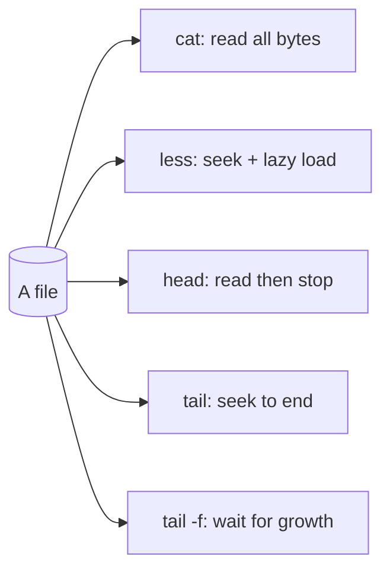

# Viewing Files

## 1. What Is This?

Commands to **read file contents** without an editor: `cat`, `less`, `more`, `head`, and `tail`.

## 2. Why Is This Needed?

You read files constantly — configs, logs, scripts. Different tools suit different needs: whole file, page-by-page, first lines, last lines, or live-updating logs.

## 3. Simple Layman Explanation

- `cat` = dump the whole page on the table at once.
- `less` = read the document page by page, scrolling.
- `head`/`tail` = peek at just the top or bottom.
- `tail -f` = watch new lines appear live, like a news ticker.

## 4. Technical Explanation

| Command | Best For |
|---------|----------|
| `cat` | Short files; also combining files |
| `less` | Large files; scroll/search without loading all into memory |
| `head` | First N lines (default 10) |
| `tail` | Last N lines (default 10) |
| `tail -f` | Follow a file as it grows (live logs) |

## 5. How It Works Under the Hood

The key difference between these tools is **how much they read into memory** — which decides whether they're safe on a 5 GB log:

- **`cat` reads the whole file start-to-finish and writes it all to your terminal.** It never seeks; it streams every byte. On a huge file that means flooding the terminal and, if piped somewhere, reading the entire thing. That's why `cat hugefile.log` "hangs" — it's dutifully printing gigabytes.
- **`less` reads lazily.** It loads only the screenful you're looking at and **seeks** to other parts of the file on demand as you scroll. Memory stays flat no matter how big the file — which is why it opens a 10 GB log instantly while `cat` chokes.
- **`head` stops early.** After N lines it simply stops reading and exits — cheap on any size.
- **`tail` seeks to the end** rather than reading from the front, so "last 10 lines" of a giant file is instant.
- **`tail -f` keeps the file open and blocks, waking up when the kernel signals the file grew**, then prints the new bytes. It's not polling in a busy loop; the kernel notifies it. That's how it shows log lines the instant an app writes them.

One more under-the-hood note: `cat` on a **binary** file dumps raw bytes, some of which are terminal control codes — that's what garbles your screen (fix with `reset`). Text tools assume text.

## 6. Diagram



## 7. Real-World Examples

**1. The everyday case.** During an outage you run `tail -f /var/log/nginx/error.log` to watch errors appear in real time as you reproduce the problem — the single most-used log command in operations.

**2. Choosing the right tool by output:**

```
$ wc -l /var/log/syslog
248193 /var/log/syslog                 # 248k lines — do NOT cat this
$ tail -n 3 /var/log/syslog            # just the recent, relevant bit
Jul  2 09:14:01 web-01 CRON[9]: session closed
Jul  2 09:15:22 web-01 sshd[8123]: Accepted publickey for deploy
Jul  2 09:15:23 web-01 systemd[1]: Started Session 42.
$ head -n 1 /var/log/syslog            # when did this log start?
Jul  1 00:00:04 web-01 rsyslogd: rsyslogd start
```

`tail`/`head` give you the ends of a 248k-line file instantly (Section 5's seek), where `cat` would flood the screen.

**3. War story — the `cat` that "froze" a production shell.** An engineer investigating high memory ran `cat /var/log/app/debug.log` — a 6 GB file. The terminal locked up scrolling for minutes and the SSH session became unusable. The right move was `less` (seeks, constant memory) or `tail -n 100`. They killed it with `Ctrl+C` and switched to `less +G` (jump to end). Lesson from Section 5: on unknown/large files, never `cat` — reach for `less` or `tail`.

## 8. Worked Walkthrough

Practice the live-log workflow that defines day-to-day ops. In terminal 1:

```
$ tail -f /tmp/test.log
```

It waits, showing nothing (the file is empty and not growing). In terminal 2:

```
$ echo "user login ok" >> /tmp/test.log
$ echo "ERROR: db timeout" >> /tmp/test.log
```

Back in terminal 1, the lines appear the instant they're written:

```
user login ok
ERROR: db timeout
```

Now filter live (combining with `grep`, the next topic):

```
$ tail -f /tmp/test.log | grep --line-buffered ERROR
ERROR: db timeout                     # only error lines show up, live
```

Press `Ctrl+C` to stop following. This `tail -f | grep` pattern is how you watch for a specific error while reproducing a bug.

## 9. Commands

```bash
cat notes.txt                 # print whole file
cat -n notes.txt              # with line numbers
less /var/log/syslog          # scroll a big file (q to quit)
head /etc/passwd              # first 10 lines
head -n 5 /etc/passwd         # first 5 lines
tail /var/log/syslog          # last 10 lines
tail -n 50 app.log            # last 50 lines
tail -f /var/log/nginx/access.log   # follow live
```

Sample output for each (dummy values, for reference):

```text
$ cat -n notes.txt
     1  first line
     2  second line

$ head -n 3 /etc/passwd
root:x:0:0:root:/root:/bin/bash
daemon:x:1:1:daemon:/usr/sbin:/usr/sbin/nologin
bin:x:2:2:bin:/bin:/usr/sbin/nologin

$ tail -n 2 /var/log/syslog
Jul  2 09:15:22 web-01 sshd[8123]: Accepted publickey for deploy
Jul  2 09:15:23 web-01 systemd[1]: Started Session 42.

$ tail -f /var/log/nginx/access.log
203.0.113.9 - - [02/Jul/2026:09:16:01] "GET /health HTTP/1.1" 200 2
# (stays open, printing new lines until Ctrl+C)
```

## 10. Command Explanation

- `cat -n` → adds line numbers; handy for referencing.
- `less` → opens a pager: arrows/PageUp/PageDown to scroll, `/word` to search, `G` to jump to end, `q` to quit. Uses constant memory — safe for huge logs.
- `head -n 5` → first 5 lines, then stops reading.
- `tail -n 50` → last 50 lines — usually the most recent/relevant log entries (seeks to the end).
- `tail -f` → keeps the file open and prints new lines as they're written; `Ctrl+C` to stop.

## 11. In Production (DevOps Context)

- `tail -f` on app/web error logs is *the* live-debugging tool during deploys and incidents (Module 09).
- **`journalctl -f`** (Module 09) is the systemd equivalent of `tail -f` for service logs.
- **`docker logs -f <container>`** and **`kubectl logs -f <pod>`** are the same "follow" concept for containers (Module 13) — the mental model transfers directly.
- Never `cat` unbounded logs on a production box; it can flood a fragile SSH session (the war story). Use `less`, `tail`, or piped `grep`.

## 12. Practice Tasks

1. `cat /etc/os-release`.
2. `less /etc/services` — scroll, search `/http`, press `G` to jump to the end, then `q`.
3. `head -n 3 /etc/passwd` and `tail -n 3 /etc/passwd`.
4. In one terminal run `tail -f /tmp/test.log`; in another run `echo "hi" >> /tmp/test.log` and watch it appear.
5. Filter live: `tail -f /tmp/test.log | grep --line-buffered ERROR`.

## 13. Common Mistakes

- `cat` on a huge log floods the screen and can hang a session (the war story) — use `less` or `tail`.
- Forgetting `q` to exit `less`/`more`.
- Using `cat` on a binary file — it garbles the terminal (run `reset` to fix).
- Expecting `tail -f | grep` to show lines promptly without `--line-buffered` (output can get stuck in a buffer).

## 14. Troubleshooting

- **Terminal garbled after `cat` on binary** → run `reset`.
- **`tail -f` shows nothing** → the file may not be updating, or you lack read permission.
- **Huge file freezes `cat`** → press `Ctrl+C`, switch to `less` (or `less +G`).

## 15. Best Practices

- Use `less` or `tail` for large/log files, never `cat`.
- `tail -f` is your go-to during live troubleshooting.
- Combine with `grep` (next topic) to filter: `tail -f app.log | grep --line-buffered ERROR`.

## 16. Connects To

- **Prev:** [Create, Copy, Move, Delete](create-copy-move-delete.md). **Next:** [Searching Files](search-files.md).
- **Filter what you view:** [Searching Files](search-files.md) (`grep`).
- **Service logs the systemd way:** [journalctl Basics](../09-logs-monitoring-troubleshooting/journalctl-basics.md), [Syslog & /var/log](../09-logs-monitoring-troubleshooting/syslog-and-var-log.md).
- **Container logs:** [Linux for Docker](../13-real-world-linux-for-devops/linux-for-docker.md).

## 17. Quick Recap

- `cat` (small files, reads everything), `less` (scroll/seek big files, constant memory), `head`/`tail` (the ends, instantly), `tail -f` (live logs via kernel notification).
- Never `cat` an unknown/huge file; use `less` or `tail`.
- `q` quits a pager; `Ctrl+C` stops `tail -f`.

## 18. References

- GNU Coreutils: https://www.gnu.org/software/coreutils/manual/
- `man cat`, `man less`, `man head`, `man tail`

<!-- NAV-FOOTER -->

---

### 🧭 Navigation

| Previous | Up | Next |
|:---|:---:|---:|
| ⬅️ Prev: [Create, Copy, Move, Delete](create-copy-move-delete.md) | ⬆️ Module: [Module 03 — Files & Directories](README.md) | ➡️ Next: [Searching Files](search-files.md) |
