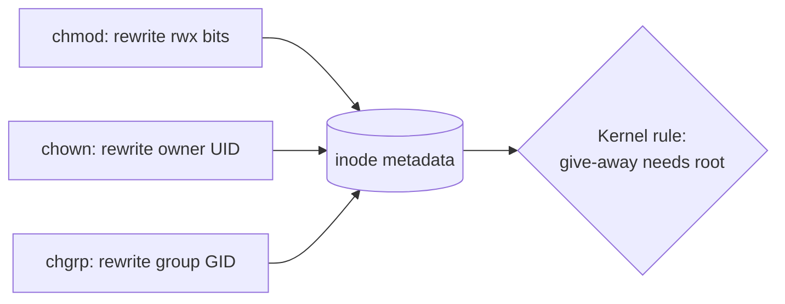

# chmod, chown, chgrp

## 1. What Is This?

The commands that **change** permissions and ownership:
- `chmod` — change permission bits (rwx).
- `chown` — change the owning user (and optionally group).
- `chgrp` — change the owning group.

## 2. Why Is This Needed?

You constantly adjust access: making a script executable, securing a key, giving a web server ownership of its files, or sharing a directory with a team.

## 3. Simple Layman Explanation

- `chmod` = change which keys (read/write/run) work.
- `chown` = change who owns the box.
- `chgrp` = change which department shares the box.

## 4. Technical Explanation

**chmod** accepts numeric or symbolic forms:

| Form | Example | Meaning |
|------|---------|---------|
| Numeric | `chmod 644 f` | owner rw, group r, others r |
| Symbolic | `chmod u+x f` | add execute for owner |
| Symbolic | `chmod go-w f` | remove write from group & others |
| Recursive | `chmod -R 755 dir` | apply to dir and contents |

Symbolic targets: `u`=user, `g`=group, `o`=others, `a`=all. Operators: `+` add, `-` remove, `=` set exactly.

## 5. How It Works Under the Hood

These three commands all edit the same place — the **inode's metadata** (see [File Permissions](file-permissions.md)) — via three different syscalls, and understanding that explains their quirks:

- **`chmod` calls `chmod(2)`**, which overwrites the 9 permission bits (plus special bits). **Numeric mode is absolute**: `chmod 644` *sets* the bits to exactly `rw-r--r--`, discarding whatever was there. **Symbolic mode is relative**: `chmod u+x` reads the current bits and flips just the owner's execute bit. That's the whole difference — `755` says "be exactly this," `+x` says "add this to what exists."
- **`chown`/`chgrp` call `chown(2)`**, which just rewrites the owner UID / group GID numbers in the inode. Here's the security rule the kernel enforces: **only root can *give away* a file** (change its owner to someone else). A normal user changing ownership could dump files onto another account or dodge disk quotas, so the kernel forbids it — which is *why* `chown` almost always needs `sudo`, while `chmod` on files you already own does not.
- **Recursion (`-R`) is not a syscall feature** — the command itself walks the directory tree and calls the syscall on each entry. That's why `chmod -R 755 dir` is dangerous: it blindly stamps `755` on *files* too, making every file executable, and one wrong path (`chmod -R 777 /`) touches the entire system file by file.

So: numeric = set absolutely, symbolic = adjust relatively; ownership changes need root because giving files away is privileged; `-R` is a loop, so aim it carefully.

## 6. Diagram



## 7. Real-World Examples

**1. The everyday case.** After writing a deploy script: `chmod +x deploy.sh` so it can run. After copying web files: `sudo chown -R www-data:www-data /var/www/site` so Nginx owns them. These two patterns appear in nearly every server setup.

**2. Numeric vs symbolic, on screen:**

```
$ ls -l s.sh
-rw-r--r-- 1 alice alice 40 Jul  2 09:00 s.sh
$ chmod u+x s.sh                 # symbolic: ADD owner execute
$ ls -l s.sh
-rwxr--r-- 1 alice alice 40 Jul  2 09:00 s.sh
$ chmod 600 s.sh                 # numeric: SET exactly rw-------
$ ls -l s.sh
-rw------- 1 alice alice 40 Jul  2 09:00 s.sh    # the x we added is gone (absolute set)
```

`u+x` layered onto existing bits; `600` wiped the slate to exactly those bits — Section 5's relative-vs-absolute rule made visible.

**3. War story — `chmod -R 777` that broke SSH.** To "fix" a permissions error fast, an engineer ran `sudo chmod -R 777 /home/deploy`. It worked for a second — then SSH key auth stopped working. Reason: SSH *refuses* a `~/.ssh` or private key that's group/world accessible (a security check), and `-R 777` had opened them to everyone. The recursive stamp hit files that must stay `600`/`700`. Fix: `chmod 700 ~/.ssh && chmod 600 ~/.ssh/id_*`. Lesson: never carpet-bomb with `777 -R`; set files and dirs deliberately.

## 8. Worked Walkthrough

Make a script runnable, secure a key, and set web perms correctly (files vs dirs):

```
$ echo 'echo hi' > s.sh
$ ./s.sh
bash: ./s.sh: Permission denied         # no execute bit yet
$ chmod +x s.sh && ./s.sh
hi                                       # now it runs
$ touch key && chmod 600 key && ls -l key
-rw------- 1 alice alice 0 Jul 2 09:00 key   # owner-only: SSH-key safe
$ mkdir -p web && sudo chown -R www-data:www-data web   # give the web server ownership
# Set dirs to 755 and files to 644 SEPARATELY (never chmod -R 755 blindly):
$ find web -type d -exec chmod 755 {} \;
$ find web -type f -exec chmod 644 {} \;
```

That `find ... -type d/-type f` split is the correct alternative to a blanket `chmod -R` — dirs need `x` to enter, files usually shouldn't be executable (Section 5).

## 9. Commands

```bash
chmod +x script.sh             # make executable (all classes)
chmod u+x script.sh            # executable for owner only
chmod 644 file.txt             # rw-r--r--
chmod 600 ~/.ssh/id_rsa        # private key: owner rw only
sudo chown alice file.txt      # change owner to alice (needs root)
sudo chown alice:devs file.txt # change owner and group
sudo chown -R www-data:www-data /var/www/site
sudo chgrp devs file.txt       # change group only
find dir -type f -exec chmod 644 {} \;   # files only
find dir -type d -exec chmod 755 {} \;   # dirs only
```

Sample output for each (dummy values, for reference):

```text
$ chmod 644 file.txt ; ls -l file.txt
-rw-r--r-- 1 alice alice 120 Jul  2 09:00 file.txt

$ chmod 600 ~/.ssh/id_rsa ; ls -l ~/.ssh/id_rsa
-rw------- 1 alice alice 2610 Jul  2 09:00 /home/alice/.ssh/id_rsa

$ sudo chown alice:devs file.txt ; ls -l file.txt
-rw-r--r-- 1 alice devs 120 Jul  2 09:00 file.txt

$ sudo chown -R www-data:www-data /var/www/site
# (no output = success)

$ sudo chgrp devs file.txt ; ls -l file.txt
-rw-r--r-- 1 alice devs 120 Jul  2 09:00 file.txt
```

## 10. Command Explanation

- `chmod +x` → adds execute (relative); required to run a script.
- `chmod 600 key` → sets exactly owner rw (absolute) — required for SSH keys.
- `chmod -R` → recursive; it *loops* over the tree (use carefully — the war story).
- `chown user:group` → sets both owner and group in one go (needs `sudo` to give away).
- `chgrp group file` → changes only the group.
- `find ... -type f/-type d -exec chmod` → the safe way to set files and dirs to different modes.

## 11. In Production (DevOps Context)

- **Deploys** routinely `chown -R` app files to a service user and `chmod +x` entrypoint scripts — the two patterns in Section 7.
- **Dockerfiles** use `COPY --chown=app:app` and `RUN chmod +x entrypoint.sh` so files land with correct ownership/mode inside the image (Module 13).
- **Config management** (Ansible `file`/`copy` modules) sets `mode`, `owner`, `group` declaratively — the same three operations, made repeatable.
- **SSH hardening** depends on strict key/dir modes (`700`/`600`); a stray `-R 777` breaks auth (the war story) — a real outage cause.

## 12. Practice Tasks

1. `echo 'echo hi' > s.sh && chmod +x s.sh && ./s.sh`.
2. `touch k && chmod 600 k && ls -l k` (confirm `rw-------`).
3. Add `u+x` to a `644` file, then `chmod 600` it, and observe the `x` disappear (relative vs absolute).
4. `mkdir -p web && sudo chown -R $USER:$USER web`, then set dirs `755` and files `644` with two `find` commands.
5. Convert `chmod 750` to its rwx string in your head, then verify with `stat`.

## 13. Common Mistakes

- `chmod 777` to "fix" permissions — opens the file to everyone and can break SSH (the war story). Avoid.
- `chmod -R` on the wrong directory (e.g., `/`) — can break the system file by file.
- Confusing numeric (absolute set) with symbolic (relative adjust).
- Forgetting `sudo` for `chown`/`chgrp` when giving a file to another owner.

## 14. Troubleshooting

- **`chmod: Operation not permitted`** → you don't own the file; use `sudo`.
- **`chown: Operation not permitted`** → giving a file away needs root; use `sudo` (Section 5).
- **Script still "Permission denied" after chmod** → confirm `x` with `ls -l`, and that the filesystem isn't mounted `noexec`.
- **Recursively broke perms** → restore from backup; for web dirs, set files `644` and dirs `755` with `find` (not a blanket `-R`).

## 15. Best Practices

- Prefer specific perms (`644`, `755`, `600`) over `777`.
- Set files and directories separately when recursing (two `find ... -exec chmod` commands).
- Double-check the path before any `-R` change.

## 16. Connects To

- **Prev:** [File Permissions](file-permissions.md). **Next:** [sudo and root](sudo-and-root.md).
- **What the bits mean:** [File Permissions](file-permissions.md).
- **Who owns things:** [Users and Groups](users-and-groups.md).
- **When changes are denied:** [Permission Troubleshooting](permission-troubleshooting.md).
- **Quick lookup:** [Permissions Cheatsheet](../16-cheatsheets/permissions-cheatsheet.md).

## 17. Quick Recap

- `chmod` = permissions (numeric = set absolutely, symbolic = adjust relatively), `chown` = owner, `chgrp` = group.
- `+x` to run scripts, `600` for keys, `644/755` for web.
- Giving files away needs root; `-R` is a loop — aim it carefully and split files vs dirs.

## 18. References

- `man chmod`, `man chown`, `man chgrp`
- GNU Coreutils: https://www.gnu.org/software/coreutils/manual/

<!-- NAV-FOOTER -->

---

### 🧭 Navigation

| Previous | Up | Next |
|:---|:---:|---:|
| ⬅️ Prev: [File Permissions](file-permissions.md) | ⬆️ Module: [Module 04 — Users, Groups & Permissions](README.md) | ➡️ Next: [sudo and root](sudo-and-root.md) |
