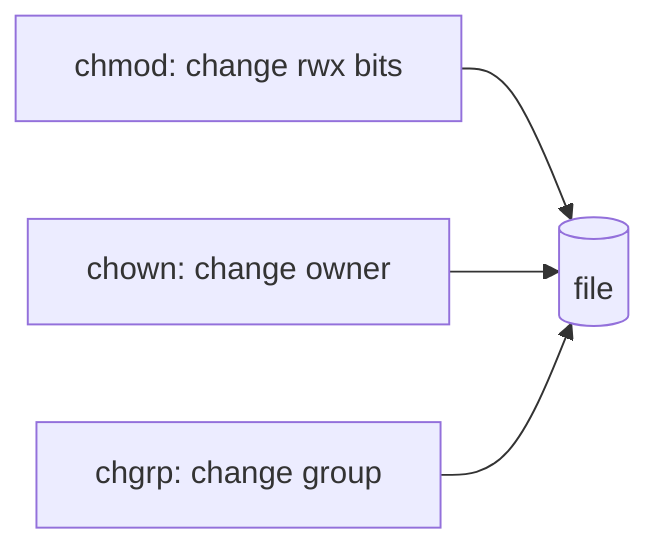

# chmod, chown, chgrp

## 1. What Is This?

The commands that **change** permissions and ownership:
- `chmod` — change permission bits (rwx).
- `chown` — change the owning user (and optionally group).
- `chgrp` — change the owning group.

## 2. Why Is This Needed?

You constantly adjust access: making a script executable, securing a key, giving a web server ownership of its files, or sharing a directory with a team.

## 3. Simple Layman Explanation

- `chmod` = change which keys (read/write/run) work.
- `chown` = change who owns the box.
- `chgrp` = change which department shares the box.

## 4. Technical Explanation

**chmod** accepts numeric or symbolic forms:

| Form | Example | Meaning |
|------|---------|---------|
| Numeric | `chmod 644 f` | owner rw, group r, others r |
| Symbolic | `chmod u+x f` | add execute for owner |
| Symbolic | `chmod go-w f` | remove write from group & others |
| Recursive | `chmod -R 755 dir` | apply to dir and contents |

Symbolic targets: `u`=user, `g`=group, `o`=others, `a`=all. Operators: `+` add, `-` remove, `=` set exactly.

## 5. Real-World Example

After writing a deploy script: `chmod +x deploy.sh` so it can run. After copying web files: `sudo chown -R www-data:www-data /var/www/site` so Nginx owns them. These two patterns appear in nearly every server setup.

## 6. Diagram



## 7. Commands

```bash
chmod +x script.sh             # make executable (all classes)
chmod u+x script.sh            # executable for owner only
chmod 644 file.txt             # rw-r--r--
chmod 600 ~/.ssh/id_rsa        # private key: owner rw only
chmod -R 755 /var/www/site     # recursive on a directory tree
sudo chown alice file.txt      # change owner to alice
sudo chown alice:devs file.txt # change owner and group
sudo chown -R www-data:www-data /var/www/site
sudo chgrp devs file.txt       # change group only
```

## 8. Command Explanation

- `chmod +x` → adds execute; required to run a script.
- `chmod 600 key` → only the owner can read/write — required for SSH keys.
- `chmod -R` → recursive; applies to the whole tree (use carefully).
- `chown user:group` → sets both owner and group in one go.
- `chgrp group file` → changes only the group.
- Ownership changes usually need `sudo`.

## 9. Practice Tasks

1. `echo 'echo hi' > s.sh && chmod +x s.sh && ./s.sh`.
2. `touch k && chmod 600 k && ls -l k` (confirm `rw-------`).
3. `mkdir -p web && sudo chown -R $USER:$USER web`.
4. Convert `chmod 750` to its rwx string in your head, then verify with `stat`.

## 10. Common Mistakes

- `chmod 777` to "fix" permissions — opens the file to everyone. Avoid.
- `chmod -R` on the wrong directory (e.g., `/`) — can break the system.
- Forgetting `sudo` for `chown`/`chgrp` on files you don't own.

## 11. Troubleshooting

- **`chmod: Operation not permitted`** → you don't own the file; use `sudo`.
- **Script still "Permission denied" after chmod** → confirm `x` with `ls -l`, and that the filesystem isn't mounted `noexec`.
- **Recursively broke perms** → restore from backup; for web dirs, files `644` and dirs `755` (use `find` to set each type).

## 12. Best Practices

- Prefer specific perms (`644`, `755`, `600`) over `777`.
- Set files and directories separately when recursing:
  `find dir -type f -exec chmod 644 {} \;` and `-type d ... 755`.
- Double-check the path before any `-R` change.

## 13. Quick Recap

- `chmod` = permissions, `chown` = owner, `chgrp` = group.
- `+x` to run scripts, `600` for keys, `644/755` for web.
- `-R` is recursive — use with care; ownership needs `sudo`.

## 14. References

- `man chmod`, `man chown`, `man chgrp`
- GNU Coreutils: https://www.gnu.org/software/coreutils/manual/

<!-- NAV-FOOTER -->

---

### 🧭 Navigation

| Previous | Up | Next |
|:---|:---:|---:|
| ⬅️ Prev: [File Permissions](file-permissions.md) | ⬆️ Module: [Module 04 — Users, Groups & Permissions](README.md) | ➡️ Next: [sudo and root](sudo-and-root.md) |
