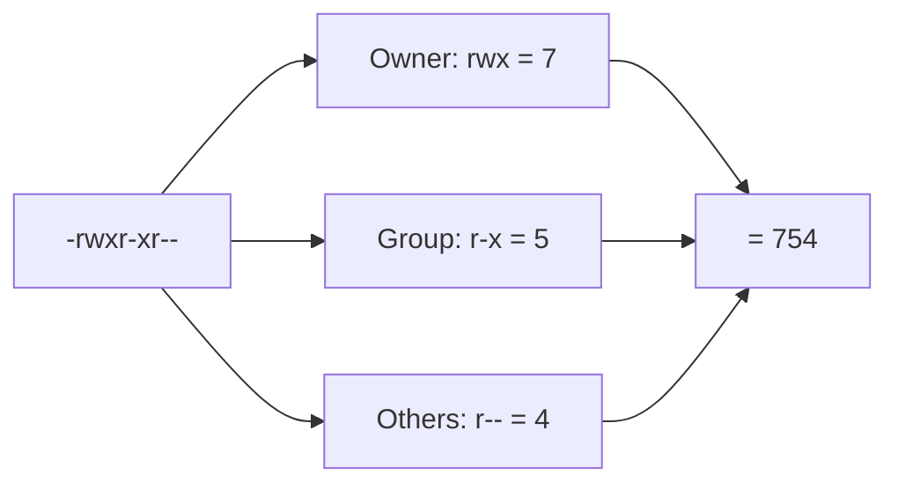
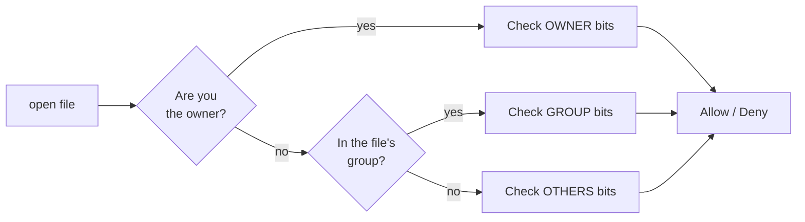

# File Permissions

## 1. What Is This?

Every Linux file has permissions controlling who can **read (r)**, **write (w)**, and **execute (x)** it, split across three classes: **owner (user)**, **group**, and **others**.

## 2. Why Is This Needed?

Permissions are Linux's core security model. They stop users from reading each other's private files, prevent accidental edits to system files, and control which files can run as programs.

## 3. Simple Layman Explanation

Each file has three sets of keys: one for the **owner**, one for the **group**, one for **everyone else**. Each key grants up to three abilities: **read** (look), **write** (change), **execute** (run).

## 4. Technical Explanation

Run `ls -l` and read the first 10 characters:

```
-rwxr-xr--
```

| Position | Meaning |
|----------|---------|
| 1 | Type: `-` file, `d` directory, `l` symlink |
| 2-4 | Owner: `rwx` |
| 5-7 | Group: `r-x` |
| 8-10 | Others: `r--` |

**Numeric (octal) values:** r=4, w=2, x=1. Add them per class:

| Symbolic | Octal | Meaning |
|----------|-------|---------|
| rwx | 7 | read+write+execute |
| rw- | 6 | read+write |
| r-x | 5 | read+execute |
| r-- | 4 | read only |

So `-rwxr-xr--` = **754**.

For **directories**: `r` = list contents, `w` = create/delete files inside, `x` = enter/traverse.

## 5. How It Works Under the Hood

The permissions you see in `ls -l` are not stored in the filename or in the directory listing. They live as **9 bits inside the file's inode** — the small metadata record on disk that describes the file (owner, group, size, timestamps, and these permission bits). `ls -l` simply *renders* those bits as the `rwx` string. There are also 3 special bits (setuid, setgid, sticky) stored alongside them, covered in later topics.

**Who checks the permissions?** Not the shell — the **kernel** does, every time a program opens a file. When a program calls `open("file", O_RDONLY)`, the kernel compares *you* (your user ID and group IDs) against the file's owner and group, and picks **exactly one** class to check, in this order:

1. Are you the **owner**? → use the **owner** bits, and stop.
2. Otherwise, are you in the file's **group**? → use the **group** bits, and stop.
3. Otherwise → use the **others** bits.

This is "first match wins." A surprising consequence: a file can be `rw-` for *others* but `---` for its own *group*, and a group member will be **denied** — because once you match the group class, the kernel never falls through to `others`. Beginners expect permissions to "add up"; they don't. The kernel finds your class and looks only there.

**Why directories behave differently.** A directory is really a special file whose *contents* are a table mapping names → inode numbers. So the bits mean:

- `r` = read that table (you can `ls` the names).
- `w` = modify that table (create, rename, delete entries) — note this controls the *directory*, so you can delete a file you can't even write to, if you can write the directory.
- `x` = resolve a name *through* the directory (traverse it).

That's why `x` **without** `r` lets you `cd` into a directory and open a file *whose name you already know*, but `ls` fails ("Permission denied"). And why deleting a file depends on the **directory's** `w` bit, not the file's. These two facts explain the majority of confusing permission bugs.

## 6. Diagram



Kernel check order when *you* open a file:



## 7. Real-World Examples

**1. The everyday case — a web directory.** Web files are usually `644` (`rw-r--r--`: owner edits, everyone reads) and directories `755` (`rwxr-xr-x`: owner manages, everyone can enter and list). Nginx runs as its own user, matches the *others* class, and can serve the files.

**2. The one that blocks you constantly — SSH keys.** An SSH private key **must** be `600` (`rw-------`). If it's group- or world-readable, SSH refuses to use it:

```
$ ssh -i ~/.ssh/id_rsa deploy@server
@@@@@@@@@@@@@@@@@@@@@@@@@@@@@@@@@@@@@@@@@@@@@@@@@@@@@@@@@@@
@   WARNING: UNPROTECTED PRIVATE KEY FILE!               @
@@@@@@@@@@@@@@@@@@@@@@@@@@@@@@@@@@@@@@@@@@@@@@@@@@@@@@@@@@@
Permissions 0644 for '/home/you/.ssh/id_rsa' are too open.
```

Fix: `chmod 600 ~/.ssh/id_rsa`. This is one of the most common "why can't I connect?" moments in real work.

**3. Production war story — the directory `x` trap.** A deploy fails with `Permission denied` reading `/opt/app/config/db.yaml`, even though the file itself is `644` and readable. Checking the *path*:

```
$ ls -ld /opt/app/config
drwxr-x--- 2 root root 4096 Jul  1 09:00 /opt/app/config
```

The **directory** is `750` — owned by `root:root`, no access for *others*. The `app` user can't **traverse** it (`x`), so it can't reach the file inside regardless of the file's own permissions. The lesson from Section 5 in action: to read a file, you need `x` on **every directory in the path leading to it**, not just permission on the file.

## 8. Worked Walkthrough

Follow along in a throwaway directory. Watch how the output changes at each step.

```
$ touch report.txt
$ ls -l report.txt
-rw-r--r-- 1 alice alice 0 Jul  2 10:00 report.txt
```

New files start `644` (that's `666` minus the default `umask` of `022` — see Section 15). No `x`, so it isn't runnable yet.

```
$ stat report.txt
  File: report.txt
  Size: 0    ...    Access: (0644/-rw-r--r--)  Uid: (1000/alice)  Gid: (1000/alice)
```

`stat` shows the octal (`0644`) and symbolic form together, plus the numeric owner/group IDs the kernel actually compares against.

```
$ chmod 600 report.txt
$ ls -l report.txt
-rw------- 1 alice alice 0 Jul  2 10:00 report.txt
```

Now only the owner can read/write; group and others get nothing — exactly what an SSH key needs.

```
$ mkdir vault && chmod 711 vault && touch vault/secret.txt
$ ls -l vault/secret.txt          # works: you know the name and have x on vault
-rw-r--r-- 1 alice alice 0 Jul  2 10:01 vault/secret.txt
$ chmod 600 vault                 # remove x from the directory
$ ls vault/secret.txt
ls: cannot access 'vault/secret.txt': Permission denied
```

You just reproduced the war story: dropping `x` on the directory made a perfectly readable file unreachable.

## 9. Commands

```bash
ls -l file.txt        # view permissions
ls -ld /var/www       # view a directory's permissions (-d)
stat file.txt         # detailed permissions incl. octal
umask                 # default permissions mask for new files
namei -l /opt/app/config/db.yaml  # show permissions of EVERY dir in a path
```

Sample output for each (dummy values, for reference):

```text
$ ls -l file.txt
-rw-r--r-- 1 alice alice 1240 Jul  2 10:00 file.txt

$ ls -ld /var/www
drwxr-xr-x 4 root root 4096 Jul  1 08:30 /var/www

$ stat file.txt
  File: file.txt
  Size: 1240        Blocks: 8          IO Block: 4096   regular file
Access: (0644/-rw-r--r--)  Uid: ( 1000/  alice)   Gid: ( 1000/  alice)
Access: 2026-07-02 10:00:01.000000000 +0000
Modify: 2026-07-02 10:00:00.000000000 +0000

$ umask
0022

$ namei -l /opt/app/config/db.yaml
f: /opt/app/config/db.yaml
 drwxr-xr-x root root /
 drwxr-xr-x root root opt
 drwxr-xr-x root root app
 drwxr-x--- root root config      # <- no 'x' for others: this dir blocks the app user
 -rw-r--r-- root root db.yaml
```

## 10. Command Explanation

- `ls -l` → shows the permission string, owner, and group.
- `ls -ld dir` → `-d` shows the directory itself, not its contents.
- `stat file` → shows access in both symbolic and octal (e.g., `0644/-rw-r--r--`).
- `umask` → the mask subtracted from default perms; `022` yields `644` files / `755` dirs.
- `namei -l <path>` → walks the whole path and prints each component's permissions — the fastest way to find the directory `x` that's blocking you.

Expected:

```
$ ls -l script.sh
-rwxr-xr-- 1 alice devs 220 Jun 28 10:00 script.sh
```

## 11. In Production (DevOps Context)

- **Docker images** carry Linux permissions inside them. A file copied in as `root:root 600` won't be readable by a container that runs as a non-root user — a very common "works on my machine, breaks in the container" bug.
- **Kubernetes** `securityContext` (`runAsUser`, `fsGroup`) sets which UID/GID your container's process runs as, which then decides *which permission class* the kernel checks against mounted volume files — the same owner/group/others logic from Section 5, one layer up.
- **CI/CD runners** frequently fail on `chmod +x deploy.sh` being forgotten (script not executable) or on cached artifacts restored with the wrong ownership.
- **Cloud servers**: locked-down `~/.ssh` permissions are the #1 reason a fresh EC2/VM login is rejected.

## 12. Practice Tasks

1. `touch perm.txt && ls -l perm.txt` — note the default permissions and relate them to your `umask`.
2. `stat perm.txt` and find the octal value.
3. Read three different `ls -l` outputs and convert each to octal by hand.
4. `ls -ld /tmp /etc /home` and compare directory permissions.
5. Recreate the directory-`x` trap: make a dir `711`, put a file in it, then `chmod 600` the dir and try to read the file. Explain the result using Section 5.
6. Run `namei -l /var/log/syslog` and read every permission along the path.

## 13. Common Mistakes

- Reading the permission string in the wrong order (it's owner → group → others).
- Expecting permissions to "add up" across classes — the kernel checks only **one** class (owner *or* group *or* others).
- Forgetting directories need `x` to be entered, even if `r` lets you list names.
- Confusing file `x` (run as program) with directory `x` (traverse).
- Fixing the file's permissions when the real block is a **parent directory** in the path.

## 14. Troubleshooting

- **Can list a folder but `cd` fails** → directory lacks `x` (execute/traverse).
- **Can read a file but not save edits** → you lack `w` (write).
- **File is readable but access still denied** → a parent directory in the path lacks `x`; run `namei -l <path>`.
- **A group member is denied even though "others" can read** → they matched the *group* class, which has fewer bits; the kernel didn't fall through to others.
- **Script won't run** → it lacks `x`; see chmod (next topic).

## 15. Best Practices

- Private keys: `600`. Scripts: `750` or `755`. Web files: `644`, dirs `755`.
- Never use `777` — it lets anyone modify the file.
- When debugging access, check the **whole path**, not just the file.
- Learn to read/convert the `rwx` ↔ octal mapping fluently.

## 16. Connects To

- **Next:** [chmod, chown, chgrp](chmod-chown-chgrp.md) — how to *change* these bits.
- **Builds on:** [Users and Groups](users-and-groups.md) — the UID/GID the kernel compares against.
- **Related:** [sudo and root](sudo-and-root.md) — root bypasses these checks entirely.
- **Practiced in:** [Lab 02 — User & Permission Practice](../14-hands-on-labs/lab-02-user-permission-practice.md).
- **Quick lookup:** [Permissions Cheatsheet](../16-cheatsheets/permissions-cheatsheet.md).

## 17. Quick Recap

- Permissions are 9 bits in the file's **inode**; the **kernel** enforces them on `open()`.
- 3 classes (owner/group/others) × 3 perms (rwx); the kernel checks **one** class only — first match wins, no adding up.
- r=4, w=2, x=1; sum per class gives octal (e.g., 754).
- Directories need `x` to enter, and you need `x` on **every** directory in a path.

## 18. References

- `man chmod`, `man stat`, `man umask`, `man namei`
- GNU Coreutils permissions: https://www.gnu.org/software/coreutils/manual/

<!-- NAV-FOOTER -->

---

### 🧭 Navigation

| Previous | Up | Next |
|:---|:---:|---:|
| ⬅️ Prev: [Users and Groups](users-and-groups.md) | ⬆️ Module: [Module 04 — Users, Groups & Permissions](README.md) | ➡️ Next: [chmod, chown, chgrp](chmod-chown-chgrp.md) |
