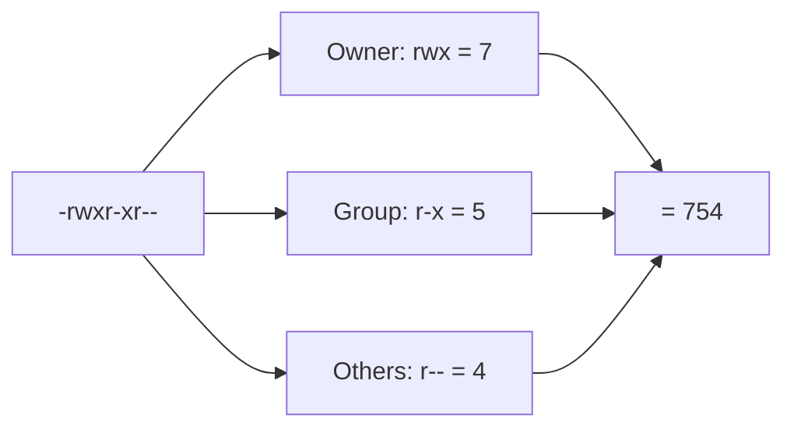

# File Permissions

## 1. What Is This?

Every Linux file has permissions controlling who can **read (r)**, **write (w)**, and **execute (x)** it, split across three classes: **owner (user)**, **group**, and **others**.

## 2. Why Is This Needed?

Permissions are Linux's core security model. They stop users from reading each other's private files, prevent accidental edits to system files, and control which files can run as programs.

## 3. Simple Layman Explanation

Each file has three sets of keys: one for the **owner**, one for the **group**, one for **everyone else**. Each key grants up to three abilities: **read** (look), **write** (change), **execute** (run).

## 4. Technical Explanation

Run `ls -l` and read the first 10 characters:

```
-rwxr-xr--
```

| Position | Meaning |
|----------|---------|
| 1 | Type: `-` file, `d` directory, `l` symlink |
| 2-4 | Owner: `rwx` |
| 5-7 | Group: `r-x` |
| 8-10 | Others: `r--` |

**Numeric (octal) values:** r=4, w=2, x=1. Add them per class:

| Symbolic | Octal | Meaning |
|----------|-------|---------|
| rwx | 7 | read+write+execute |
| rw- | 6 | read+write |
| r-x | 5 | read+execute |
| r-- | 4 | read only |

So `-rwxr-xr--` = **754**.

For **directories**: `r` = list contents, `w` = create/delete files inside, `x` = enter/traverse.

## 5. Real-World Example

An SSH private key must be `600` (`rw-------`) — only you can read it. If it's group/world-readable, SSH refuses to use it. Web files are often `644` (readable) and directories `755` (enterable).

## 6. Diagram



## 7. Commands

```bash
ls -l file.txt        # view permissions
ls -ld /var/www       # view a directory's permissions (-d)
stat file.txt         # detailed permissions incl. octal
umask                 # default permissions mask for new files
```

## 8. Command Explanation

- `ls -l` → shows the permission string, owner, and group.
- `ls -ld dir` → `-d` shows the directory itself, not its contents.
- `stat file` → shows access in both symbolic and octal (e.g., `0644/-rw-r--r--`).
- `umask` → the mask subtracted from default perms; `022` yields `644` files / `755` dirs.

Expected:

```
$ ls -l script.sh
-rwxr-xr-- 1 alice devs 220 Jun 28 10:00 script.sh
```

## 9. Practice Tasks

1. `touch perm.txt && ls -l perm.txt` — note the default permissions.
2. `stat perm.txt` and find the octal value.
3. Read three different `ls -l` outputs and convert each to octal by hand.
4. `ls -ld /tmp /etc /home` and compare directory permissions.

## 10. Common Mistakes

- Reading the permission string in the wrong order (it's owner → group → others).
- Forgetting directories need `x` to be entered, even if `r` lets you list names.
- Confusing file `x` (run as program) with directory `x` (traverse).

## 11. Troubleshooting

- **Can list a folder but `cd` fails** → directory lacks `x` (execute/traverse).
- **Can read a file but not save edits** → you lack `w` (write).
- **Script won't run** → it lacks `x`; see chmod (next topic).

## 12. Best Practices

- Private keys: `600`. Scripts: `750` or `755`. Web files: `644`, dirs `755`.
- Never use `777` — it lets anyone modify the file.
- Learn to read/convert the `rwx` ↔ octal mapping fluently.

## 13. Quick Recap

- 3 classes (owner/group/others) × 3 perms (rwx).
- r=4, w=2, x=1; sum per class gives octal (e.g., 754).
- Directories need `x` to enter.

## 14. References

- `man chmod`, `man stat`, `man umask`
- GNU Coreutils permissions: https://www.gnu.org/software/coreutils/manual/
