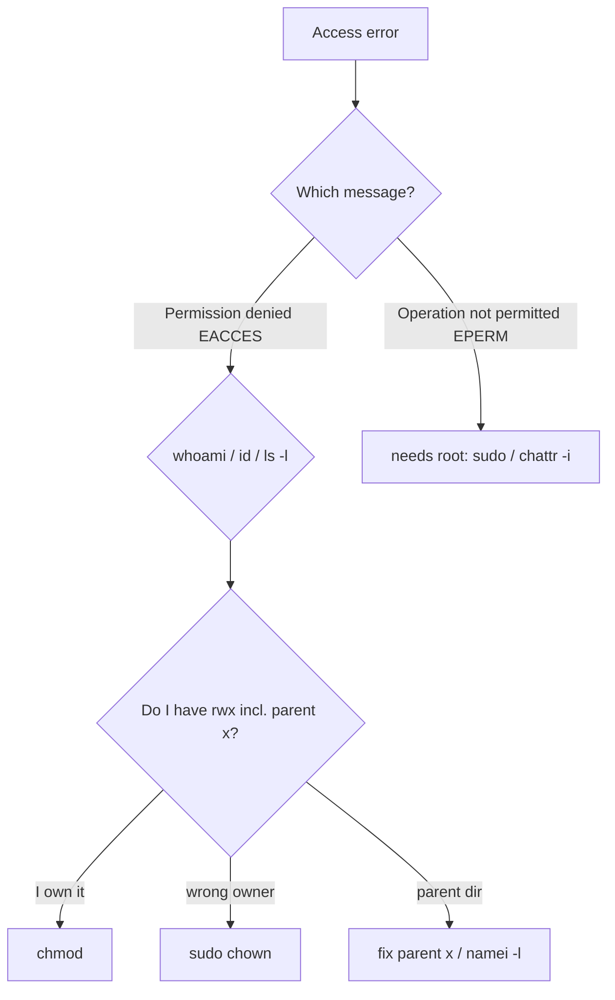

# Permission Troubleshooting

## 1. What Is This?

A practical guide to diagnosing and fixing the most common permission errors: **Permission denied**, **Operation not permitted**, and scripts that won't run.

## 2. Why Is This Needed?

Permission errors block beginners constantly. A clear method turns a frustrating wall into a 30-second fix.

## 3. Simple Layman Explanation

A locked door (permission denied) has only a few causes: you don't have the key (no permission), you're at the wrong door (wrong path/owner), or you need the master key (sudo). Check each in order.

## 4. Technical Explanation

Diagnostic order:
1. **Who am I?** → `whoami`, `id`.
2. **Who owns it and what are the perms?** → `ls -l`.
3. **Do my user/group match the needed access?**
4. **Is a parent directory blocking traversal?** (needs `x`).
5. **Does this action need root?** → use `sudo`.

## 5. How It Works Under the Hood

Almost every permission error is the kernel returning one of two distinct error codes, and telling them apart is the whole diagnosis:

- **`EACCES` → "Permission denied".** The kernel ran its normal owner/group/other check (see [File Permissions](file-permissions.md)) and your process's UID/GID didn't have the needed bit. This is a *discretionary* failure — fixable by changing the file's mode/owner or your group membership. Crucially, the check runs on **every directory in the path** (each needs `x` to traverse), so the block is often a *parent directory*, not the file itself. That's why `namei -l` (which prints permissions at every path level) is the fastest tool: it shows exactly where the walk stops.
- **`EPERM` → "Operation not permitted".** This is different: the operation itself is *privileged* — reserved for root (UID 0) regardless of file bits — or blocked by a special attribute. Binding port 80, editing files under `/etc` you don't own, or writing a file marked **immutable** (`chattr +i`) all raise `EPERM`. No amount of `chmod` fixes it; you need `sudo` or to remove the attribute.

So the two messages point at two different fixes: **"Permission denied" (EACCES)** → adjust ownership/mode/path/traversal; **"Operation not permitted" (EPERM)** → elevate with `sudo` (or clear an immutable flag). Reading *which* error you got is step zero, and it's why the scenarios below split along exactly that line.

## 6. Diagram



## 7. Real-World Examples

**1. The everyday case.** A deploy fails: "Permission denied: /var/www/site". `ls -l` shows the files owned by `root`, but the deploy runs as `deploy`. Fix: `sudo chown -R deploy:deploy /var/www/site`. Problem solved.

**2. Using `namei -l` to find the real blocker:**

```
$ sudo -u deploy cat /var/www/site/config/db.yaml
cat: /var/www/site/config/db.yaml: Permission denied
$ ls -l /var/www/site/config/db.yaml
-rw-r--r-- 1 deploy deploy 210 Jul 2 09:00 db.yaml    # file itself looks readable!
$ namei -l /var/www/site/config/db.yaml
 drwxr-xr-x root   root   /
 drwxr-xr-x root   root   var
 drwxr-xr-x root   root   www
 drwxr-xr-x root   root   site
 drwxr-x--- root   root   config      # <-- others have no x: deploy can't traverse
 -rw-r--r-- deploy deploy db.yaml
```

The file is fine; the `config` directory lacks traversal for `deploy`. Fix the directory, not the file — exactly the "parent dir" branch of Section 5.

**3. War story — "Permission denied" that was really EPERM.** A CI job started nginx directly and failed to bind port 80 with "Operation not permitted." An engineer spent an hour `chmod`-ing the nginx binary and config — pointless, because this was **EPERM**, not EACCES: binding ports below 1024 is privileged and no file mode changes it (Section 5). The real fixes were running via `sudo`/systemd (which starts as root then drops privileges) or granting the `CAP_NET_BIND_SERVICE` capability. Reading the *exact* error message would have saved the hour.

## 8. Worked Walkthrough

Reproduce and diagnose the two classic failures:

```
$ echo 'echo hi' > s.sh
$ ./s.sh
bash: ./s.sh: Permission denied            # EACCES: no execute bit
$ ls -l s.sh
-rw-r--r-- 1 alice alice 8 Jul 2 09:00 s.sh
$ chmod +x s.sh && ./s.sh
hi                                          # fixed by adjusting the mode

$ touch locked.txt && sudo chattr +i locked.txt   # mark immutable
$ echo "x" >> locked.txt
bash: locked.txt: Operation not permitted   # EPERM: privileged/attribute block
$ lsattr locked.txt
----i---------e------- locked.txt           # the 'i' flag is the culprit
$ sudo chattr -i locked.txt && echo "x" >> locked.txt   # clear it, now it works
```

Two failures, two *different* messages, two *different* fixes — `chmod` for the EACCES case, root + `chattr -i` for the EPERM case. That split is the entire method.

## 9. Commands

```bash
whoami; id                      # who am I, my groups
ls -l file                      # owner, group, perms
ls -ld /path/to/parent          # check parent dir traversal (x)
namei -l /var/www/site/app.js   # show perms at every path level
stat file                       # full permission detail
lsattr file                     # special attributes (e.g. immutable 'i')
chmod +x script.sh              # fix non-executable script
sudo chown -R user:group dir    # fix ownership
```

Sample output for each (dummy values, for reference):

```text
$ id
uid=1001(deploy) gid=1001(deploy) groups=1001(deploy)

$ ls -l app.js
-rw-r----- 1 root root 512 Jul  2 09:00 app.js

$ namei -l /srv/app/app.js
 drwxr-xr-x root   root   /
 drwxr-xr-x root   root   srv
 drwxr-x--- root   root   app        # <-- blocks non-group users here
 -rw-r----- root   root   app.js

$ stat app.js
Access: (0640/-rw-r-----)  Uid: (0/root)   Gid: (0/root)

$ lsattr app.js
-------------e------- app.js
```

## 10. Command Explanation

- `id` / `whoami` → establish which UID/GID the kernel will check for you.
- `ls -l` / `stat` → the file's owner, group, and mode.
- `namei -l <path>` → walks each component of a path showing perms — pinpoints *which* directory blocks you (the parent-`x` case).
- `lsattr` → reveals special attributes like immutable (`i`) behind an EPERM.
- `chmod +x` / `sudo chown` → the two most common EACCES fixes.

## 11. In Production (DevOps Context)

- **Deploy failures** are dominated by ownership mismatches (files owned by `root`, app runs as a service user) — `sudo chown -R` is the routine fix (Section 7).
- **Containers:** "Permission denied" on a mounted volume usually means the container's `runAsUser` UID doesn't match the volume's file ownership — the same EACCES/UID logic one layer up (Module 13).
- **Privileged ports & capabilities:** the port-80 EPERM (the war story) is why web servers run via systemd (start as root, drop privileges) or use `CAP_NET_BIND_SERVICE` (Module 12).
- **Immutable configs:** some hardened systems set `chattr +i` on critical files; automation that edits them must clear it first — an EPERM that confuses many pipelines.

## 12. Practice Tasks

1. Create a file, remove your read with `chmod u-r f`, try `cat f`, then restore — note the "Permission denied".
2. Make a script, run it without `+x` (fails), add `chmod +x`, run again.
3. Use `namei -l` on a deep path (e.g., `/var/log/journal/`) and read the per-level permissions.
4. `sudo chattr +i test && echo x >> test` to trigger "Operation not permitted", then `lsattr` and `sudo chattr -i test`.

## 13. Common Mistakes

- Jumping straight to `chmod 777` instead of diagnosing (and breaking security in the process).
- Fixing the *file* when a *parent directory's* `x` is the real block (Section 7).
- Confusing "Permission denied" (EACCES → mode/owner) with "Operation not permitted" (EPERM → needs root/attribute) — the war story.
- Confusing either with "No such file or directory" (a *path* problem, not permissions).

## 14. Troubleshooting

**Scenario A — Permission denied reading/writing a file (EACCES)**
- **Problem:** `cat file` or saving an edit returns `Permission denied`.
- **Symptoms:** You can see the file exists but can't read/write it.
- **Possible Causes:** You're not the owner and lack group/other rights; or a parent directory lacks `x`.
- **Commands to Check:** `id`, `ls -l file`, `namei -l /full/path/to/file`.
- **Step-by-Step Fix:** ① If you own it, add the bit: `chmod u+rw file`. ② If wrong owner and you're admin: `sudo chown $USER file`. ③ If a parent dir blocks you: fix its `x` (`sudo chmod o+x /parent`) or join its group.
- **Prevention:** Set correct ownership/permissions at creation; use groups for shared access.

**Scenario B — Script won't run: "Permission denied"**
- **Problem:** `./script.sh` returns `Permission denied` though the script is correct.
- **Symptoms:** Runs fine via `bash script.sh` but not `./script.sh`.
- **Possible Causes:** Missing execute bit; or the filesystem is mounted `noexec`.
- **Commands to Check:** `ls -l script.sh`; `mount | grep "$(df --output=target script.sh | tail -1)"`.
- **Step-by-Step Fix:** ① `chmod +x script.sh`. ② Or run via interpreter: `bash script.sh`. ③ If `noexec`, move the script to a normal filesystem.
- **Prevention:** `chmod +x` scripts at creation; keep them off `noexec` mounts like some `/tmp`.

**Scenario C — "Operation not permitted" (EPERM)**
- **Problem:** A command fails even though file perms look fine.
- **Symptoms:** The message is "Operation not permitted", *not* "Permission denied".
- **Possible Causes:** The action needs root (bind port <1024, edit `/etc`, change another's file owner); or the file is immutable (`chattr +i`).
- **Commands to Check:** `lsattr file`; `sudo -l`.
- **Step-by-Step Fix:** ① Retry with `sudo`. ② If immutable: `sudo chattr -i file`, then proceed. ③ For privileged ports, run via systemd or grant a capability.
- **Prevention:** Use sudo for system-level actions; document any immutable files you set.

## 15. Best Practices

- Read the *exact* error first (EACCES vs EPERM) — it dictates the fix.
- Diagnose with `id` + `ls -l` + `namei -l` before changing anything.
- Fix with the minimal change (least privilege), not `777`.
- Prefer ownership/groups over world-wide permissions.

## 16. Connects To

- **Prev:** [sudo and root](sudo-and-root.md). **Next:** [Module 05 — Processes & Services](../05-processes-and-services/README.md).
- **The rules being enforced:** [File Permissions](file-permissions.md), [chmod/chown/chgrp](chmod-chown-chgrp.md).
- **Elevating (EPERM):** [sudo and root](sudo-and-root.md), [Least Privilege](../12-linux-security-basics/least-privilege.md).
- **Quick lookup:** [Permissions Cheatsheet](../16-cheatsheets/permissions-cheatsheet.md), [Troubleshooting Cheatsheet](../16-cheatsheets/troubleshooting-cheatsheet.md).

## 17. Quick Recap

- Two errors, two fixes: **"Permission denied" (EACCES)** → mode/owner/parent-`x`; **"Operation not permitted" (EPERM)** → needs root or clear an immutable flag.
- Diagnose in order: identity (`id`) → ownership/mode (`ls -l`) → path traversal (`namei -l`) → then `sudo`.
- `chmod +x` for scripts, `chown` for wrong owner, `sudo`/`chattr -i` for EPERM. Avoid `777`.

## 18. References

- `man chmod`, `man chown`, `man namei`, `man lsattr`, `man chattr`
- [chmod-chown-chgrp.md](./chmod-chown-chgrp.md)

<!-- NAV-FOOTER -->

---

### 🧭 Navigation

| Previous | Up | Next |
|:---|:---:|---:|
| ⬅️ Prev: [sudo and root](sudo-and-root.md) | ⬆️ Module: [Module 04 — Users, Groups & Permissions](README.md) | ➡️ Next: [Module 05 — Processes & Services](../05-processes-and-services/README.md) |
