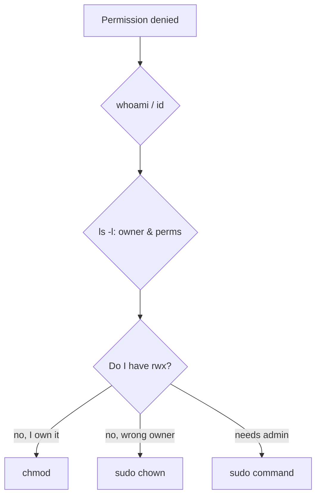

# Permission Troubleshooting

## 1. What Is This?

A practical guide to diagnosing and fixing the most common permission errors: **Permission denied**, **Operation not permitted**, and scripts that won't run.

## 2. Why Is This Needed?

Permission errors block beginners constantly. A clear method turns a frustrating wall into a 30-second fix.

## 3. Simple Layman Explanation

A locked door (permission denied) has only a few causes: you don't have the key (no permission), you're at the wrong door (wrong path/owner), or you need the master key (sudo). Check each in order.

## 4. Technical Explanation

Diagnostic order:
1. **Who am I?** → `whoami`, `id`.
2. **Who owns it and what are the perms?** → `ls -l`.
3. **Do my user/group match the needed access?**
4. **Is a parent directory blocking traversal?** (needs `x`).
5. **Does this action need root?** → use `sudo`.

## 5. Real-World Example

A deploy fails: "Permission denied: /var/www/site". `ls -l` shows the files owned by `root`, but the deploy runs as `deploy`. Fix: `sudo chown -R deploy:deploy /var/www/site`. Problem solved.

## 6. Diagram



## 7. Commands

```bash
whoami; id                      # who am I, my groups
ls -l file                      # owner, group, perms
ls -ld /path/to/parent          # check parent dir traversal (x)
namei -l /var/www/site/app.js   # show perms at every path level
stat file                       # full permission detail
chmod +x script.sh              # fix non-executable script
sudo chown -R user:group dir    # fix ownership
```

## 8. Command Explanation

- `namei -l <path>` → walks each component of a path showing perms — perfect for finding *which* directory blocks you.
- `stat` → confirms exact perms/owner.
- `chmod +x` / `chown` → the two most common fixes.

---

## Scenario: Permission Denied (reading/writing a file)

### Problem
You can't read or edit a file.

### Symptoms
`cat file` or saving an edit returns `Permission denied`.

### Possible Causes
- You're not the owner and lack group/other read/write.
- A parent directory lacks `x` (can't traverse to it).

### Commands to Check
```bash
id
ls -l file
namei -l /full/path/to/file
```

### Step-by-Step Fix
1. If you own it: add the bit you need, e.g. `chmod u+rw file`.
2. If wrong owner and you're admin: `sudo chown $USER file`.
3. If a parent dir blocks you: `sudo chmod o+x /parent` (or add yourself to its group).

### Prevention
Set correct ownership/permissions when creating files; use groups for shared access.

---

## Scenario: Script Won't Run ("Permission denied")

### Problem
`./script.sh` returns `Permission denied`.

### Symptoms
The script exists and is correct but won't execute.

### Possible Causes
- Missing execute bit.
- Filesystem mounted `noexec`.

### Commands to Check
```bash
ls -l script.sh        # look for x
mount | grep $(df --output=target script.sh | tail -1)
```

### Step-by-Step Fix
1. `chmod +x script.sh`.
2. Or run via interpreter: `bash script.sh` (no x needed).
3. If `noexec`, move the script to a normal filesystem.

### Prevention
`chmod +x` scripts when you create them; keep scripts in a normal location.

---

## Scenario: "Operation not permitted"

### Problem
A command fails even though you seem to have permission.

### Symptoms
`Operation not permitted` (vs "Permission denied").

### Possible Causes
- The action needs root (e.g., binding port 80, editing `/etc`).
- File has an immutable attribute (`chattr +i`).

### Commands to Check
```bash
lsattr file        # check for 'i' (immutable)
sudo -l            # what can I do as sudo?
```

### Step-by-Step Fix
1. Retry with `sudo`.
2. If immutable: `sudo chattr -i file`, then proceed.

### Prevention
Use sudo for system-level actions; document any immutable files you set.

## 9. Practice Tasks

1. Create a file, remove your read with `chmod u-r f`, try `cat f`, then restore.
2. Make a script, run it without `+x` (fails), add `chmod +x`, run again.
3. Use `namei -l` on a deep path and read the per-level permissions.

## 10. Common Mistakes

- Jumping straight to `chmod 777` instead of diagnosing.
- Ignoring parent-directory `x` permissions.
- Confusing "Permission denied" (perms) with "No such file" (path).

## 11. Troubleshooting

Already covered above — the scenarios *are* the troubleshooting.

## 12. Best Practices

- Diagnose with `id` + `ls -l` + `namei -l` before changing anything.
- Fix with the minimal change (least privilege), not `777`.
- Prefer ownership/groups over world-wide permissions.

## 13. Quick Recap

- Check identity, ownership, perms, parent dirs, then sudo.
- `chmod +x` for scripts; `chown` for wrong owner; `sudo` for system actions.
- Avoid `777`.

## 14. References

- `man chmod`, `man chown`, `man namei`, `man lsattr`
- [chmod-chown-chgrp.md](./chmod-chown-chgrp.md)

<!-- NAV-FOOTER -->

---

### 🧭 Navigation

| Previous | Up | Next |
|:---|:---:|---:|
| ⬅️ Prev: [sudo and root](sudo-and-root.md) | ⬆️ Module: [Module 04 — Users, Groups & Permissions](README.md) | ➡️ Next: [Module 05 — Processes & Services](../05-processes-and-services/README.md) |
