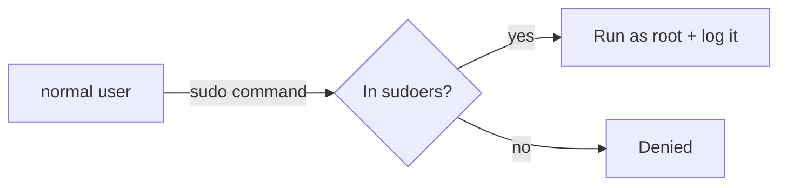

# sudo and root

## 1. What Is This?

**root** is the all-powerful superuser (UID 0). **sudo** ("superuser do") lets a permitted normal user run a single command with root privileges, without logging in as root.

## 2. Why Is This Needed?

Some actions (installing software, editing system files, restarting services) require admin rights. `sudo` grants them temporarily and safely, with an audit trail — far better than living as root.

## 3. Simple Layman Explanation

root is the **master key** to the whole building. Carrying it everywhere is dangerous — one slip and you damage everything. `sudo` is like asking security to unlock **one specific door** when you need it, and it logs who asked.

## 4. Technical Explanation

- root can read/write/delete anything and override permissions.
- `sudo` checks `/etc/sudoers` (and `/etc/sudoers.d/`) to see if you're allowed, then runs the command as root.
- Membership in the `sudo` group (Debian/Ubuntu) or `wheel` group (RHEL) typically grants sudo rights.
- `sudo` actions are logged (e.g., in `/var/log/auth.log`), giving accountability.

## 5. Real-World Example

To install Nginx: `sudo apt install nginx`. To edit the SSH config: `sudo nano /etc/ssh/sshd_config`. You stay as your normal user and only elevate for the specific command.

## 6. Diagram



## 7. Commands

```bash
sudo apt update                 # run one command as root
sudo -i                         # start an interactive root shell
sudo -u alice whoami            # run a command as another user
sudo !!                         # re-run the previous command with sudo
whoami                          # check who you are
sudo -l                         # list what sudo rights you have
sudo visudo                     # safely edit the sudoers file
sudo usermod -aG sudo bob       # grant bob sudo (Debian/Ubuntu)
```

## 8. Command Explanation

- `sudo <cmd>` → runs that one command as root (prompts for *your* password).
- `sudo -i` → opens a root shell; exit with `exit`. Use sparingly.
- `sudo -u alice <cmd>` → run as a different user, not just root.
- `sudo !!` → handy when you forgot `sudo` (re-runs last command elevated).
- `visudo` → edits `/etc/sudoers` with syntax checking (never edit it directly).

## 9. Practice Tasks

1. Run `sudo -l` to see your privileges.
2. Try `cat /etc/shadow` (denied), then `sudo cat /etc/shadow` (works).
3. Run a harmless command, forget sudo, then use `sudo !!`.
4. (On a test box) create `bob` and grant sudo with `usermod -aG sudo bob`.

## 10. Common Mistakes

- Running everything as root or `sudo -i` constantly — one typo can wreck the system.
- Editing `/etc/sudoers` directly with a normal editor (syntax error locks out sudo). Use `visudo`.
- Typing your root password instead of your user password at the `sudo` prompt.

## 11. Troubleshooting

- **"user is not in the sudoers file"** → you lack sudo rights; an admin must add you.
- **Forgot sudo, got "Permission denied"** → re-run with `sudo` (or `sudo !!`).
- **Broke sudoers** → boot to recovery/root and fix `/etc/sudoers` with `visudo`.

## 12. Best Practices

- Use `sudo` per-command; avoid persistent root shells.
- Never share the root password; grant sudo to specific users instead.
- Edit sudoers only via `visudo`.
- Review `sudo` logs for accountability.

## 13. Quick Recap

- root = superuser; `sudo` = temporary, audited elevation for one command.
- Add users to the `sudo`/`wheel` group to grant access.
- Edit sudoers only with `visudo`.

## 14. References

- `man sudo`, `man sudoers`, `man visudo`
- Sudo project: https://www.sudo.ws/docs/
