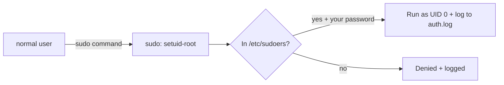

# sudo and root

## 1. What Is This?

**root** is the all-powerful superuser (UID 0). **sudo** ("superuser do") lets a permitted normal user run a single command with root privileges, without logging in as root.

## 2. Why Is This Needed?

Some actions (installing software, editing system files, restarting services) require admin rights. `sudo` grants them temporarily and safely, with an audit trail — far better than living as root.

## 3. Simple Layman Explanation

root is the **master key** to the whole building. Carrying it everywhere is dangerous — one slip and you damage everything. `sudo` is like asking security to unlock **one specific door** when you need it, and it logs who asked.

## 4. Technical Explanation

- root can read/write/delete anything and override permissions.
- `sudo` checks `/etc/sudoers` (and `/etc/sudoers.d/`) to see if you're allowed, then runs the command as root.
- Membership in the `sudo` group (Debian/Ubuntu) or `wheel` group (RHEL) typically grants sudo rights.
- `sudo` actions are logged (e.g., in `/var/log/auth.log`), giving accountability.

## 5. How It Works Under the Hood

Root's power isn't a setting — it's **UID 0**. Recall from [Users and Groups](users-and-groups.md) that the kernel checks numbers: when a process runs as UID 0, the kernel *skips* the normal owner/group/other permission checks entirely. That single rule is why root can read any file, kill any process, and bind low ports.

So how does `sudo` safely hand you that power?

- **`sudo` is a `setuid-root` program.** Look at `ls -l /usr/bin/sudo` and you'll see an `s` where the owner's `x` would be, owned by root. The **setuid bit** tells the kernel: "when *anyone* runs this program, run it as its *owner* (root), not as the caller." That's the mechanism that lets your unprivileged shell launch something with UID 0.
- **But setuid alone would be a giant hole** — so before doing anything, `sudo` consults `/etc/sudoers` to check whether *you* are permitted to run *this* command, prompts for **your own** password (proving it's really you at the keyboard, not someone who walked up to an unlocked terminal), caches that approval briefly, and **logs** the action to `/var/log/auth.log`.
- **The result:** you get root for exactly one command, gated by policy, tied to your identity, and recorded. Compare that to `su -`/logging in as root: no per-command policy, and the audit log just says "root did it" — no accountability.

This also explains the gotchas: `sudo` asks for *your* password (you're proving identity, not the root password); editing `/etc/sudoers` wrong can lock everyone out (hence `visudo` with its syntax check); and a misused setuid program is exactly how privilege-escalation attacks work (Module 12).

## 6. Diagram



## 7. Real-World Examples

**1. The everyday case.** To install Nginx: `sudo apt install nginx`. To edit the SSH config: `sudo nano /etc/ssh/sshd_config`. You stay as your normal user and only elevate for the specific command.

**2. Seeing the identity switch and the audit trail:**

```
$ whoami
alice
$ cat /etc/shadow
cat: /etc/shadow: Permission denied         # normal user blocked
$ sudo cat /etc/shadow | head -1
[sudo] password for alice:
root:$6$xyz...:19700:0:99999:7:::            # UID 0 bypasses the check
$ sudo tail -1 /var/log/auth.log
Jul  2 09:20:01 web-01 sudo: alice : TTY=pts/0 ; PWD=/home/alice ; USER=root ; COMMAND=/usr/bin/cat /etc/shadow
```

That last line is the accountability payoff — the log records *who* elevated and *what* they ran.

**3. War story — the broken `/etc/sudoers` that locked everyone out.** An admin hand-edited `/etc/sudoers` with `nano` to add a rule, made a typo, and saved. The next `sudo` anything returned `>>> /etc/sudoers: syntax error <<<` and **refused to run** — including the `sudo` needed to fix the file. With no root shell open, recovery meant rebooting into single-user/recovery mode. Had they used `sudo visudo` (which validates syntax and refuses to save a broken file), the typo would've been caught instantly. Rule: never edit sudoers by hand.

## 8. Worked Walkthrough

Inspect your privileges, elevate, and grant sudo to another user safely:

```
$ sudo -l                                # what am I allowed to run as sudo?
[sudo] password for alice:
User alice may run the following commands on web-01:
    (ALL : ALL) ALL
$ id -u                                  # my UID
1001
$ sudo id -u                             # UID of a sudo'd command
0                                        # it's root (UID 0) — Section 5 in action
$ sudo useradd -m -s /bin/bash bob
$ sudo usermod -aG sudo bob              # grant bob sudo (append to the sudo group)
$ groups bob
bob : bob sudo
$ ls -l /usr/bin/sudo                    # see the setuid bit that makes this all work
-rwsr-xr-x 1 root root 232416 ... /usr/bin/sudo    # the 's' = setuid-root
```

The `s` in `-rwsr-xr-x` is the setuid bit from Section 5 — the reason an unprivileged user can launch a root-powered command at all.

## 9. Commands

```bash
sudo apt update                 # run one command as root
sudo -i                         # start an interactive root shell
sudo -u alice whoami            # run a command as another user
sudo !!                         # re-run the previous command with sudo
sudo -l                         # list what sudo rights you have
sudo visudo                     # safely edit the sudoers file (validates syntax)
sudo usermod -aG sudo bob       # grant bob sudo (Debian/Ubuntu)
```

Sample output for each (dummy values, for reference):

```text
$ sudo apt update
[sudo] password for alice:
Hit:1 http://archive.ubuntu.com/ubuntu jammy InRelease
Reading package lists... Done

$ sudo -i
root@web-01:~#           # note the '#' prompt = you are now root

$ sudo -u postgres whoami
postgres

$ sudo -l
User alice may run the following commands on web-01:
    (ALL : ALL) ALL

$ sudo visudo
# opens /etc/sudoers in an editor; refuses to save on syntax error
```

## 10. Command Explanation

- `sudo <cmd>` → runs that one command as root (prompts for *your* password).
- `sudo -i` → opens a root shell (`#` prompt); exit with `exit`. Use sparingly.
- `sudo -u alice <cmd>` → run as a different user, not just root (e.g., as `postgres` to debug a DB).
- `sudo !!` → handy when you forgot `sudo` (re-runs last command elevated).
- `sudo -l` → lists your allowed commands per `/etc/sudoers`.
- `visudo` → edits `/etc/sudoers` with syntax checking (never edit it directly — the war story).

## 11. In Production (DevOps Context)

- **Automation runs scoped sudo:** CI/CD and Ansible use `/etc/sudoers.d/` rules limiting a deploy user to *specific* commands (e.g., only `systemctl restart myapp`) — least privilege, not blanket root (Module 12).
- **Audit & compliance:** `/var/log/auth.log` sudo entries are shipped to central logging/SIEM so every privileged action is traceable — the accountability from Section 5.
- **Cloud instances** put the default user (`ubuntu`, `ec2-user`) in a passwordless-sudo group for automation; hardening tightens this.
- **setuid awareness** matters for security: auditing setuid-root binaries is a standard step, since a vulnerable one is a privilege-escalation path (Module 12).

## 12. Practice Tasks

1. Run `sudo -l` to see your privileges.
2. Try `cat /etc/shadow` (denied), then `sudo cat /etc/shadow` (works); compare `id -u` vs `sudo id -u`.
3. Run a harmless command, forget sudo, then use `sudo !!`.
4. `ls -l /usr/bin/sudo` and find the setuid `s` bit.
5. (On a test box) create `bob` and grant sudo with `usermod -aG sudo bob`; verify with `groups bob`.

## 13. Common Mistakes

- Running everything as root or `sudo -i` constantly — one typo can wreck the system, and the audit log loses granularity.
- Editing `/etc/sudoers` directly with a normal editor (syntax error locks out sudo — the war story). Use `visudo`.
- Typing your root password instead of your **user** password at the `sudo` prompt.
- Granting blanket `(ALL) ALL` when a scoped rule in `/etc/sudoers.d/` would do.

## 14. Troubleshooting

- **"user is not in the sudoers file"** → you lack sudo rights; an admin must add you (`usermod -aG sudo <you>`).
- **Forgot sudo, got "Permission denied"** → re-run with `sudo` (or `sudo !!`).
- **Broke sudoers** → boot to recovery/single-user mode and fix `/etc/sudoers` with `visudo`.
- **`sudo` keeps asking for a password in a script** → use a scoped `NOPASSWD` rule in `/etc/sudoers.d/` for that exact command (not blanket).

## 15. Best Practices

- Use `sudo` per-command; avoid persistent root shells.
- Never share the root password; grant sudo to specific users/commands instead.
- Edit sudoers only via `visudo`; prefer scoped rules in `/etc/sudoers.d/`.
- Review `sudo` logs for accountability.

## 16. Connects To

- **Prev:** [chmod, chown, chgrp](chmod-chown-chgrp.md). **Next:** [Permission Troubleshooting](permission-troubleshooting.md).
- **Why UID 0 is special:** [Users and Groups](users-and-groups.md).
- **Least privilege & setuid risks:** [Least Privilege](../12-linux-security-basics/least-privilege.md), [Security Best Practices](../12-linux-security-basics/security-best-practices.md).
- **When to elevate for fixes:** [Permission Troubleshooting](permission-troubleshooting.md).

## 17. Quick Recap

- root = UID 0, which the kernel lets bypass permission checks; `sudo` = temporary, audited, policy-gated elevation for one command.
- `sudo` works via the **setuid-root** bit + `/etc/sudoers` + your password + logging.
- Add users to `sudo`/`wheel` to grant access; edit sudoers only with `visudo`.

## 18. References

- `man sudo`, `man sudoers`, `man visudo`
- Sudo project: https://www.sudo.ws/docs/

<!-- NAV-FOOTER -->

---

### 🧭 Navigation

| Previous | Up | Next |
|:---|:---:|---:|
| ⬅️ Prev: [chmod, chown, chgrp](chmod-chown-chgrp.md) | ⬆️ Module: [Module 04 — Users, Groups & Permissions](README.md) | ➡️ Next: [Permission Troubleshooting](permission-troubleshooting.md) |
