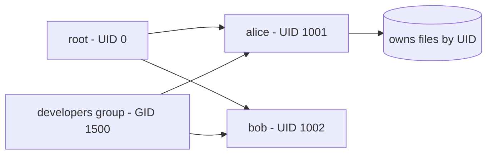

# Users and Groups

## 1. What Is This?

Linux is **multi-user**. A **user** is an account that can log in and own files. A **group** is a collection of users that share access. Every file is owned by a user and a group.

## 2. Why Is This Needed?

Servers are shared by teams and services. Separate accounts mean accountability, security, and the ability to grant exactly the access each person/service needs.

## 3. Simple Layman Explanation

Think of an **office building**. Each person has their own keycard (user). Departments (groups) get access to shared rooms. The building manager (root) can open every door.

## 4. Technical Explanation

- Users are listed in `/etc/passwd`; groups in `/etc/group`; password hashes in `/etc/shadow`.
- Each user has a **UID** (user ID) and a **primary group**; they can belong to extra **secondary groups**.
- **root** is the superuser (UID 0) with full control.
- **System users** (e.g., `www-data`, `nginx`) run services without login rights.

A line in `/etc/passwd`:

```
alice:x:1001:1001:Alice:/home/alice:/bin/bash
# name:passwd:UID:GID:comment:home:shell
```

## 5. How It Works Under the Hood

The big surprise for beginners: **the kernel doesn't know your username at all — it only knows numbers.** Internally, every process and file is tagged with a **UID** and **GID** (integers). "alice" is just a friendly label that tools look up in `/etc/passwd` for display. This is why:

- **UID 0 is special, not the name "root".** Root's power comes from being UID 0; the kernel grants UID 0 the right to bypass permission checks. Rename root or create another account with UID 0 and it's *also* all-powerful. The name is cosmetic; the number is authority.
- **Permissions compare numbers.** When you open a file, the kernel checks *your process's UID/GID* against the *file's owner UID/GID* (see [File Permissions](file-permissions.md)). `/etc/passwd` and `/etc/group` are just the phonebook translating those numbers to names for humans.
- **The `x` in `/etc/passwd` is a pointer, not a password.** Real password hashes live in `/etc/shadow`, readable only by root — so ordinary users can't grab hashes to crack. That split is a deliberate security design.
- **Primary vs secondary groups** exist because a process runs with *one* primary GID (what new files it creates are group-owned by) plus a set of supplementary GIDs (extra access). `id` shows all of them; the kernel checks the whole set.

The practical payoff: "why can service X read this file?" always answers by comparing the *numbers* the process runs as against the file's owner/group — names are a convenience layered on top.

## 6. Diagram



## 7. Real-World Examples

**1. The everyday case — onboarding.** A new engineer joins. You create their user, add them to the `developers` group (which can read the app directory), and they get exactly the access they need — no shared logins.

**2. Reading identity with `id`:**

```
$ id
uid=1001(alice) gid=1001(alice) groups=1001(alice),1500(developers),27(sudo)
$ id www-data
uid=33(www-data) gid=33(www-data) groups=33(www-data)     # a low-numbered SYSTEM user
$ grep alice /etc/passwd
alice:x:1001:1001:Alice:/home/alice:/bin/bash
```

Note `www-data` has a small UID (system service) while `alice` is 1001 (a human account) — a convention that helps you tell services from people at a glance.

**3. War story — the `usermod -G` that locked someone out of sudo.** An admin added a user to a `docker` group with `sudo usermod -G docker bob`. Minutes later Bob couldn't `sudo` anymore. The cause: `usermod -G` *replaces* all secondary groups, so it silently removed `bob` from the `sudo` group (Section 8 shows the fix). The correct command is `usermod -aG` (**append**). One missing `-a` revoked his admin rights — a genuinely common, high-impact mistake.

## 8. Worked Walkthrough

Create a user, add them to a group the safe way, and verify — then clean up:

```
$ sudo useradd -m -s /bin/bash testuser        # -m = make home, -s = login shell
$ sudo passwd testuser
New password: ******
passwd: password updated successfully
$ id testuser
uid=1002(testuser) gid=1002(testuser) groups=1002(testuser)
$ sudo groupadd team
$ sudo usermod -aG team testuser               # -aG = APPEND to secondary groups
$ id testuser
uid=1002(testuser) gid=1002(testuser) groups=1002(testuser),1501(team)   # team added, nothing lost
$ groups testuser
testuser : testuser team
$ sudo userdel -r testuser                     # -r also removes the home dir
```

Watch the `groups=` list before and after `usermod -aG` — `team` was *added* while `testuser` stayed. That `-a` is the difference between the war story and a clean change.

## 9. Commands

```bash
whoami                       # current user
id                           # UID, GID, and groups
id alice                     # info for another user
cat /etc/passwd              # all users
cat /etc/group               # all groups
sudo useradd -m -s /bin/bash alice   # create user with home + bash
sudo passwd alice            # set alice's password
sudo groupadd developers     # create a group
sudo usermod -aG developers alice    # add alice to developers (APPEND)
groups alice                 # show alice's groups
sudo userdel -r alice        # delete user and home (-r)
```

Sample output for each (dummy values, for reference):

```text
$ whoami
alice

$ id
uid=1001(alice) gid=1001(alice) groups=1001(alice),1500(developers),27(sudo)

$ groups alice
alice : alice developers sudo

$ sudo useradd -m -s /bin/bash alice
# (no output = success)

$ tail -1 /etc/passwd
alice:x:1001:1001::/home/alice:/bin/bash

$ tail -1 /etc/group
developers:x:1500:alice,bob
```

## 10. Command Explanation

- `id` → shows your UID, primary GID, and all groups — the quickest identity check.
- `useradd -m -s /bin/bash alice` → `-m` creates a home dir; `-s` sets the login shell.
- `passwd alice` → sets/changes a password (writes the hash to `/etc/shadow`).
- `usermod -aG developers alice` → `-a` **append** to (`-G`) supplementary groups. **Forgetting `-a` replaces them all!**
- `userdel -r alice` → deletes the user and (`-r`) their home directory.

## 11. In Production (DevOps Context)

- **Service accounts** (`www-data`, `postgres`, `nginx`) run daemons under their own low-privilege UID so a compromised service can't touch the whole system — least privilege in action (Module 12).
- **Container users:** `USER appuser` in a Dockerfile and Kubernetes `runAsUser` set the UID a container runs as, which then drives file access on mounted volumes (Module 13) — the same UID-comparison logic.
- **Config management** (Ansible, cloud-init) creates users/groups declaratively and manages SSH keys per user — no shared logins, full audit trail.
- **Centralized identity** (LDAP/SSSD/IAM) maps company logins to Linux UIDs at scale, but the kernel still enforces on numbers.

## 12. Practice Tasks

1. Run `id` and `groups`; identify your UID and every group you're in.
2. `sudo useradd -m -s /bin/bash testuser` then `sudo passwd testuser`.
3. `sudo groupadd team` and `sudo usermod -aG team testuser`; verify with `id testuser`.
4. Deliberately compare: note `id testuser`, run `sudo usermod -G team testuser` (no `-a`), and see the difference — then fix with `-aG`.
5. Clean up: `sudo userdel -r testuser`.

## 13. Common Mistakes

- Using `usermod -G` without `-a`, wiping the user's other groups (the war story).
- `useradd` without `-m`, leaving the user without a home directory.
- Sharing one login across a team (no accountability).
- Assuming the *name* grants power — it's the UID (0 = root).

## 14. Troubleshooting

- **New group membership not active** → log out/in (or `newgrp <group>`); group changes apply on new sessions/logins.
- **User lost sudo/other access after `usermod`** → you likely dropped `-a`; re-add with `usermod -aG <group> <user>`.
- **`useradd: user exists`** → already created; check `id <user>`.
- **Can't create users** → you need `sudo`.

## 15. Best Practices

- One account per person/service. No shared logins.
- Use groups to grant shared access instead of opening files to everyone.
- Give service accounts no login shell (`-s /usr/sbin/nologin`).
- Always use `-a` with `usermod -G`.

## 16. Connects To

- **Prev:** [Module 04 — Users, Groups & Permissions](README.md). **Next:** [File Permissions](file-permissions.md).
- **How UIDs drive access:** [File Permissions](file-permissions.md), [chmod/chown/chgrp](chmod-chown-chgrp.md).
- **Elevating to UID 0:** [sudo and root](sudo-and-root.md).
- **Least privilege & service accounts:** [Least Privilege](../12-linux-security-basics/least-privilege.md).
- **Container users:** [Linux for Kubernetes](../13-real-world-linux-for-devops/linux-for-kubernetes.md).

## 17. Quick Recap

- Users own files; groups share access; root (UID 0) rules all — the kernel checks **numbers**, names are labels.
- `useradd -m`, `passwd`, `groupadd`, `usermod -aG` manage them; hashes live in `/etc/shadow`.
- Always use `-a` with `usermod -G`, or you replace the user's groups.

## 18. References

- `man useradd`, `man usermod`, `man passwd`
- Ubuntu user management: https://ubuntu.com/server/docs/security-users

<!-- NAV-FOOTER -->

---

### 🧭 Navigation

| Previous | Up | Next |
|:---|:---:|---:|
| ⬅️ Prev: [Module 04 — Users, Groups & Permissions](README.md) | ⬆️ Module: [Module 04 — Users, Groups & Permissions](README.md) | ➡️ Next: [File Permissions](file-permissions.md) |
