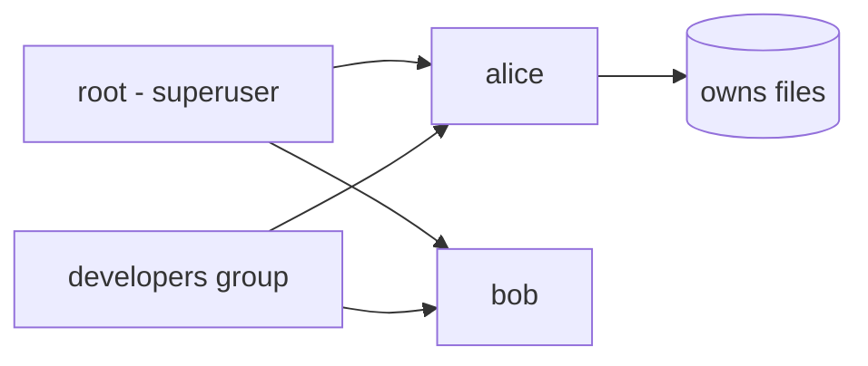

# Users and Groups

## 1. What Is This?

Linux is **multi-user**. A **user** is an account that can log in and own files. A **group** is a collection of users that share access. Every file is owned by a user and a group.

## 2. Why Is This Needed?

Servers are shared by teams and services. Separate accounts mean accountability, security, and the ability to grant exactly the access each person/service needs.

## 3. Simple Layman Explanation

Think of an **office building**. Each person has their own keycard (user). Departments (groups) get access to shared rooms. The building manager (root) can open every door.

## 4. Technical Explanation

- Users are listed in `/etc/passwd`; groups in `/etc/group`; password hashes in `/etc/shadow`.
- Each user has a **UID** (user ID) and a **primary group**; they can belong to extra **secondary groups**.
- **root** is the superuser (UID 0) with full control.
- **System users** (e.g., `www-data`, `nginx`) run services without login rights.

A line in `/etc/passwd`:

```
alice:x:1001:1001:Alice:/home/alice:/bin/bash
# name:passwd:UID:GID:comment:home:shell
```

## 5. Real-World Example

A new engineer joins. You create their user, add them to the `developers` group (which can read the app directory), and they get exactly the access they need — no shared logins.

## 6. Diagram



## 7. Commands

```bash
whoami                       # current user
id                           # UID, GID, and groups
id alice                     # info for another user
cat /etc/passwd              # all users
cat /etc/group               # all groups
sudo useradd -m -s /bin/bash alice   # create user with home + bash
sudo passwd alice            # set alice's password
sudo groupadd developers     # create a group
sudo usermod -aG developers alice    # add alice to developers
groups alice                 # show alice's groups
sudo userdel -r alice        # delete user and home (-r)
```

## 8. Command Explanation

- `id` → shows your UID, primary GID, and all groups — the quickest identity check.
- `useradd -m -s /bin/bash alice` → `-m` creates a home dir; `-s` sets the login shell.
- `passwd alice` → sets/changes a password.
- `usermod -aG developers alice` → `-a` **append** to (`-G`) supplementary groups. **Forgetting `-a` removes existing groups!**
- `userdel -r alice` → deletes the user and (`-r`) their home directory.

## 9. Practice Tasks

1. Run `id` and `groups`.
2. `sudo useradd -m -s /bin/bash testuser` then `sudo passwd testuser`.
3. `sudo groupadd team` and `sudo usermod -aG team testuser`.
4. Verify with `id testuser`.
5. Clean up: `sudo userdel -r testuser`.

## 10. Common Mistakes

- Using `usermod -G` without `-a`, wiping the user's other groups.
- `useradd` without `-m`, leaving the user without a home directory.
- Sharing one login across a team (no accountability).

## 11. Troubleshooting

- **New group membership not active** → log out/in (or `newgrp <group>`); group changes apply on new sessions.
- **`useradd: user exists`** → already created; check `id <user>`.
- **Can't create users** → you need `sudo`.

## 12. Best Practices

- One account per person/service. No shared logins.
- Use groups to grant shared access instead of opening files to everyone.
- Give service accounts no login shell (`-s /usr/sbin/nologin`).

## 13. Quick Recap

- Users own files; groups share access; root rules all.
- `useradd`, `passwd`, `groupadd`, `usermod -aG` manage them.
- Always use `-a` with `usermod -G`.

## 14. References

- `man useradd`, `man usermod`, `man passwd`
- Ubuntu user management: https://ubuntu.com/server/docs/security-users

<!-- NAV-FOOTER -->

---

### 🧭 Navigation

| Previous | Up | Next |
|:---|:---:|---:|
| ⬅️ Prev: [Module 04 — Users, Groups & Permissions](README.md) | ⬆️ Module: [Module 04 — Users, Groups & Permissions](README.md) | ➡️ Next: [File Permissions](file-permissions.md) |
