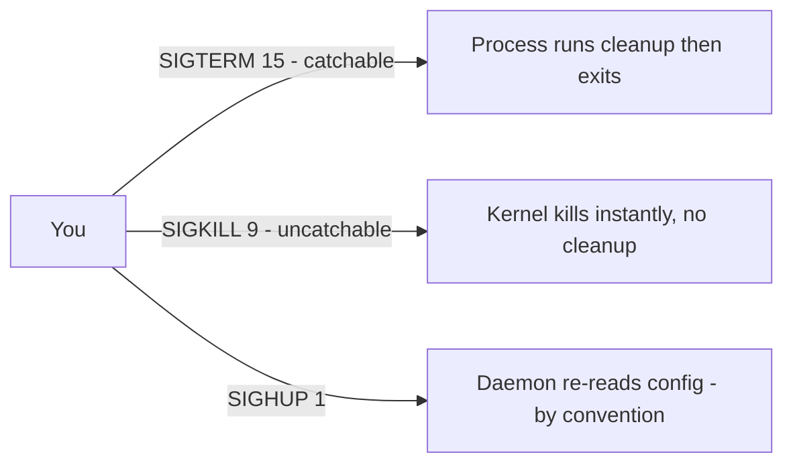

# Kill and Signals

## 1. What Is This?

**Signals** are messages the kernel sends to processes to tell them to stop, reload, or terminate. `kill`, `killall`, and `pkill` send these signals.

## 2. Why Is This Needed?

Sometimes a process hangs, leaks memory, or must be reloaded after a config change. Signals are how you control running processes gracefully — or forcefully when needed.

## 3. Simple Layman Explanation

Sending a signal is like talking to a worker:
- **SIGTERM** = "please finish up and leave" (polite).
- **SIGKILL** = "drop everything and get out now" (forced, no cleanup).
- **SIGHUP** = "re-read your instructions" (reload config).

Always ask politely first.

## 4. Technical Explanation

| Signal | Number | Meaning |
|--------|--------|---------|
| SIGTERM | 15 | Graceful termination (default for `kill`) |
| SIGKILL | 9 | Force kill, cannot be caught/ignored |
| SIGHUP | 1 | Hangup; often used to reload config |
| SIGINT | 2 | Interrupt (what `Ctrl+C` sends) |
| SIGSTOP/SIGCONT | 19/18 | Pause / resume |

`kill` defaults to SIGTERM (15). Use SIGKILL (9) only if SIGTERM fails.

## 5. How It Works Under the Hood

The reason "always try SIGTERM before SIGKILL" is a rule and not just etiquette lies in **who handles the signal**:

- When you send a signal, the kernel delivers it to the target process. For most signals, the program can **register a handler** — a function that runs when the signal arrives. Well-behaved services handle **SIGTERM** by doing cleanup: finishing in-flight requests, flushing buffers to disk, releasing locks, removing PID files — *then* exiting. So SIGTERM = "shut down cleanly, on your terms."
- **SIGKILL (9) and SIGSTOP cannot be caught, blocked, or handled.** The kernel acts on them directly, yanking the process off the CPU and reclaiming its memory with **zero cleanup**. That's its power (nothing can ignore it) and its danger: half-written files, orphaned locks, corrupted state. It's the last resort precisely *because* the program never gets to tidy up.
- **SIGHUP (1)** historically meant "the terminal hung up," but daemons repurposed it to mean "re-read your config." That's convention, not kernel magic — nginx/sshd *chose* to handle SIGHUP as a reload. It's why `kill -HUP` reloads some services and kills others (those without a handler fall back to the default action: terminate).
- **`Ctrl+C` sends SIGINT (2)** to the foreground process; `Ctrl+Z` sends SIGSTOP. So the keys you already use *are* signals.

The practical rule falls out directly: **SIGTERM lets the process save itself; SIGKILL doesn't give it the chance.** Escalate only when a process ignores the polite request.

## 6. Diagram



## 7. Real-World Examples

**1. The everyday case.** A stuck Java process ignores SIGTERM. You wait a few seconds, then `kill -9 <pid>` to force it. For Nginx config reload without downtime: `kill -HUP <master_pid>` (or `systemctl reload nginx`).

**2. Graceful vs forced, observed:**

```
$ sleep 600 & echo "PID $!"
[1] 7420
PID 7420
$ kill 7420                    # SIGTERM (15): polite
$ jobs
[1]+  Terminated              sleep 600     # it exited cleanly
$ sleep 600 & echo "PID $!"
[2] 7455
PID 7455
$ kill -9 7455                 # SIGKILL (9): forced
$ jobs
[2]+  Killed                  sleep 600     # note: "Killed", not "Terminated"
```

The wording differs — **Terminated** (handled SIGTERM) vs **Killed** (SIGKILL, no cleanup) — reflecting Section 5.

**3. War story — the `kill -9` that corrupted a database.** A Postgres instance was slow to stop, so an impatient operator went straight to `kill -9` on the postmaster. Because SIGKILL skips cleanup, Postgres never flushed its buffers or wrote a clean shutdown, and on restart it had to run crash recovery — with several minutes of downtime and a scare about data integrity. The correct path was `systemctl stop postgresql` (SIGTERM → wait), which lets the DB checkpoint and exit cleanly. `kill -9` on stateful services is a genuine footgun; it's the *last* resort, not the first.

## 8. Worked Walkthrough

Practice the escalation ladder and a config-reload signal:

```
$ pgrep -a sleep                       # find any sleeps (none yet)
$ sleep 999 &
[1] 8100
$ pgrep -a sleep
8100 sleep 999
$ kill 8100                            # step 1: SIGTERM (graceful)
$ pgrep sleep || echo "gone"
gone                                   # it obeyed the polite signal
# If a process IGNORES SIGTERM, escalate:
$ sleep 999 &
[2] 8155
$ kill -15 8155 ; sleep 2 ; pgrep sleep && kill -9 8155   # TERM, wait, then KILL
$ kill -l | tr ' ' '\n' | grep -n -E 'HUP|INT|KILL|TERM'  # see numbers behind names
 1) SIGHUP
 2) SIGINT
 9) SIGKILL
15) SIGTERM
```

The ladder — **SIGTERM → wait a moment → SIGKILL only if needed** — is the exact routine you should build muscle memory for (Section 5).

## 9. Commands

```bash
kill 1234                # send SIGTERM (graceful) to PID 1234
kill -15 1234            # same, explicit
kill -9 1234             # force kill (last resort)
kill -HUP 1234           # reload config (daemons that support it)
pgrep -a nginx           # find PIDs by name (with command line)
killall nginx            # signal all processes named nginx
pkill -f "python app.py" # kill by matching the full command line
kill -l                  # list all signal names
```

Sample output for each (dummy values, for reference):

```text
$ kill 1234
# (no output = signal sent; process may exit)

$ kill -9 1234
# (no output; forced)

$ pgrep -a nginx
712 nginx: master process /usr/sbin/nginx
713 nginx: worker process

$ killall nginx
# (no output = success; errors if no match: "nginx: no process found")

$ kill -l
 1) SIGHUP   2) SIGINT   3) SIGQUIT  4) SIGILL   ...
 9) SIGKILL 15) SIGTERM 18) SIGCONT 19) SIGSTOP  ...
```

## 10. Command Explanation

- `kill <pid>` → sends SIGTERM; the process can catch it, clean up, and exit.
- `kill -9 <pid>` → SIGKILL; uncatchable, no cleanup — use only when SIGTERM fails.
- `kill -HUP <pid>` → asks many daemons to reload configuration (convention).
- `pgrep -a <name>` → find PIDs by name safely (better than `ps|grep`); `pkill` signals them.
- `killall <name>` → signals every process with that exact name.
- `pkill -f "pattern"` → matches against the full command line (`-f`), great for scripts.
- `kill -l` → lists signal names/numbers.

## 11. In Production (DevOps Context)

- **Graceful shutdown is a design contract:** load balancers stop sending traffic, then the orchestrator sends **SIGTERM** and waits a grace period before **SIGKILL** — so in-flight requests finish (zero-downtime deploys).
- **Kubernetes** does exactly this: `SIGTERM` → `terminationGracePeriodSeconds` → `SIGKILL`. Apps that ignore SIGTERM get hard-killed and drop requests (Module 13).
- **Docker:** `docker stop` = SIGTERM then SIGKILL after a timeout; `docker kill` = straight SIGKILL.
- **Config reloads** (`nginx -s reload`, `systemctl reload`) use SIGHUP-style mechanisms to apply changes without dropping connections — prefer them over restart.
- **`kill -9` on stateful services** (DBs, brokers) risks corruption/recovery (the war story) — reserve it for truly stuck processes.

## 12. Practice Tasks

1. `sleep 600 &`, note the PID (`echo $!`), then `kill <pid>` (graceful) and observe "Terminated".
2. Start another `sleep 600 &`; `kill -9` it and compare the "Killed" message.
3. `pgrep -a sleep` to find sleeps, then `pkill sleep`.
4. Run `kill -l` and locate SIGHUP(1), SIGKILL(9), SIGTERM(15).

## 13. Common Mistakes

- Reaching for `kill -9` first — it skips cleanup and can corrupt data/leave locks (the war story).
- Killing the wrong PID (verify with `pgrep`/`ps` first).
- Assuming `kill -HUP` reloads *every* service — only those that implement a handler; others terminate.
- Using raw `kill` on managed services instead of `systemctl stop/reload` (next topic).

## 14. Troubleshooting

- **Process won't die even with -9** → it's likely in uninterruptible I/O wait (state `D`); the disk/NFS is stuck (Module 08) — even SIGKILL waits for the I/O.
- **`kill: Operation not permitted`** → you don't own it; use `sudo`.
- **Reload didn't apply** → prefer `systemctl reload <service>` for managed services; check the app actually handles SIGHUP.
- **`killall` hits too much/too little** → use `pkill -f` with a precise pattern.

## 15. Best Practices

- Escalate gracefully: SIGTERM → wait → SIGKILL.
- For services, prefer `systemctl stop/reload` over raw `kill`.
- Never `kill -9` a database/stateful service unless it's truly hung.
- Always confirm the PID before signaling.

## 16. Connects To

- **Prev:** [ps, top & htop](ps-top-htop.md). **Next:** [systemd Services](systemd-services.md).
- **Find the PID first:** [ps, top & htop](ps-top-htop.md).
- **Managed stop/reload:** [systemd Services](systemd-services.md).
- **Stuck-in-D (I/O):** [Disk Full Troubleshooting](../08-storage-and-disk-management/disk-full-troubleshooting.md).
- **Graceful shutdown in orchestration:** [Linux for Kubernetes](../13-real-world-linux-for-devops/linux-for-kubernetes.md).

## 17. Quick Recap

- Signals control processes; `kill` sends them (default SIGTERM 15, catchable → clean exit).
- SIGKILL (9) is uncatchable and skips cleanup — forceful last resort; SIGHUP (1) often reloads by convention.
- `pgrep`/`pkill`/`killall` target by name/pattern; verify before you signal.

## 18. References

- `man kill`, `man pkill`, `man 7 signal`

<!-- NAV-FOOTER -->

---

### 🧭 Navigation

| Previous | Up | Next |
|:---|:---:|---:|
| ⬅️ Prev: [ps, top, and htop](ps-top-htop.md) | ⬆️ Module: [Module 05 — Processes & Services](README.md) | ➡️ Next: [systemd Services](systemd-services.md) |
