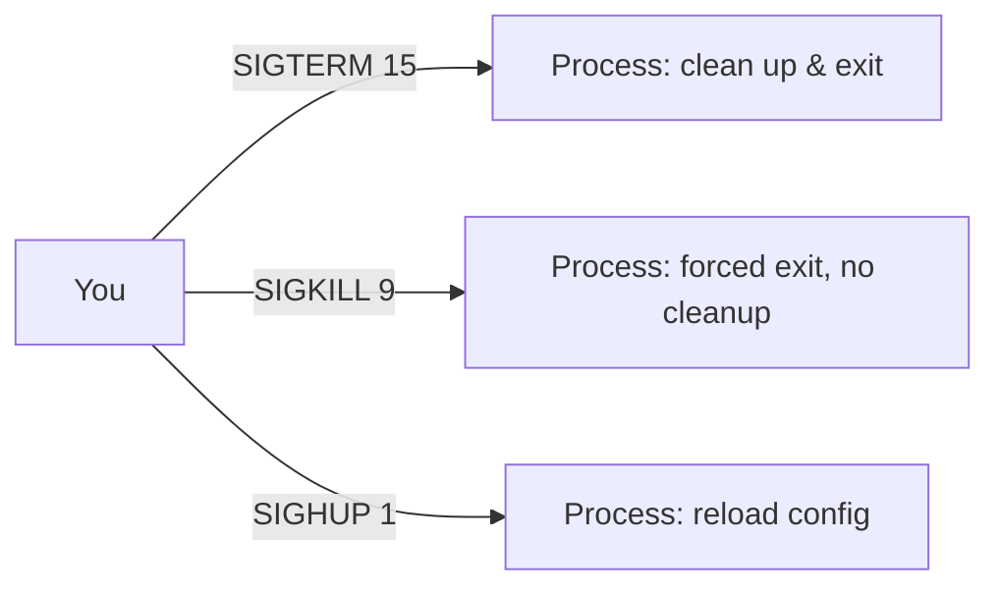

# Kill and Signals

## 1. What Is This?

**Signals** are messages the kernel sends to processes to tell them to stop, reload, or terminate. `kill`, `killall`, and `pkill` send these signals.

## 2. Why Is This Needed?

Sometimes a process hangs, leaks memory, or must be reloaded after a config change. Signals are how you control running processes gracefully — or forcefully when needed.

## 3. Simple Layman Explanation

Sending a signal is like talking to a worker:
- **SIGTERM** = "please finish up and leave" (polite).
- **SIGKILL** = "drop everything and get out now" (forced, no cleanup).
- **SIGHUP** = "re-read your instructions" (reload config).

Always ask politely first.

## 4. Technical Explanation

| Signal | Number | Meaning |
|--------|--------|---------|
| SIGTERM | 15 | Graceful termination (default for `kill`) |
| SIGKILL | 9 | Force kill, cannot be caught/ignored |
| SIGHUP | 1 | Hangup; often used to reload config |
| SIGINT | 2 | Interrupt (what `Ctrl+C` sends) |
| SIGSTOP/SIGCONT | 19/18 | Pause / resume |

`kill` defaults to SIGTERM (15). Use SIGKILL (9) only if SIGTERM fails.

## 5. Real-World Example

A stuck Java process ignores SIGTERM. You wait a few seconds, then `kill -9 <pid>` to force it. For Nginx config reload without downtime: `kill -HUP <master_pid>` (or `systemctl reload nginx`).

## 6. Diagram



## 7. Commands

```bash
kill 1234                # send SIGTERM (graceful) to PID 1234
kill -15 1234            # same, explicit
kill -9 1234             # force kill (last resort)
kill -HUP 1234           # reload config
killall nginx            # signal all processes named nginx
pkill -f "python app.py" # kill by matching the full command line
kill -l                  # list all signal names
```

## 8. Command Explanation

- `kill <pid>` → sends SIGTERM; the process can clean up and exit.
- `kill -9 <pid>` → SIGKILL; immediate, no cleanup — use only when SIGTERM fails.
- `kill -HUP <pid>` → asks many daemons to reload configuration.
- `killall <name>` → signals every process with that exact name.
- `pkill -f "pattern"` → matches against the full command line (`-f`), great for scripts.
- `kill -l` → lists signal names/numbers.

## 9. Practice Tasks

1. `sleep 600 &`, note the PID, then `kill <pid>` (graceful).
2. Start another `sleep 600 &`; `kill -9` it and compare.
3. `pgrep -a sleep` to find sleeps, then `pkill sleep`.
4. Run `kill -l` and read the signal list.

## 10. Common Mistakes

- Reaching for `kill -9` first — it skips cleanup and can corrupt data/leave locks.
- Killing the wrong PID (verify with `ps`/`pgrep` first).
- Using `killall` on Solaris-style systems (there it means something different — on Linux it's by name).

## 11. Troubleshooting

- **Process won't die even with -9** → it's likely in uninterruptible I/O wait (state `D`); the disk/NFS is stuck (Module 08).
- **`kill: Operation not permitted`** → you don't own it; use `sudo`.
- **Reload didn't apply** → prefer `systemctl reload <service>` for managed services.

## 12. Best Practices

- Escalate gracefully: SIGTERM → wait → SIGKILL.
- For services, prefer `systemctl stop/reload` over raw `kill`.
- Always confirm the PID before signaling.

## 13. Quick Recap

- Signals control processes; `kill` sends them (default SIGTERM 15).
- SIGKILL (9) is the forceful last resort; SIGHUP (1) often reloads.
- `killall`/`pkill` target by name/pattern.

## 14. References

- `man kill`, `man pkill`, `man 7 signal`

<!-- NAV-FOOTER -->

---

### 🧭 Navigation

| Previous | Up | Next |
|:---|:---:|---:|
| ⬅️ Prev: [ps, top, and htop](ps-top-htop.md) | ⬆️ Module: [Module 05 — Processes & Services](README.md) | ➡️ Next: [systemd Services](systemd-services.md) |
