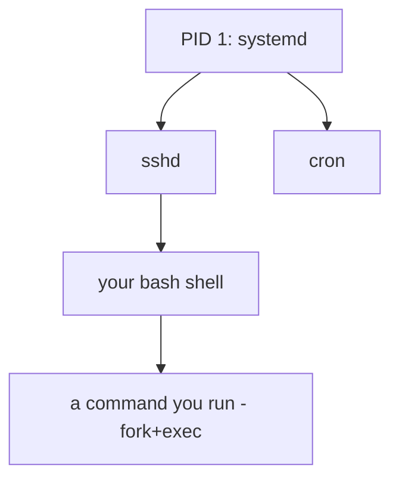
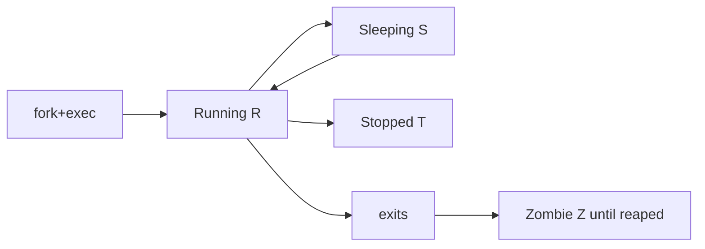

# Process Basics

## 1. What Is This?

A **process** is a running program. When you launch anything — a command, a web server, a script — Linux creates a process with a unique **PID** (Process ID).

## 2. Why Is This Needed?

To manage a system you must understand what's running, how processes relate (parent/child), and their states. Nearly all troubleshooting starts with "what process is doing this?"

## 3. Simple Layman Explanation

A program (like a recipe) is just instructions on paper. A **process** is the chef actively cooking that recipe right now. You can have many chefs cooking the same recipe — each is a separate process.

## 4. Technical Explanation

- Each process has a **PID** and a **PPID** (parent's PID). Processes form a tree rooted at PID 1 (`systemd`/init).
- **Foreground** processes hold your terminal; **background** ones (`&`) run while you keep working.
- Process **states**: Running (R), Sleeping (S), Stopped (T), Zombie (Z).
- A **daemon** is a background service process (often ending in `d`, e.g., `sshd`).

## 5. How It Works Under the Hood

Where do processes even come from? On Linux, **every process is created by copying an existing one** via the `fork()` syscall, then optionally replacing its program with `exec()`. That's the whole model:

- **`fork()`** makes a near-identical child of the parent (same code, its own PID). **`exec()`** then loads a new program into that child. When you type `ls` in bash, bash `fork`s itself and the child `exec`s `/usr/bin/ls`. This is why every process has a **parent** (PPID) and why they form a **tree** — each was forked by someone.
- **PID 1 is the root of that tree.** At boot the kernel starts one process (`systemd`), and *everything* descends from it. That's why PID 1 is special (kill it and the system halts).
- **States reflect what the scheduler is doing.** The kernel time-slices the CPU among processes: **R** = running/runnable, **S** = sleeping (waiting for something, e.g., input or a timer — most processes, most of the time), **D** = uninterruptible sleep (stuck in I/O — can't even be killed), **T** = stopped, **Z** = zombie.
- **Zombies explained:** when a process exits, it doesn't fully vanish — it leaves an exit code the parent must collect ("reap") with `wait()`. Until the parent reaps it, it's a **zombie** (dead but listed). Lots of zombies = a buggy parent not reaping; the fix is restarting the *parent*, not the zombie (you can't kill what's already dead).

So the tree, the states, and zombies all fall out of one mechanism: fork/exec to create, the scheduler to run, exit + reap to end.

## 6. Diagram





## 7. Real-World Examples

**1. The everyday case.** Nginx runs a master process that `fork`s worker processes (children). If a worker misbehaves, you can identify it by PID and signal just that one, leaving the others serving traffic.

**2. Seeing the parent/child tree:**

```
$ echo $$
4821                                  # this shell's PID
$ sleep 300 &
[1] 5099
$ ps -o pid,ppid,stat,cmd -p 4821,5099
    PID    PPID STAT CMD
   4821    4780 Ss   -bash            # our shell (parent)
   5099    4821 S    sleep 300        # its child: PPID = 4821, state S (sleeping)
```

The `sleep`'s PPID (4821) is our shell's PID — proof it was forked by the shell (Section 5). Its state `S` = sleeping (it's just waiting out the timer).

**3. War story — the zombie apocalypse that wasn't.** Monitoring flagged "hundreds of defunct processes" on an app server and the team feared a leak. `ps aux | grep defunct` confirmed many `<defunct>` (Z-state) entries — but CPU/memory were fine. The real issue: the app spawned child workers but never called `wait()` to reap them (Section 5). The zombies held only a PID slot, not real resources. The fix was restarting the *parent* app (and later a code fix to reap children) — not killing zombies (impossible; they're already dead). Understanding reaping turned a "server dying!" alert into a known, low-severity bug.

## 8. Worked Walkthrough

Create, background, foreground, and inspect a process:

```
$ sleep 600 &                         # start in background (fork+exec, returns control)
[1] 6210
$ jobs
[1]+  Running                 sleep 600 &
$ ps -o pid,ppid,stat,cmd --ppid $$   # children of THIS shell
    PID    PPID STAT CMD
   6210    4821 S    sleep 600
$ pstree -p $$                        # visualize the tree from our shell down
bash(4821)───sleep(6210)
$ fg %1                               # pull job 1 back to the foreground
sleep 600
^C                                    # Ctrl+C sends SIGINT → it terminates
$ jobs
                                       # empty: the process is gone
```

You watched a child get forked, run while you kept working, come to the foreground, and be interrupted — the full lifecycle from Section 5.

## 9. Commands

```bash
ps                       # processes in this shell
ps aux                   # all processes, detailed
pstree -p                # process tree with PIDs (parent/child)
echo $$                  # PID of current shell
sleep 300 &              # run a background process
jobs                     # background jobs in this shell
fg %1                    # bring job 1 to foreground
```

Sample output for each (dummy values, for reference):

```text
$ ps
    PID TTY          TIME CMD
   4821 pts/0    00:00:00 bash
   6301 pts/0    00:00:00 ps

$ ps aux | head -3
USER   PID %CPU %MEM    VSZ   RSS TTY   STAT START   TIME COMMAND
root     1  0.0  0.4 168100 11840 ?     Ss   Jun28   0:12 /sbin/init
alice 4821  0.0  0.1  13920  6100 pts/0 Ss   09:00   0:00 -bash

$ pstree -p 4821
bash(4821)───sleep(6210)

$ echo $$
4821

$ jobs
[1]+  Running                 sleep 300 &
```

## 10. Command Explanation

- `ps aux` → lists **a**ll processes for all **u**sers with details; `x` includes those without a terminal.
- `pstree -p` → shows the parent/child hierarchy with PIDs.
- `$$` → the current shell's PID.
- `cmd &` → forks `cmd` into the background; the shell prints its job number and PID.
- `jobs` / `fg` → list background jobs / bring one to the foreground.
- `ps aux` columns: `USER PID %CPU %MEM ... STAT START TIME COMMAND`.

## 11. In Production (DevOps Context)

- **Containers pin their whole world to PID 1:** a container's main process *is* PID 1 inside it, and if PID 1 exits the container stops (Module 13). A poorly chosen PID 1 that doesn't reap children causes zombie buildup — hence "init" wrappers like `tini`.
- **`CrashLoopBackOff`** in Kubernetes = the container's PID 1 keeps exiting non-zero; you read the exit code and logs (Module 13).
- **Master/worker models** (Nginx, Gunicorn, PostgreSQL) are fork trees — reloading often means signaling the master to re-fork workers with new config (next topics).
- **Uninterruptible sleep (D state)** signals stuck I/O (dead disk, hung NFS) — a real incident category (Module 08).

## 12. Practice Tasks

1. Run `sleep 300 &`, then `jobs` and `ps -o pid,ppid,stat,cmd --ppid $$`; confirm the PPID matches your shell.
2. Run `pstree -p $$` and find your shell → child chain.
3. `echo $$` and confirm it appears as the PPID of your background job.
4. Bring the sleep job to the foreground with `fg`, then `Ctrl+C` to stop it.

## 13. Common Mistakes

- Confusing a program (file on disk) with a process (a running fork of it).
- Forgetting `&`, so a long task locks your terminal (use `Ctrl+Z` then `bg` to recover).
- Trying to "kill" zombies — they're already dead; restart the parent that isn't reaping (Section 5).

## 14. Troubleshooting

- **Terminal frozen by a foreground task** → `Ctrl+C` (stop) or `Ctrl+Z` (suspend, then `bg`).
- **Process won't appear in `ps`** → it may have exited, or you need `ps aux` (all users).
- **Many zombies (Z / `<defunct>`)** → the parent isn't reaping; restart the parent service.
- **Process stuck in `D` state, can't kill** → uninterruptible I/O wait; check disk/NFS (Module 08).

## 15. Best Practices

- Use `&` for long tasks; manage them with `jobs`/`fg`/`bg` (or `tmux`/`nohup` for session-independent runs).
- Identify processes by PID before acting on them.
- Understand the tree: killing a parent can affect its children.

## 16. Connects To

- **Prev:** [Module 05 — Processes & Services](README.md). **Next:** [ps, top & htop](ps-top-htop.md).
- **PID 1 / init:** [systemd Services](systemd-services.md).
- **Signaling processes:** [Kill and Signals](kill-signals.md).
- **Monitoring live:** [ps, top & htop](ps-top-htop.md), [CPU/Memory/Disk Checks](../09-logs-monitoring-troubleshooting/cpu-memory-disk-checks.md).
- **Processes as containers:** [Linux for Kubernetes](../13-real-world-linux-for-devops/linux-for-kubernetes.md).

## 17. Quick Recap

- A process = a running program with a PID; created by `fork()`+`exec()`, so every one has a parent (tree rooted at PID 1).
- States: Running/Sleeping/**D**(stuck I/O)/Stopped/**Zombie** (exited, awaiting reap).
- Zombies are harmless slots — fix the parent, don't try to kill them.
- `ps aux`, `pstree -p`, `&`, `jobs`, `fg` are your basics.

## 18. References

- `man ps`, `man pstree`
- Linux `/proc` docs: https://docs.kernel.org/filesystems/proc.html

<!-- NAV-FOOTER -->

---

### 🧭 Navigation

| Previous | Up | Next |
|:---|:---:|---:|
| ⬅️ Prev: [Module 05 — Processes & Services](README.md) | ⬆️ Module: [Module 05 — Processes & Services](README.md) | ➡️ Next: [ps, top, and htop](ps-top-htop.md) |
