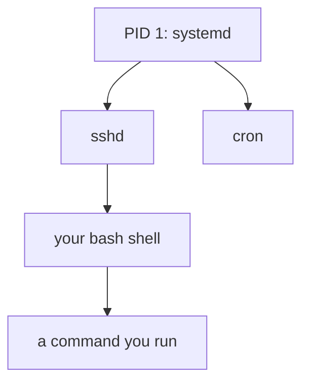
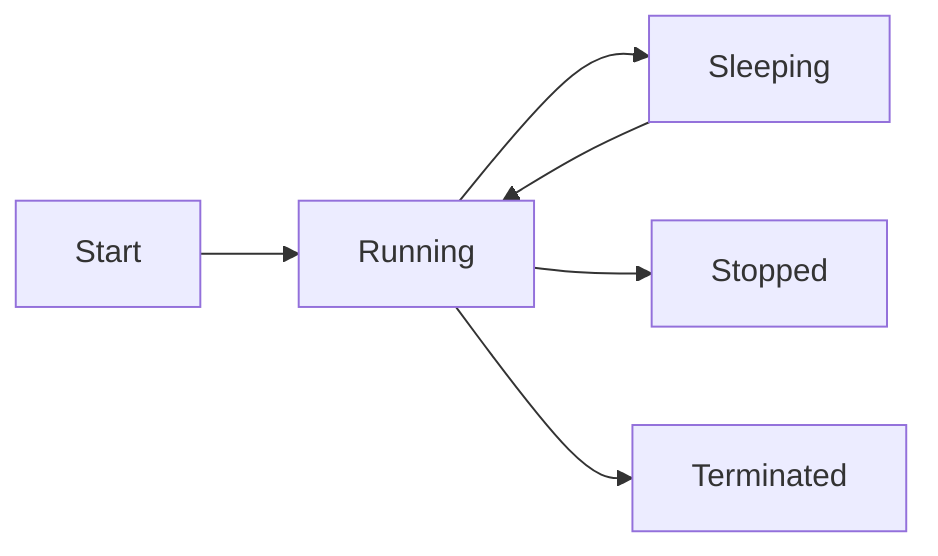

# Process Basics

## 1. What Is This?

A **process** is a running program. When you launch anything — a command, a web server, a script — Linux creates a process with a unique **PID** (Process ID).

## 2. Why Is This Needed?

To manage a system you must understand what's running, how processes relate (parent/child), and their states. Nearly all troubleshooting starts with "what process is doing this?"

## 3. Simple Layman Explanation

A program (like a recipe) is just instructions on paper. A **process** is the chef actively cooking that recipe right now. You can have many chefs cooking the same recipe — each is a separate process.

## 4. Technical Explanation

- Each process has a **PID** and a **PPID** (parent's PID). Processes form a tree rooted at PID 1 (`systemd`/init).
- **Foreground** processes hold your terminal; **background** ones (`&`) run while you keep working.
- Process **states**: Running (R), Sleeping (S), Stopped (T), Zombie (Z).
- A **daemon** is a background service process (often ending in `d`, e.g., `sshd`).

## 5. Real-World Example

Nginx runs a master process that spawns worker processes (children). If a worker misbehaves, you can identify it by PID and signal just that one, leaving the others serving traffic.

## 6. Diagram





## 7. Commands

```bash
ps                       # processes in this shell
ps aux                   # all processes, detailed
pstree                   # process tree (parent/child)
echo $$                  # PID of current shell
sleep 300 &              # run a background process
jobs                     # background jobs in this shell
fg %1                    # bring job 1 to foreground
```

## 8. Command Explanation

- `ps aux` → lists **a**ll processes for all **u**sers with details; `x` includes those without a terminal.
- `pstree` → shows the parent/child hierarchy visually.
- `$$` → the current shell's PID.
- `cmd &` → runs `cmd` in the background; the shell prints its job number and PID.
- `jobs` / `fg` → list background jobs / bring one to the foreground.

`ps aux` columns: `USER PID %CPU %MEM ... STAT START TIME COMMAND`.

## 9. Practice Tasks

1. Run `sleep 300 &`, then `jobs` and `ps aux | grep sleep`.
2. Run `pstree | head -20` and find your shell.
3. `echo $$` and confirm it appears in `ps`.
4. Bring the sleep job to the foreground with `fg`, then `Ctrl+C` to stop it.

## 10. Common Mistakes

- Confusing a program (file) with a process (running instance).
- Forgetting `&`, so a long task locks your terminal.
- Ignoring zombie/defunct processes (usually harmless; fixed when parent reaps them).

## 11. Troubleshooting

- **Terminal frozen by a foreground task** → `Ctrl+C` (stop) or `Ctrl+Z` (suspend, then `bg`).
- **Process won't appear in `ps`** → it may have exited, or you need `ps aux` (all users).
- **Many zombies** → the parent isn't reaping; restart the parent service.

## 12. Best Practices

- Use `&` for long tasks; manage them with `jobs`/`fg`/`bg`.
- Identify processes by PID before acting on them.
- Understand the tree: killing a parent can affect its children.

## 13. Quick Recap

- Process = running program with a PID; PPID links to its parent.
- States: Running/Sleeping/Stopped/Zombie.
- `ps aux`, `pstree`, `&`, `jobs`, `fg` are your basics.

## 14. References

- `man ps`, `man pstree`
- Linux `/proc` docs: https://docs.kernel.org/filesystems/proc.html
