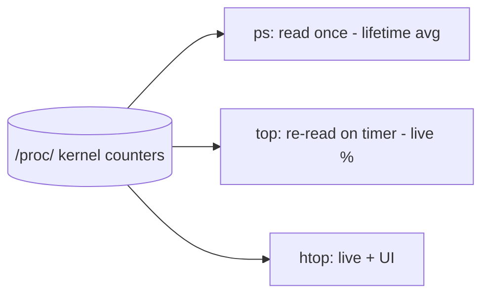

# ps, top, and htop

## 1. What Is This?

Tools to **see and monitor** processes: `ps` (snapshot), `top` (live, built-in), and `htop` (live, friendlier, installable).

## 2. Why Is This Needed?

When a server is slow or an app misbehaves, you need to find which process is responsible and how much CPU/memory it's using — in real time.

## 3. Simple Layman Explanation

- `ps` = a **photo** of who's working right now.
- `top` = a **live security-camera feed** of all workers, busiest at the top.
- `htop` = the same feed but in color, with easy buttons.

## 4. Technical Explanation

| Tool | Type | Strength |
|------|------|----------|
| `ps` | Snapshot | Scriptable, precise filtering |
| `top` | Live | Always installed, refreshes ~every 3s |
| `htop` | Live | Color, scroll, tree view, kill with F-keys |

These read process data from `/proc`.

## 5. How It Works Under the Hood

None of these tools "watch" the CPU directly — they all read the kernel's **`/proc` virtual filesystem** (see [Linux Filesystem Overview](../02-linux-basics/linux-file-system-overview.md)). For every process there's a `/proc/<pid>/` directory the kernel generates on demand, holding its state, memory, and CPU counters. `ps` reads it once; `top`/`htop` re-read it on a timer. That single fact explains the trickiest columns:

- **`%CPU` is a rate, not a reading.** The kernel stores *total CPU time a process has consumed* (a counter that only grows). To get a percentage, a tool reads the counter twice, a moment apart, and computes the delta ÷ elapsed time. That's why `ps aux` `%CPU` is an *average over the process's whole life* (often misleadingly low for a process that just spiked), while `top`'s `%CPU` reflects the *last refresh interval* (the live truth). Use `top`/`htop` for "what's hot right now."
- **`%CPU` can exceed 100%.** On a 4-core box a process using all cores shows ~400% — because the counter sums time across cores.
- **RES vs VIRT memory:** VIRT is everything the process has *mapped* (often huge, includes shared libraries and unused reservations); **RES (resident)** is the physical RAM actually in use. When hunting a memory hog, sort by RES/`%MEM`, not VIRT.
- **Load average is not CPU%.** It's the average number of processes *runnable or waiting on I/O* over 1/5/15 minutes. On a 4-core machine, load 4.0 ≈ fully busy; load 8.0 ≈ twice the work the cores can handle. A high load with low CPU% means processes are stuck waiting (usually disk I/O — the `wa` figure).

So the tools are windows onto `/proc` counters; knowing they're *deltas of counters* is why "snapshot vs live" and "why is it over 100%?" stop being confusing.

## 6. Diagram



## 7. Real-World Examples

**1. The everyday case.** Alert: "CPU at 100%". You run `top`, press `P` to sort by CPU, see `python` using 99%, note its PID, and investigate or kill it. Minutes later the server recovers.

**2. Finding the hog with `ps`, then confirming live:**

```
$ ps aux --sort=-%cpu | head -3
USER   PID %CPU %MEM    VSZ   RSS TTY  STAT START  TIME COMMAND
app   8123 98.7  2.1 912400 87020 ?    R    09:10  3:41 python train.py
app    611  1.2  6.4 2().. 260112 ?    Ssl Jun28  40:11 java -jar api.jar
$ top -b -n1 | head -5
top - 09:14:02 up 42 days,  load average: 3.90, 2.10, 1.05    # ~4 = a 4-core box maxed
%Cpu(s): 96.2 us,  1.1 sy,  0.0 ni,  2.5 id,  0.0 wa
   PID USER   %CPU %MEM    TIME+ COMMAND
  8123 app    98.7  2.1  3:41.20 python
```

`ps` found the offender; the `top` header confirms it's real *right now* (load ≈ cores, idle near 0) — the snapshot-vs-live distinction from Section 5.

**3. War story — "CPU is fine but the server crawls."** A site was slow, yet `top` showed CPU ~10% idle 85%. The tell was the header: **load average 12.0 on 4 cores with high `wa` (I/O wait)**. Processes weren't burning CPU — they were *blocked waiting on a failing disk* (Section 5: load counts I/O waiters too). `iostat` confirmed the disk at 100% utilization. The fix was storage, not CPU. Reading load + `wa` (not just `%CPU`) pointed straight at it (Module 08).

## 8. Worked Walkthrough

Generate load, then hunt it with each tool:

```
$ yes > /dev/null &            # a cheap CPU burner (Ctrl-C / kill it after)
[1] 9001
$ ps -o pid,%cpu,stat,cmd -p 9001
    PID %CPU STAT CMD
   9001 99.0 R    yes
$ top -b -n1 | grep yes        # live view, batch mode (one refresh)
   9001 alice  99.0  0.0  0:07.11 yes
$ ps aux --sort=-%mem | head -3    # switch to memory ranking (RES-based)
USER   PID %CPU %MEM    VSZ    RSS TTY STAT COMMAND
app    611  1.0  6.4 2100000 260112 ? Ssl java -jar api.jar
$ kill 9001                    # stop the burner (graceful) — see Kill & Signals
[1]+  Terminated              yes > /dev/null
```

You saw `yes` pegged at ~99% (`R` state), confirmed it live in `top`, then re-ranked by memory. In practice this is exactly the "find the offender → note PID → act" loop.

## 9. Commands

```bash
ps aux                          # all processes
ps aux --sort=-%cpu | head      # top CPU users
ps aux --sort=-%mem | head      # top memory users (by RES/%MEM)
ps -ef | grep nginx             # find a specific process
top                             # live monitor (q to quit)
htop                            # nicer live monitor (install first)
sudo apt install htop           # install htop on Ubuntu/Debian
```

Inside `top`: `P` sort by CPU, `M` sort by memory, `k` kill a PID, `1` show per-core, `q` quit.

Sample output for each (dummy values, for reference):

```text
$ ps aux --sort=-%cpu | head -3
USER   PID %CPU %MEM    VSZ   RSS TTY STAT START TIME COMMAND
app   8123 98.7  2.1 912400 87020 ?  R    09:10 3:41 python train.py
app    611  1.2  6.4 2.1G  260112 ?  Ssl Jun28 40:11 java -jar api.jar

$ ps -ef | grep nginx
root   712     1  0 Jun28 ? 00:00:00 nginx: master process
www-d  713   712  0 Jun28 ? 00:00:11 nginx: worker process

$ top
top - 09:14:02 up 42 days,  2 users,  load average: 0.42, 0.31, 0.20
%Cpu(s):  3.1 us,  0.8 sy,  0.0 ni, 95.9 id,  0.2 wa
MiB Mem :   7822.0 total,   3011.4 free,   2100.1 used,   2710.5 buff/cache
   PID USER   PR  NI    VIRT    RES  %CPU  %MEM     TIME+ COMMAND
   611 app    20   0    2.1g  254m   1.3   6.4  40:11.02 java
```

## 10. Command Explanation

- `ps aux --sort=-%cpu` → sorts by CPU descending (`-` = descending); pipe to `head` for the top offenders (lifetime average — Section 5).
- `ps aux --sort=-%mem` → ranks by memory (`%MEM`, based on RES) — the right one for memory leaks.
- `ps -ef | grep nginx` → classic way to find a process by name (the `grep` line itself may appear; ignore it, or use `pgrep`).
- `top` → live dashboard: load average, `%Cpu(s)` incl. `wa` (I/O wait), memory, per-process usage.
- `htop` → scrollable, color UI; F9 kills, F6 sorts, F5 tree view.

## 11. In Production (DevOps Context)

- **First-response triage** for "server slow / CPU alert" is `top`/`htop` → find PID → decide (kill, scale, or fix) (Module 09).
- **Load + `wa`** distinguishes CPU problems from **I/O** problems (the war story) — a key SRE reflex tied to storage (Module 08).
- **`kubectl top` / `docker stats`** are the container-world equivalents, sourced from cgroup counters rather than `/proc` — same mental model (Module 13).
- **`ps` in scripts** powers health checks and alerts (e.g., "is the java pid still up, and under X% mem?").
- Metrics exporters (node_exporter) scrape the *same* `/proc` counters that feed dashboards.

## 12. Practice Tasks

1. Run `top`, press `P` (CPU), then `M` (memory), then `1` (per-core), then `q`.
2. `ps aux --sort=-%mem | head` — note the biggest memory user by `%MEM`.
3. Install and run `htop`; scroll and explore F-keys (F6 sort, F5 tree).
4. Start `yes > /dev/null &`, watch it in `top`, then `kill` it.
5. Read the `top` header: identify load average and the `wa` (I/O wait) value.

## 13. Common Mistakes

- Reading a one-time `ps` `%CPU` (a lifetime average) and thinking it reflects a live spike — use `top`/`htop` for now (Section 5).
- Misreading **load average** as a percentage (it's a count relative to CPU cores).
- Chasing VIRT instead of RES/`%MEM` when hunting a memory hog.
- Killing the wrong PID because of a stale snapshot — re-check before acting.

## 14. Troubleshooting

- **`htop: command not found`** → `sudo apt install htop` (or `dnf install htop`).
- **Can't see/kill a process in `top`** → you may need `sudo top` for processes you don't own.
- **High load but low CPU%** → likely I/O wait (`wa` in top) or disk problems (Module 08).
- **`%CPU` over 100%** → normal on multi-core (it sums across cores); press `1` to see per-core.

## 15. Best Practices

- Use `top`/`htop` for live issues, `ps` for scripts and precise filters.
- Sort by `%cpu` or `%mem` (RES) to find offenders fast.
- Always read the load average + `wa` before concluding "it's the CPU."
- Note the PID before taking action.

## 16. Connects To

- **Prev:** [Process Basics](process-basics.md). **Next:** [Kill and Signals](kill-signals.md).
- **Act on what you find:** [Kill and Signals](kill-signals.md).
- **Resource triage & I/O wait:** [CPU/Memory/Disk Checks](../09-logs-monitoring-troubleshooting/cpu-memory-disk-checks.md), [df/du/lsblk](../08-storage-and-disk-management/df-du-lsblk.md).
- **Container equivalents:** [Linux for Docker](../13-real-world-linux-for-devops/linux-for-docker.md).
- **Quick lookup:** [Process/Service Cheatsheet](../16-cheatsheets/process-service-cheatsheet.md).

## 17. Quick Recap

- `ps` = snapshot (lifetime avg), `top` = live (current interval), `htop` = live+friendly — all read `/proc` counters.
- Sort by `%CPU`/`%MEM` (RES) to find the culprit; `%CPU` can exceed 100% on multi-core.
- Load average counts runnable **and** I/O-waiting processes; high load + high `wa` = I/O, not CPU.

## 18. References

- `man ps`, `man top`
- htop: https://htop.dev/

<!-- NAV-FOOTER -->

---

### 🧭 Navigation

| Previous | Up | Next |
|:---|:---:|---:|
| ⬅️ Prev: [Process Basics](process-basics.md) | ⬆️ Module: [Module 05 — Processes & Services](README.md) | ➡️ Next: [Kill and Signals](kill-signals.md) |
