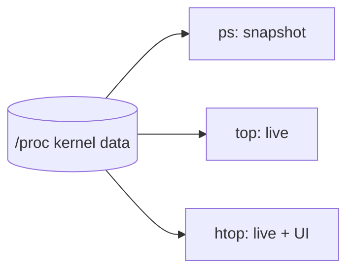

# ps, top, and htop

## 1. What Is This?

Tools to **see and monitor** processes: `ps` (snapshot), `top` (live, built-in), and `htop` (live, friendlier, installable).

## 2. Why Is This Needed?

When a server is slow or an app misbehaves, you need to find which process is responsible and how much CPU/memory it's using — in real time.

## 3. Simple Layman Explanation

- `ps` = a **photo** of who's working right now.
- `top` = a **live security-camera feed** of all workers, busiest at the top.
- `htop` = the same feed but in color, with easy buttons.

## 4. Technical Explanation

| Tool | Type | Strength |
|------|------|----------|
| `ps` | Snapshot | Scriptable, precise filtering |
| `top` | Live | Always installed, refreshes ~every 3s |
| `htop` | Live | Color, scroll, tree view, kill with F-keys |

These read process data from `/proc`.

## 5. Real-World Example

Alert: "CPU at 100%". You run `top`, press `P` to sort by CPU, see `python` using 99%, note its PID, and investigate or kill it. Minutes later the server recovers.

## 6. Diagram



## 7. Commands

```bash
ps aux                          # all processes
ps aux --sort=-%cpu | head      # top CPU users
ps aux --sort=-%mem | head      # top memory users
ps -ef | grep nginx             # find a specific process
top                             # live monitor (q to quit)
htop                            # nicer live monitor (install first)
sudo apt install htop           # install htop on Ubuntu/Debian
```

Inside `top`: `P` sort by CPU, `M` sort by memory, `k` kill a PID, `q` quit.

## 8. Command Explanation

- `ps aux --sort=-%cpu` → sorts by CPU descending (`-` = descending); pipe to `head` for the top offenders.
- `ps -ef | grep nginx` → classic way to find a process by name (the `grep` line itself may appear; ignore it).
- `top` → live dashboard: load average, CPU%, memory, and per-process usage.
- `htop` → scrollable, color UI; F9 kills, F6 sorts, F5 tree view.

`top` header essentials: **load average** (1/5/15-min), **%Cpu(s)**, **MiB Mem**.

## 9. Practice Tasks

1. Run `top`, press `P`, then `M`, then `q`.
2. `ps aux --sort=-%mem | head` — note the biggest memory user.
3. Install and run `htop`; scroll and explore F-keys.
4. Start `sleep 999 &`, then find it with `ps -ef | grep sleep`.

## 10. Common Mistakes

- Reading a one-time `ps` and assuming it reflects a spike that already passed — use `top` for live trends.
- Misreading **load average** as a percentage (it's a count relative to CPU cores).
- Killing the wrong PID because of a stale snapshot.

## 11. Troubleshooting

- **`htop: command not found`** → `sudo apt install htop` (or `dnf install htop`).
- **Can't kill a process in `top`** → you may need `sudo top` for processes you don't own.
- **High load but low CPU%** → likely I/O wait (`wa` in top) or disk problems (Module 08).

## 12. Best Practices

- Use `top`/`htop` for live issues, `ps` for scripts and precise filters.
- Sort by `%cpu` or `%mem` to find offenders fast.
- Note the PID before taking action.

## 13. Quick Recap

- `ps` = snapshot, `top` = live, `htop` = live+friendly.
- Sort by CPU/memory to find the culprit.
- Watch load average and `%Cpu(s)` in `top`.

## 14. References

- `man ps`, `man top`
- htop: https://htop.dev/
