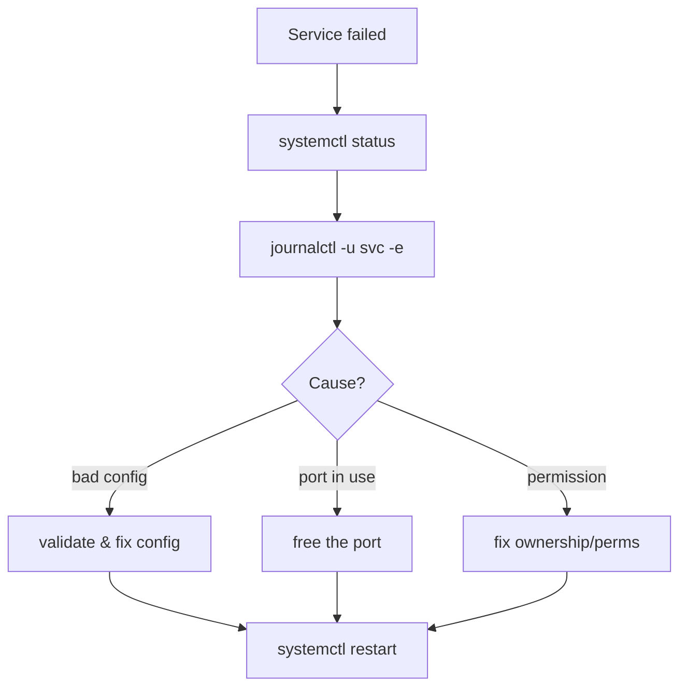

# Service Troubleshooting

## 1. What Is This?

A method for diagnosing services that **fail to start**, **crash**, or **won't stay running** under systemd.

## 2. Why Is This Needed?

"The service won't start" is one of the most common production incidents. A repeatable method finds the root cause fast instead of random restarts.

## 3. Simple Layman Explanation

When a machine won't turn on, you check: is it switched on, is there an error light, what does the manual say? For services: check status, read the logs, check the config, then fix and restart.

## 4. Technical Explanation

The golden sequence:
1. `systemctl status <svc>` — state + last log lines + exit code.
2. `journalctl -u <svc> -e` — full recent logs (Module 09).
3. Validate config (e.g., `nginx -t`, `sshd -t`).
4. Check ports/permissions/dependencies.
5. Fix → `systemctl restart` → re-check.

## 5. Real-World Example

`nginx` fails to start. `journalctl -u nginx -e` shows "bind() to 0.0.0.0:80 failed (Address already in use)". `ss -ltnp | grep :80` reveals Apache is on port 80. You stop Apache, restart Nginx — fixed.

## 6. Diagram



## 7. Commands

```bash
systemctl status nginx           # state + recent logs + exit code
journalctl -u nginx -e           # jump to end of this service's logs
journalctl -u nginx --since "10 min ago"
nginx -t                         # validate nginx config
ss -ltnp | grep :80              # what's using port 80
sudo systemctl daemon-reload     # after editing unit files
sudo systemctl restart nginx     # apply fix
```

## 8. Command Explanation

- `systemctl status` → the `Active:` line and `Main PID` exit code tell you *how* it failed.
- `journalctl -u <svc> -e` → the actual error message lives here.
- `nginx -t` / `sshd -t` → catch config syntax errors before restarting.
- `ss -ltnp` → find port conflicts (Module 07).
- `daemon-reload` → required after editing a unit file.

---

## Scenario: Service Won't Start

### Problem
`systemctl start <svc>` fails or the service immediately dies.

### Symptoms
`Active: failed`, a non-zero exit code, or "job failed".

### Possible Causes
- Config syntax error.
- Port already in use.
- Missing file/permission/dependency.

### Commands to Check
```bash
systemctl status <svc>
journalctl -u <svc> -e
<svc> -t            # if the service has a config test
ss -ltnp | grep :<port>
```

### Step-by-Step Fix
1. Read the exact error in `journalctl`.
2. If config error → fix the file, validate, retry.
3. If port conflict → stop the conflicting service or change the port.
4. If permission → fix ownership of the files/sockets it needs.
5. `sudo systemctl restart <svc>` and confirm `active (running)`.

### Prevention
Validate configs before restarting; avoid port clashes; use `enable --now`.

## 9. Practice Tasks

1. `systemctl status ssh` and read every line.
2. `journalctl -u ssh --since "1 hour ago"`.
3. If you have Nginx: edit the config to introduce a typo, run `nginx -t` (see it fail), fix it.
4. Use `ss -ltnp` to list listening ports and their services.

## 10. Common Mistakes

- Restarting repeatedly without reading the logs.
- Forgetting `daemon-reload` after editing a unit file.
- Skipping the config validation step.

## 11. Troubleshooting

This whole file is the troubleshooting guide. If logs are empty, check the service even has a journal (`journalctl -u <svc>`), and that the unit name is correct (`systemctl list-units | grep <name>`).

## 12. Best Practices

- Always read `journalctl -u <svc> -e` first.
- Validate config (`-t`) before every restart.
- Set `Restart=on-failure` in custom units for resilience.

## 13. Quick Recap

- status → journalctl → validate config → fix → restart.
- Most failures are bad config, port conflicts, or permissions.
- The error is almost always in `journalctl`.

## 14. References

- `man systemctl`, `man journalctl`
- [systemd-services.md](./systemd-services.md), [Module 09](../09-logs-monitoring-troubleshooting/)
