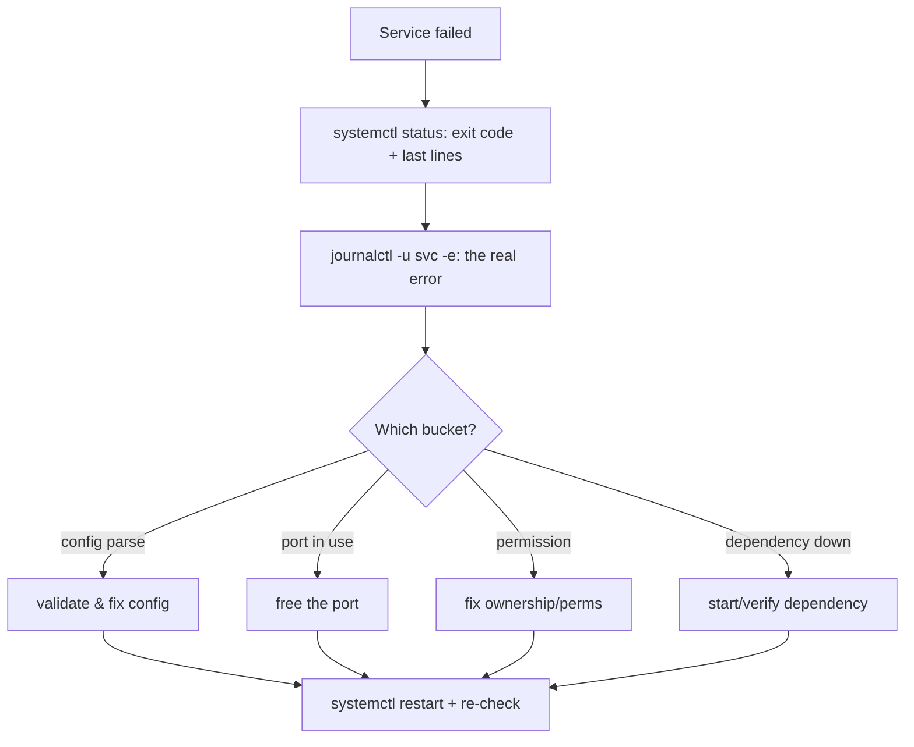

# Service Troubleshooting

## 1. What Is This?

A method for diagnosing services that **fail to start**, **crash**, or **won't stay running** under systemd.

## 2. Why Is This Needed?

"The service won't start" is one of the most common production incidents. A repeatable method finds the root cause fast instead of random restarts.

## 3. Simple Layman Explanation

When a machine won't turn on, you check: is it switched on, is there an error light, what does the manual say? For services: check status, read the logs, check the config, then fix and restart.

## 4. Technical Explanation

The golden sequence:
1. `systemctl status <svc>` — state + last log lines + exit code.
2. `journalctl -u <svc> -e` — full recent logs (Module 09).
3. Validate config (e.g., `nginx -t`, `sshd -t`).
4. Check ports/permissions/dependencies.
5. Fix → `systemctl restart` → re-check.

## 5. How It Works Under the Hood

The method works because systemd doesn't just start a service — it **records exactly how the process died**, and that evidence narrows the cause to one of a few families:

- **The exit code tells the story.** systemd captures the process's exit status (see [Kill and Signals](kill-signals.md) and [Terminal Basics](../01-linux-setup/terminal-basics.md) on exit codes). `status=0` but service "failed" often means a `Type=forking` mismatch; a config-parse error usually exits non-zero *immediately*; `signal=KILL/OOM` means the kernel's OOM killer struck (Module 09); `status=203/EXEC` means the binary path is wrong; `status=209/STDOUT` and friends point at unit misconfig. You rarely have to guess — the `Active:` line and `Main PID: ... (code=exited, status=N)` classify the failure.
- **Most failures cluster into three buckets**, because a service needs three things to run: its **config** must parse (bad config → dies on startup), its **resources** must be free (port already bound → `Address already in use`; file/socket not writable → permission error), and its **dependencies** must be up (DB/mount/network not ready → connection refused). The golden sequence is just "read the exit evidence, then check those three."
- **Where the real error message lives:** systemd captures the service's stdout/stderr into the **journal**, so `journalctl -u <svc>` shows the app's own last words — the actual "bind failed" / "no such file" / "permission denied" line. `status` summarizes; `journalctl` quotes.

So troubleshooting isn't random restarting — it's reading systemd's recorded exit evidence, then confirming config / port / permission / dependency. Restarting without reading skips the one piece of information that solves it.

## 6. Diagram



## 7. Real-World Examples

**1. The everyday case.** `nginx` fails to start. `journalctl -u nginx -e` shows "bind() to 0.0.0.0:80 failed (Address already in use)". `ss -ltnp | grep :80` reveals Apache is on port 80. You stop Apache, restart Nginx — fixed.

**2. Reading the exit evidence:**

```
$ sudo systemctl start nginx
Job for nginx.service failed because the control process exited with error code.
$ systemctl status nginx --no-pager | sed -n '3,6p'
     Active: failed (Result: exit-code) since Tue 2026-07-02 09:20:01; 3s ago
    Process: 8123 ExecStartPre=/usr/sbin/nginx -t (code=exited, status=1/FAILURE)
$ journalctl -u nginx -e --no-pager | tail -2
nginx[8123]: nginx: [emerg] unknown directive "serverr" in /etc/nginx/nginx.conf:34
nginx[8123]: nginx: configuration file test failed
```

The chain is unambiguous: `ExecStartPre` (the `nginx -t` test) exited `1` → the journal quotes the exact typo (`serverr`) and line (34). Fix line 34, restart — no guessing (Section 5).

**3. War story — the port conflict after a "harmless" install.** A team installed a monitoring agent, and afterwards their app service kept failing to start. `journalctl -u myapp -e` said `Address already in use :9090`. `ss -ltnp | grep :9090` showed the *new agent* had grabbed 9090 — the app's port. Nothing was wrong with the app; a resource (its port) was taken (Section 5's "resources must be free" bucket). They reconfigured the agent's port and the app started. Lesson: "it broke after installing X" often means X took a port/file the service needs — `ss -ltnp` reveals it instantly (Module 07).

## 8. Worked Walkthrough

Deliberately break a config, watch the method catch it, then fix:

```
$ sudo cp /etc/nginx/nginx.conf /etc/nginx/nginx.conf.bak   # always back up first
$ echo "serverr {" | sudo tee -a /etc/nginx/nginx.conf > /dev/null   # inject a typo
$ sudo nginx -t                          # step 3: validate BEFORE restarting
nginx: [emerg] unknown directive "serverr" in /etc/nginx/nginx.conf:41
nginx: configuration file test failed
$ sudo mv /etc/nginx/nginx.conf.bak /etc/nginx/nginx.conf   # restore known-good
$ sudo nginx -t
nginx: configuration file test is successful
$ sudo systemctl reload nginx && systemctl is-active nginx
active
```

Notice we caught the fault with `nginx -t` *before* touching the running service — the "validate config before restart" step (Section 4/5) prevents turning a typo into an outage.

## 9. Commands

```bash
systemctl status nginx           # state + recent logs + exit code
journalctl -u nginx -e           # jump to end of this service's logs
journalctl -u nginx --since "10 min ago"
nginx -t                         # validate nginx config (sshd -t for SSH)
ss -ltnp | grep :80              # what's using port 80
sudo systemctl daemon-reload     # after editing unit files
sudo systemctl restart nginx     # apply fix
```

Sample output for each (dummy values, for reference):

```text
$ systemctl status nginx --no-pager | head -4
● nginx.service - A high performance web server
     Active: failed (Result: exit-code) since Tue 2026-07-02 09:20:01; 3s ago
    Process: 8123 ExecStart=/usr/sbin/nginx (code=exited, status=1/FAILURE)

$ journalctl -u nginx -e --no-pager | tail -2
nginx[8123]: nginx: [emerg] bind() to 0.0.0.0:80 failed (Address already in use)
nginx[8123]: nginx: configuration file test failed

$ nginx -t
nginx: configuration file /etc/nginx/nginx.conf test is successful

$ ss -ltnp | grep :80
LISTEN 0 511 0.0.0.0:80 0.0.0.0:* users:(("apache2",pid=690,fd=4))
```

## 10. Command Explanation

- `systemctl status` → the `Active:` line and `Main PID`/`Process` exit code tell you *how* it failed (Section 5).
- `journalctl -u <svc> -e` → the actual error message (the app's own output) lives here.
- `nginx -t` / `sshd -t` → catch config syntax errors before restarting — the highest-value habit.
- `ss -ltnp` → find port conflicts (which process owns a port) (Module 07).
- `daemon-reload` → required after editing a unit file, before restart.

## 11. In Production (DevOps Context)

- **Incident response** for "service down" pages is precisely this loop; speed comes from reading exit codes/logs, not restarting blindly.
- **Config-test gates in CI/CD:** pipelines run `nginx -t`/`sshd -t`/`--dry-run` before deploying, so a typo fails the pipeline instead of the server (Section 8).
- **Port conflicts** are common on shared hosts and after adding agents/sidecars (the war story) — `ss -ltnp` is the go-to (Module 07).
- **OOM kills** (`status=... signal=KILL`, or `journalctl -k` showing "Out of memory") tie service failures back to memory pressure (Module 09) and cgroup limits (Module 13).
- **`Restart=on-failure`** keeps flaky services up, but masks root causes — always read the journal even if it auto-recovered.

## 12. Practice Tasks

1. `systemctl status ssh` and read every line, including the exit/active state.
2. `journalctl -u ssh --since "1 hour ago"`.
3. If you have Nginx: back up the config, introduce a typo, run `nginx -t` (see it fail), then restore and re-test.
4. Use `ss -ltnp` to list listening ports and their owning services; find what's on `:22`.

## 13. Common Mistakes

- Restarting repeatedly without reading the logs (skips the one clue that solves it — Section 5).
- Forgetting `daemon-reload` after editing a unit file.
- Skipping the config validation (`-t`) step and turning a typo into an outage.
- Assuming the app is broken when a *resource* (port/file) it needs was taken by something else (the war story).

## 14. Troubleshooting

**Scenario — Service won't start / immediately dies**
- **Problem:** `systemctl start <svc>` fails or the service dies right after starting.
- **Symptoms:** `Active: failed`, a non-zero exit code, or "job failed".
- **Possible Causes:** config syntax error; port already in use; missing file/permission/dependency; out-of-memory kill.
- **Commands to Check:**
  ```bash
  systemctl status <svc>
  journalctl -u <svc> -e
  <svc> -t                      # if it has a config test (nginx -t / sshd -t)
  ss -ltnp | grep :<port>
  ```
- **Step-by-Step Fix:** ① Read the exact error in `journalctl`. ② Config error → fix the file, validate (`-t`), retry. ③ Port conflict → free the port or change it. ④ Permission → fix ownership of the files/sockets it needs (Module 04). ⑤ Dependency → ensure it's up (DB/mount/network). ⑥ `sudo systemctl restart <svc>` and confirm `active (running)`.
- **Prevention:** validate configs before restarting; avoid port clashes; set `Restart=on-failure`; use `enable --now`.

**If the journal is empty** → confirm the unit name (`systemctl list-units | grep <name>`) and that the service actually logs to the journal (`journalctl -u <svc>` with no filters).

## 15. Best Practices

- Always read `journalctl -u <svc> -e` first — the real error is there.
- Validate config (`-t`) before every restart.
- Back up a config before editing (`cp file file.bak`) so you can revert instantly.
- Set `Restart=on-failure` in custom units for resilience — but still investigate the cause.

## 16. Connects To

- **Prev:** [systemd Services](systemd-services.md). **Next:** [Module 06 — Package Management](../06-package-management/README.md).
- **Reading logs deeply:** [journalctl Basics](../09-logs-monitoring-troubleshooting/journalctl-basics.md), [Real-World Troubleshooting Scenarios](../09-logs-monitoring-troubleshooting/real-world-troubleshooting-scenarios.md).
- **Port conflicts:** [netstat/ss/lsof](../07-networking-basics/netstat-ss-lsof.md), [Ports and Sockets](../07-networking-basics/ports-and-sockets.md).
- **Exit codes & signals:** [Kill and Signals](kill-signals.md).
- **Quick lookup:** [Process/Service Cheatsheet](../16-cheatsheets/process-service-cheatsheet.md), [Troubleshooting Cheatsheet](../16-cheatsheets/troubleshooting-cheatsheet.md).

## 17. Quick Recap

- Method: `status` (exit code) → `journalctl -u` (the real error) → validate config → check port/permission/dependency → fix → restart → re-check.
- Most failures are bad config, port conflicts, permissions, or a downed dependency — the exit code narrows it.
- The actual error is almost always in `journalctl`; validate configs (`-t`) before restarting.

## 18. References

- `man systemctl`, `man journalctl`
- [systemd-services.md](./systemd-services.md), [Module 09](../09-logs-monitoring-troubleshooting/)

<!-- NAV-FOOTER -->

---

### 🧭 Navigation

| Previous | Up | Next |
|:---|:---:|---:|
| ⬅️ Prev: [systemd Services](systemd-services.md) | ⬆️ Module: [Module 05 — Processes & Services](README.md) | ➡️ Next: [Module 06 — Package Management](../06-package-management/README.md) |
